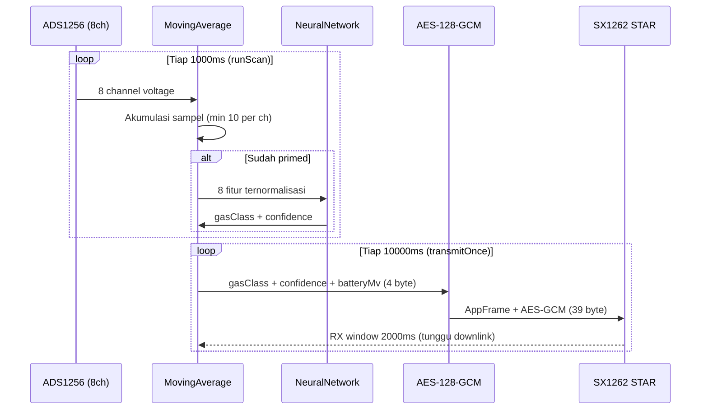
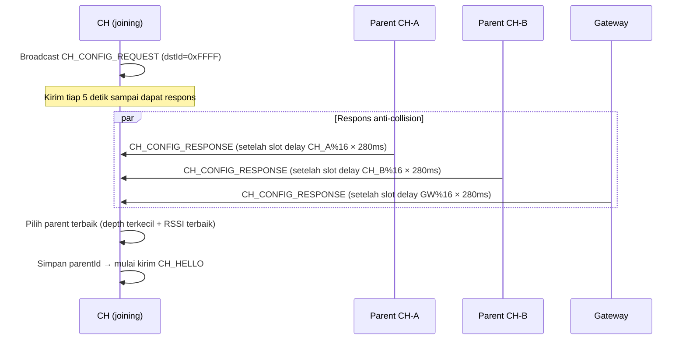
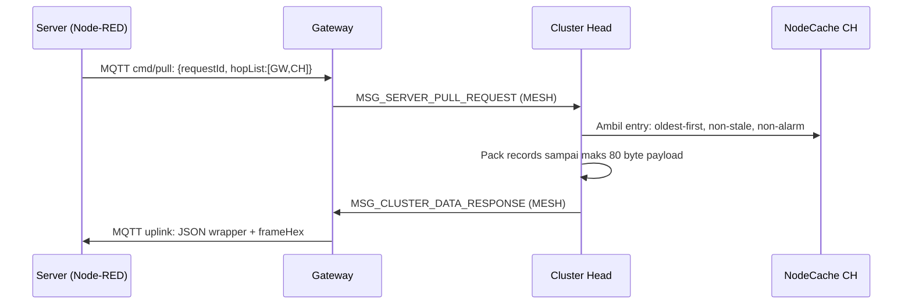
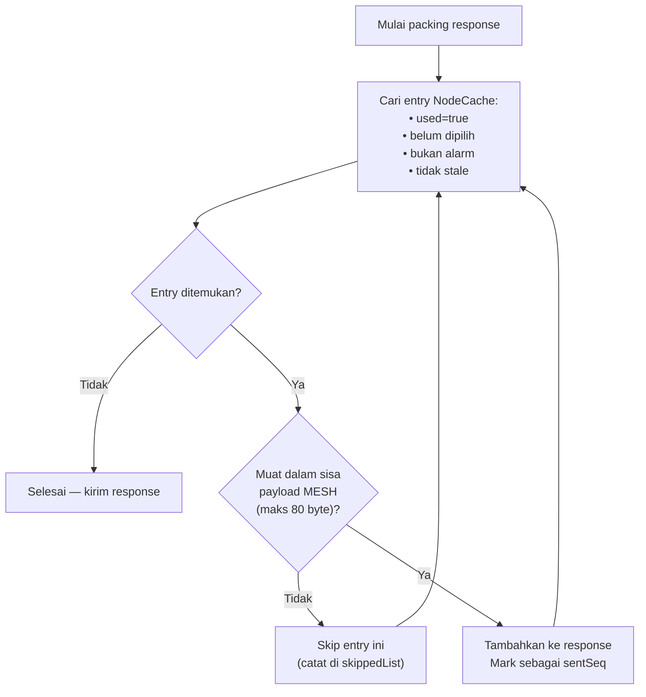
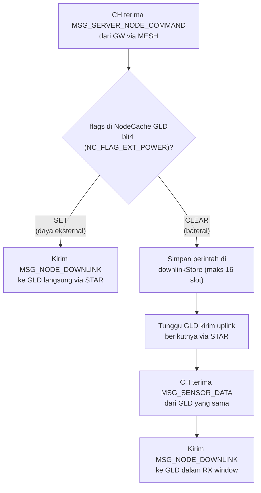
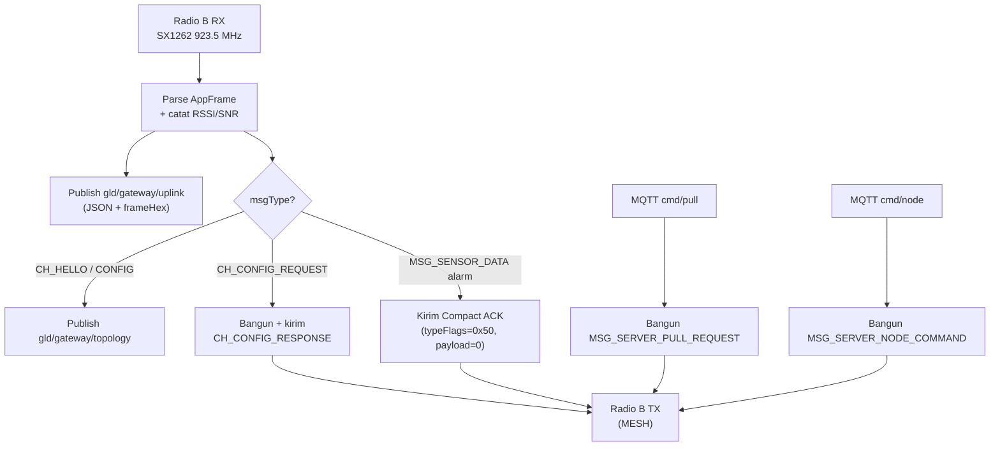
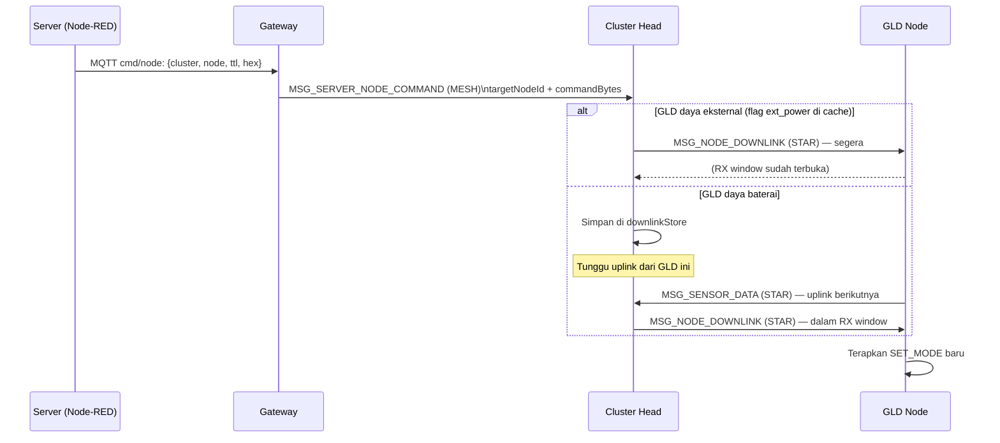

# Pertamina GLD — Protocol & Role Reference

**Versi:** 1.0 | **Tanggal:** 2026-06-29 | **Berdasarkan:** Firmware yang sedang berjalan

Dokumen ini menjelaskan peran masing-masing komponen sistem Pertamina GLD, format byte protokol komunikasi, dan logika operasional berdasarkan source firmware aktual.

---

## Daftar Isi

| No | Bab |
|---|---|
| 1 | GLD Node — Sensor, Inference, dan Transmisi |
| 2 | Cluster Head (CH) — Cache, Topology, Pull, dan Downlink |
| 3 | Gateway (GW) — Bridge MESH ke Server |
| 4 | Server Site — Pull dan Perintah ke GLD |
| 5 | Referensi Cepat: Semua Message Type |

---

## 1. GLD Node

### 1.1 Peran GLD

GLD (Gas Leak Detector) adalah node sensor ujung yang melakukan pembacaan gas, inferensi ML, dan transmisi data ke Cluster Head (CH).

**Tugas utama GLD:**

- Membaca 8 sensor gas (MQ2/3/4/5/6/7/8/135) via TCA9548A (I2C mux) → ADS1256 (24-bit ADC) **setiap 1000 ms**
- Menerapkan moving average (window 10 sampel per channel) — inference baru aktif setelah semua channel primed (≥10 sampel)
- Menjalankan NeuralNetwork.predict() → menghasilkan `gasClass` (0–6) dan `confidence` (0–100%)
- Membangun frame terenkripsi (AES-128-GCM) → mengirim ke CH via **LoRa STAR setiap 10.000 ms**
- Membuka **RX window 2.000 ms** setelah setiap TX: menerima perintah mode dari CH
- Mendeteksi sumber daya: GPIO45 HIGH → 24v; GPIO45 LOW + GPIO4 ADC valid → battery; selain itu → 5v

**Kondisi alarm:** `gasClass ≠ 0 && confidence ≥ 40%`

Saat alarm aktif, GLD menyalakan output fisik via ULN2003G (active low):
- **Alarm Lamp** — GPIO1 LOW
- **Buzzer** — GPIO2 LOW
- **Status LED** — GPIO41 LOW

Sekaligus, bit FLAG_ALARM_ACK (`0x40`) di-set pada typeFlags frame yang dikirim — CH langsung meneruskan ke GW tanpa menunggu pull request.

---

### 1.2 Format Frame GLD → CH (Uplink STAR)

Total frame: **39 byte**

```
┌────────────────────────────────────────────────────────────────┐
│  AppFrame Header (8 byte)  │  Payload Terenkripsi (29 byte)    │  CRC16 (2 byte)
└────────────────────────────────────────────────────────────────┘
```

**AppFrame Header (8 byte):**

| Offset | Ukuran | Field | Nilai / Keterangan |
|---|---|---|---|
| 0 | 1 Byte | Magic | `0xAA` (selalu) |
| 1 | 1 Byte | typeFlags | Lihat tabel typeFlags di bawah |
| 2–3 | 2 Byte | srcId | GLD Node ID (big-endian uint16) |
| 4–5 | 2 Byte | dstId | CH ID (big-endian uint16) |
| 6 | 1 Byte | seq | Sequence counter (0–255, wrap) |
| 7 | 1 Byte | payloadLen | `0x1D` = 29 |

**typeFlags — Kombinasi Valid untuk GLD Uplink:**

| typeFlags | Nilai | Kondisi |
|---|---|---|
| MSG_SENSOR_DATA, battery, normal | `0x10` | Tidak ada alarm, pakai baterai |
| MSG_SENSOR_DATA, eksternal, normal | `0x90` | Tidak ada alarm, pakai daya eksternal |
| MSG_SENSOR_DATA, battery, alarm | `0x50` | Alarm aktif, pakai baterai |
| MSG_SENSOR_DATA, eksternal, alarm | `0xD0` | Alarm aktif, pakai daya eksternal |

Definisi bit typeFlags:
- **Bit 7** (`0x80`) = FLAG_GLD_EXT_POWER: 1 = daya eksternal, 0 = baterai
- **Bit 6** (`0x40`) = FLAG_ALARM_ACK: 1 = kondisi alarm, 0 = normal
- **Bit 5–0** (`0x3F`) = MSG_TYPE_MASK: `0x10` = MSG_SENSOR_DATA

**Encrypted Payload (29 byte):**

| Offset | Ukuran | Field | Keterangan |
|---|---|---|---|
| 0 | 1 Byte | keyId | ID kunci enkripsi AES |
| 1–12 | 12 Byte | Nonce | Nonce AES-128-GCM (4 Byte prefix + 4 Byte random + 4 Byte counter) |
| 13–16 | 4 Byte | Ciphertext | Plaintext 4 Byte yang sudah dienkripsi |
| 17–28 | 12 Byte | Auth Tag | Tag otentikasi AES-GCM |

**Plaintext 4 byte (sebelum enkripsi):**

| Offset | Ukuran | Field | Keterangan |
|---|---|---|---|
| 0 | 1 Byte | gasClass | 0=clear, 1=LPG, 2=methane, 3=propane, 4=butane, 6=anomaly |
| 1 | 1 Byte | confidence | 0–100 (persentase kepercayaan ML) |
| 2–3 | 2 Byte | batteryMv | Tegangan baterai dalam mV (big-endian); `0xFFFF` jika eksternal atau tidak valid |

**CRC16 (2 byte):** CRC16-CCITT-False atas seluruh header + payload (byte 0–36).

---

### 1.3 Frame yang Diterima GLD dari CH (Downlink STAR)

**MSG_NODE_DOWNLINK — typeFlags = `0x14`**

| Field AppFrame | Nilai |
|---|---|
| srcId | CH ID |
| dstId | GLD Node ID (harus cocok) |
| payloadLen | ≥ 2 |

**Payload (minimal 2 byte):**

| Offset | Ukuran | Field | Keterangan |
|---|---|---|---|
| 0 | 1 Byte | cmdType | `0x01` = SET_MODE |
| 1 | 1 Byte | mode | 0=INFERENCE, 1=RUNNING, 2=DATASET, 3=NULLING |

> GLD hanya dapat menerima downlink dalam RX window 2.000 ms setelah setiap TX uplink. GLD dengan daya baterai: CH menunda pengiriman downlink sampai menerima uplink berikutnya dari GLD tersebut.

---

### 1.4 Alur Lengkap GLD — Sensor hingga TX



---

## 2. Cluster Head (CH)

### 2.1 Peran CH

Cluster Head (CH) adalah node perantara antara GLD dan Gateway. Setiap CH dapat mengelola banyak GLD.

**Tugas utama CH:**

- Menerima data sensor GLD via **LoRa STAR** → menyimpan di **NodeCache** (32 slot)
- Menerima **pull request** dari Server (via GW, jalur MESH) → mengambil data dari cache → mengirim ke GW
- Meneruskan **perintah Server** ke GLD dengan logika **power-aware** (segera jika eksternal, antre jika baterai)
- Membangun dan memelihara topologi MESH via **CH_HELLO** (heartbeat) dan **CH_CONFIG** (discovery/recovery parent)
- Meneruskan alarm GLD ke GW **tanpa menunggu pull request**

---

### 2.2 NodeCache (CacheGLD)

NodeCache adalah memori CH untuk menyimpan data sensor terbaru dari setiap GLD yang dikelolanya.

**Kapasitas:** 32 entry (satu entry per GLD Node ID)

**Isi setiap entry NodeCache:**

| Field | Ukuran | Keterangan |
|---|---|---|
| nodeId | 2 Byte | GLD Node ID |
| seq | 1 Byte | Sequence number terakhir dari GLD |
| flags | 1 Byte | bit 0 = alarm aktif; bit 4 = daya eksternal |
| lastSeenMs | 4 Byte | Timestamp (millis) terakhir data diterima dari GLD ini |
| payloadLen | 1 Byte | Ukuran encrypted payload tersimpan |
| payload | ≤64 Byte | Encrypted payload dari GLD (disimpan apa adanya) |

**Aturan staleness dan expiry:**

| Kondisi | Threshold | Efek |
|---|---|---|
| Data stale | `now − lastSeenMs > 300.000 ms` (5 menit) | Tidak disertakan dalam pull response |
| Entry expire | `now − lastSeenMs > 3.600.000 ms` (1 jam) | Slot dibebaskan (entry dihapus) |

**Update cache:** Setiap kali CH menerima MSG_SENSOR_DATA valid dari GLD, entry yang sesuai (berdasarkan nodeId) diperbarui: seq, flags (alarm + ext_power), lastSeenMs, payload.

---

### 2.3 CH_HELLO — Heartbeat Topology

CH_HELLO dikirim secara periodik oleh CH untuk memberitahu posisinya dalam topologi MESH.

**typeFlags = `0x33` | Interval: setiap 5 menit | Tujuan: parentId**

**Payload CH_HELLO (11 byte):**

| Offset | Ukuran | Field | Keterangan |
|---|---|---|---|
| 0–1 | 2 Byte | clusterId | CH ID pengirim |
| 2–3 | 2 Byte | parentId | ID parent CH saat ini |
| 4–5 | 2 Byte | batteryMv | Tegangan baterai CH (mV) |
| 6–7 | 2 Byte | uptimeSec | Uptime dalam detik |
| 8 | 1 Byte | meshDepth | Kedalaman dari root (0=root, 0xFF=tidak diketahui) |
| 9–10 | 2 Byte | parentAltId | ID parent alternatif (failover) |

GW menerima CH_HELLO → mempublikasikan JSON topology ke MQTT `gld/gateway/topology`.

---

### 2.4 CH_CONFIG — Discovery dan Recovery Parent

CH menggunakan mekanisme CONFIG untuk menemukan atau memulihkan rute ke GW (root) saat pertama boot, atau saat koneksi ke parent terputus.

**Alur CH_CONFIG:**



**CH_CONFIG_REQUEST — typeFlags = `0x34` | dstId = `0xFFFF` (broadcast)**

Payload (2 byte):

| Offset | Ukuran | Field |
|---|---|---|
| 0–1 | 2 Byte | requesterId (CH ID yang bertanya) |

**CH_CONFIG_RESPONSE — typeFlags = `0x35`**

Payload (10 byte):

| Offset | Ukuran | Field | Keterangan |
|---|---|---|---|
| 0–1 | 2 Byte | requesterId | Echo: siapa yang bertanya |
| 2–3 | 2 Byte | parentId | ID parent responder |
| 4 | 1 Byte | depth | Kedalaman responder ke root |
| 5–6 | 2 Byte | batteryMv | Tegangan baterai responder |
| 7 | 1 Byte | routeFlags | bit 0 = memiliki rute ke root |
| 8 | 1 Byte | rxRssi | RSSI diterima (dBm, signed int8) |
| 9 | 1 Byte | rxSnr | SNR diterima (dB, signed int8) |

**Anti-collision:** Setiap CH menunggu `CH_ID % 16 × 280 ms` sebelum merespons → maksimal ~4,4 detik dari waktu request diterima.

---

### 2.5 Pull Request — Mengambil Data dari Cache

Saat Node-RED ingin mendapatkan data sensor dari GLD tertentu, Server mengirim pull request ke GW → GW meneruskan ke CH target.

**Alur Pull:**



**MSG_SERVER_PULL_REQUEST — typeFlags = `0x30`**

Payload:

| Offset | Ukuran | Field | Keterangan |
|---|---|---|---|
| 0–1 | 2 Byte | requestId | ID permintaan (big-endian) |
| 2 + | N×2 Byte | hopList | Array uint16 ID hop (big-endian); CH target adalah hop terakhir |

**MSG_CLUSTER_DATA_RESPONSE — typeFlags = `0x31`**

Response Header (6 byte):

| Offset | Ukuran | Field | Keterangan |
|---|---|---|---|
| 0–1 | 2 Byte | requestId | Echo request ID |
| 2 | 1 Byte | dataStatus | 0=OK, 1=Empty, 2=NotAvail, 3=Stale |
| 3–4 | 2 Byte | chBatteryMv | Tegangan baterai CH sendiri |
| 5 | 1 Byte | recordCount | Jumlah GLD record yang disertakan |

Diikuti `recordCount` GLD Record (masing-masing 5 + payloadLen byte):

| Offset | Ukuran | Field | Keterangan |
|---|---|---|---|
| 0–1 | 2 Byte | nodeId | GLD Node ID |
| 2 | 1 Byte | seq | Sequence number GLD |
| 3 | 1 Byte | flags | bit 0=alarm; bit 4=ext_power |
| 4 | 1 Byte | payloadLen | Ukuran payload (biasanya 29) |
| 5+ | payloadLen | payload | Encrypted payload dari GLD (apa adanya) |

**Logika packing oldest-first:**



Setiap GLD record berukuran 5 + 29 = **34 byte** → maks ~2 record per frame MESH.

---

### 2.6 Power-Aware Downlink

Saat Server mengirim perintah ke GLD tertentu, CH menentukan cara pengiriman berdasarkan status daya GLD di cache.

**Alur Power-Aware Downlink:**



**MSG_SERVER_NODE_COMMAND — typeFlags = `0x32`** (GW → CH, via MESH)

Payload:

| Offset | Ukuran | Field | Keterangan |
|---|---|---|---|
| 0–1 | 2 Byte | targetNodeId | GLD yang dituju (big-endian) |
| 2–3 | 2 Byte | commandId | ID perintah |
| 4–5 | 2 Byte | ttlSec | Time-to-live dalam detik |
| 6 | 1 Byte | commandLen | Panjang commandBytes (0–32) |
| 7+ | commandLen | commandBytes | Byte perintah |

**MSG_NODE_DOWNLINK — typeFlags = `0x14`** (CH → GLD, via STAR)

Payload:

| Offset | Ukuran | Field | Keterangan |
|---|---|---|---|
| 0 | 1 Byte | cmdType | `0x01` = SET_MODE |
| 1 | 1 Byte | mode | 0=INFERENCE, 1=RUNNING, 2=DATASET, 3=NULLING |

---

## 3. Gateway (GW)

### 3.1 Peran Gateway

Gateway adalah jembatan antara jaringan **LoRa MESH** dan jaringan **WiFi/MQTT** menuju Server Site.

**Tugas utama GW:**

- Menerima frame MESH dari CH via **Radio B** (SX1262, 923.5 MHz, SF9, sync `0x34`)
- Mempublikasikan frame yang diterima sebagai JSON ke MQTT Broker
- Menerima perintah JSON dari Server via MQTT → membangun AppFrame → mengirim ke CH via MESH
- Auto-merespons **CH_CONFIG_REQUEST** (broadcast) dengan **CH_CONFIG_RESPONSE**
- Mengirim **Compact ACK** (`0x50`) ke CH saat menerima alarm dari GLD

---

### 3.2 Koneksi GW ke Server Site

| Parameter | Nilai |
|---|---|
| WiFi SSID | `Fshares` |
| WiFi Password | `kayabiasa` |
| MQTT Broker | `10.158.198.180:1884` |
| MQTT Username | `deviot` |
| MQTT Password | `deviot` |
| Gateway ID | `0x006F` |
| MQTT Client ID | `pgl-gateway-006F-<MAC>` |
| Status interval | 10.000 ms |

GW dan Server berada **dalam satu jaringan WiFi yang sama**.

---

### 3.3 MQTT Topics

| Topic | Arah | Isi |
|---|---|---|
| `gld/gateway/uplink` | GW → Server | JSON wrapper setiap frame MESH diterima |
| `gld/gateway/topology` | GW → Server | JSON topology dari CH_HELLO / CH_CONFIG |
| `gld/gateway/status` | GW → Server | Status GW: wifi, mqtt, meshReady, ip |
| `gld/gateway/cmd/pull` | Server → GW | JSON pull request |
| `gld/gateway/cmd/node` | Server → GW | JSON node command ke GLD |

**Format JSON uplink (gld/gateway/uplink):**

| Field | Selalu Ada | Keterangan |
|---|---|---|
| `source` | ✅ | `"gateway"` |
| `gatewayId` | ✅ | Numerik ID GW |
| `frameHex` | ✅ | Frame mentah dalam hex |
| `frameLen` | ✅ | Panjang frame dalam byte |
| `rssi` | ✅ | RSSI dalam dBm |
| `snr` | ✅ | SNR dalam dB |
| `parseStatus` | ✅ | 0 = berhasil parse |
| `typeFlags`, `msgType`, `srcId`, `dstId`, `seq`, `payloadLen` | ✅ jika parse OK | Hasil decode AppFrame header |
| `topology` (object) | Jika CH_HELLO | cluster ID, parent, depth, battery, uptime |

---

### 3.4 Alur GW — Terima MESH, Teruskan ke MQTT



---

## 4. Server Site

### 4.1 Peran Server Site

Server Site adalah pusat pemrosesan data dan kontrol sistem GLD. Server berkomunikasi dengan GW melalui **MQTT Broker** yang berada dalam jaringan lokal yang sama.

**Tugas utama Server:**

- Menerima data sensor GLD (via uplink JSON dari GW) → diproses di Node-RED
- Mengirim **pull request** ke CH untuk mengambil data dari NodeCache
- Mengirim **perintah** ke GLD spesifik (via GW → CH → GLD)
- Memantau topologi jaringan dari data CH_HELLO yang dipublikasikan GW

---

### 4.2 Pull Request dari Server ke CH

Server mengirim pull request ke MQTT topic `gld/gateway/cmd/pull`:

```json
{
  "requestId": 1,
  "hopList": ["0x006F", "0x0065", "0x0064"]
}
```

- `hopList`: rute menuju CH target, dari GW hingga CH
- `hopList[0]` biasanya adalah GW ID (`0x006F`) yang diabaikan (GW sudah di sini)
- `hopList` terakhir adalah CH yang akan merespons dengan data cache-nya
- CH perantara (jika ada) meneruskan frame tanpa memrosesnya

GW membangun **MSG_SERVER_PULL_REQUEST** dan mengirimkan ke MESH.

---

### 4.3 Perintah dari Server ke GLD

Server mengirim perintah ke MQTT topic `gld/gateway/cmd/node`:

```json
{
  "cluster": "0x0064",
  "node": "0xF001",
  "id": 1,
  "ttl": 600,
  "hex": "0100"
}
```

| Field | Keterangan |
|---|---|
| `cluster` | CH ID yang mengelola GLD target |
| `node` | GLD Node ID tujuan |
| `id` | Command ID |
| `ttl` | Waktu berlaku perintah (detik) — berguna untuk GLD baterai yang lambat merespons |
| `hex` | Byte perintah dalam format hex string |

**Byte perintah yang diketahui (`hex` field):**

| Hex | Arti |
|---|---|
| `01 00` | SET_MODE INFERENCE (monitoring normal) |
| `01 01` | SET_MODE RUNNING (alias INFERENCE) |
| `01 02` | SET_MODE DATASET (pengambilan data training) |
| `01 03` | SET_MODE NULLING (kalibrasi baseline) |

**Alur lengkap perintah Server → GLD:**



---

## 5. Referensi Cepat: Semua Message Type

| typeFlags (hex) | Nama Konstanta | Arah | Keterangan |
|---|---|---|---|
| `0x10` | MSG_SENSOR_DATA (normal battery) | GLD → CH | Data sensor, baterai, tidak alarm |
| `0x90` | MSG_SENSOR_DATA (normal external) | GLD → CH | Data sensor, eksternal, tidak alarm |
| `0x50` | MSG_SENSOR_DATA (alarm battery) | GLD → CH | Data sensor, baterai, alarm aktif |
| `0xD0` | MSG_SENSOR_DATA (alarm external) | GLD → CH | Data sensor, eksternal, alarm aktif |
| `0x14` | MSG_NODE_DOWNLINK | CH → GLD | Perintah mode ke GLD |
| `0x30` | MSG_SERVER_PULL_REQUEST | GW → CH | Server minta data dari cache CH |
| `0x31` | MSG_CLUSTER_DATA_RESPONSE | CH → GW | Respons pull berisi GLD records |
| `0x32` | MSG_SERVER_NODE_COMMAND | GW → CH | Perintah untuk GLD tertentu |
| `0x33` | MSG_CH_HELLO | CH → parent | Heartbeat topology tiap 5 menit |
| `0x34` | MSG_CH_CONFIG_REQUEST | CH → broadcast | Discovery/recovery parent |
| `0x35` | MSG_CH_CONFIG_RESPONSE | parent → CH | Respons dengan info rute ke root |

**AppFrame Header (berlaku untuk semua message type):**

| Offset | Ukuran | Field |
|---|---|---|
| 0 | 1 Byte | Magic = `0xAA` |
| 1 | 1 Byte | typeFlags |
| 2–3 | 2 Byte | srcId (big-endian) |
| 4–5 | 2 Byte | dstId (big-endian) |
| 6 | 1 Byte | seq |
| 7 | 1 Byte | payloadLen |
| 8 + payloadLen | 2 Byte | CRC16-CCITT-False (big-endian) |

**Batas ukuran payload:**
- LoRa STAR (GLD ↔ CH): maks 64 byte payload
- LoRa MESH (CH ↔ CH ↔ GW): maks 80 byte payload
