# Penjelasan Visual End-to-End Sistem Pertamina GLD

---

**Versi Dokumen:** 1.0.0  
**Tanggal Pembuatan:** 2026-06-29  
**Source Basis Repo:** `firmware/platformio.ini`, `firmware/shared/include/*.h`, `firmware/config/*.h`, `firmware/gld/`, `firmware/ch/`, `firmware/gateway/`, `docs/design/*/final_design.md`, `server/nodered/`  
**Status Firmware:** GLD `0.8.12` · CH `0.7.1` · Gateway `0.1.3` · Protocol `0.1.0`

---

## Daftar Isi

| No | Section |
|---:|---|
| 1 | Visual Executive Summary |
| 2 | Peta Arsitektur Sistem |
| 3 | Peta Firmware Environment |
| 4 | GLD Node |
| 5 | Cluster Head |
| 6 | Gateway |
| 7 | Server / Node-RED |
| 8 | Protocol Visual Map |
| 9 | Konfigurasi Penting |
| 10 | Operasi Lapangan |
| 11 | Verifikasi dan Test |
| 12 | Known Caveats / Risiko |
| 13 | Appendix |
---

## 1. Visual Executive Summary

### Alur Data GLD ke Server (dan Downlink Server ke GLD)


```mermaid
flowchart LR
    subgraph FIELD["Lapangan — LoRa STAR 920-923 MHz"]
        GLD["GLD Node\n8 sensor gas\nML inference\nLoRa STAR TX"]
    end

    subgraph BACKBONE["Jaringan Backbone LoRa MESH — 923.5 MHz"]
        CH1["CH1\nSTAR RX\nMESH TX"]
        CH2["CH2\nParent dari CH1\nMESH relay ke GW"]
    end

    subgraph GW["Gateway"]
        GW_NODE["Gateway\nMESH RX\nWiFi + MQTT"]
    end

    subgraph SERVER["Server Site"]
        MQTT["MQTT Broker\n10.158.198.180:1884"]
        NR["Node-RED\nDecode + Routing\nTopology + Dashboard"]
    end

    GLD -->|"LoRa STAR SF7\nAES-GCM encrypted"| CH1
    CH1 -->|"LoRa MESH SF9\n(uplink via parent)"| CH2
    CH2 -->|"LoRa MESH SF9"| GW_NODE
    GW_NODE -->|"WiFi\ngld/gateway/uplink"| MQTT
    MQTT --> NR
    NR -->|"cmd/pull\ncmd/node"| MQTT
    MQTT -->|"gld/gateway/cmd/#"| GW_NODE
    GW_NODE -->|"LoRa MESH\ndownlink"| CH2
    CH2 -->|"LoRa MESH\ndownlink relay"| CH1
    CH1 -->|"LoRa STAR\nMSG_NODE_DOWNLINK"| GLD
```

*Gambar 1: Alur data GLD ke Server (uplink) dan Server ke GLD (downlink). CH tersusun parent-child — semua traffic MESH melewati jalur parent yang sama.*

---

### Tabel Ringkasan Komponen

| Komponen | Perangkat | Firmware | Peran Utama |
|---|---|---|---|
| GLD | ESP32-WROOM-1U | `0.8.12` | Sensor gas, ML inference, enkripsi, LoRa STAR TX |
| CH1 | ESP32-WROOM-1U | `0.7.1` | STAR RX (dari GLD), NodeCache, MESH TX ke parent |
| CH2 | ESP32-WROOM-1U | `0.7.1` | Parent dari CH1, MESH relay ke Gateway |
| Gateway | ESP32-WROOM-1U | `0.1.3` | MESH RX, MQTT bridge ke Server Site |
| Server Dataset | PC/Server | — | MQTT Broker Dataset + Node-RED untuk capture data training |
| Server Site | PC/Server | — | MQTT Broker Site + Node-RED untuk monitoring, alarm, topologi |

---

### Ringkasan Alur Data Utama

| Alur | Trigger | Jalur Lengkap |
|---|---|---|
| **Normal Cache Update** | Tiap 10 detik | GLD ke CH (simpan di NodeCache, tidak diteruskan otomatis ke server) |
| **Server Pull Data** | Node-RED request | Node-RED ke MQTT ke GW ke CH (hopList relay) ke GW ke MQTT ke Node-RED |
| **Alarm Push** | GasClass berbeda 0 dan conf lebih dari sama dengan 30 | GLD ke CH ke parent chain CH ke GW ke MQTT ke Node-RED |
| **Dataset Capture** | Mode dataset aktif | GLD ke MQTT Broker Dataset ke Node-RED |
| **Downlink Command** | Operator | Node-RED ke MQTT ke GW ke CH ke GLD (via LoRa STAR) |
| **Topology Report** | CH boot + tiap 5 menit | CH ke parent CHx ke GW ke MQTT ke Node-RED |
| **Nulling** | Mode nulling, offline | GLD lokal saja (DAC/ADS), tidak ke server |

> **Penting:** Data sensor GLD tidak otomatis diteruskan ke server. CH hanya menyimpan di NodeCache. Data dikirim ke server hanya jika Node-RED mengirim pull request ke CH tersebut.

---

## 2. Peta Arsitektur Sistem

### Diagram Arsitektur End-to-End

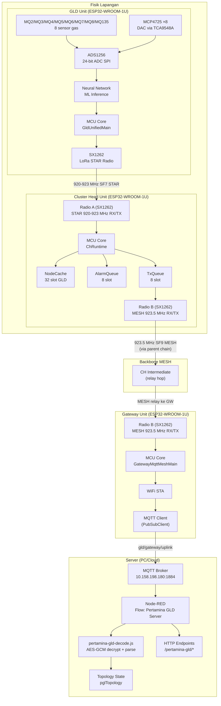
```mermaid
graph TB
    subgraph PHYSICAL["Fisik Lapangan"]
        subgraph GLD_BOX["GLD Unit (ESP32-WROOM-1U)"]
            SENSORS["MQ2/MQ3/MQ4/MQ5/MQ6/MQ7/MQ8/MQ135\n8 sensor gas"]
            ADS["ADS1256\n24-bit ADC SPI"]
            DAC["MCP4725 ×8\nDAC via TCA9548A"]
            ML["Neural Network\nML Inference"]
            GLDMCU["MCU Core\nGldUnifiedMain"]
            LORA_GLD["SX1262\nLoRa STAR Radio"]
        end

        subgraph CH_BOX["Cluster Head Unit (ESP32-WROOM-1U)"]
            RADIO_A["Radio A (SX1262)\nSTAR 920-923 MHz RX/TX"]
            RADIO_B["Radio B (SX1262)\nMESH 923.5 MHz RX/TX"]
            CACHE["NodeCache\n32 slot GLD"]
            ALARM_Q["AlarmQueue\n8 slot"]
            TX_Q["TxQueue\n8 slot"]
            CHMCU["MCU Core\nChRuntime"]
        end
    end

    subgraph BACKBONE["Backbone MESH"]
        CH_MID["CH Intermediate\n(relay hop)"]
    end

    subgraph GW_BOX["Gateway Unit (ESP32-WROOM-1U)"]
        RADIO_GW["Radio B (SX1262)\nMESH 923.5 MHz RX/TX"]
        WIFI["WiFi STA"]
        MQTTC["MQTT Client\n(PubSubClient)"]
        GWMCU["MCU Core\nGatewayMqttMeshMain"]
    end

    subgraph SERVER_BOX["Server (PC/Cloud)"]
        BROKER["MQTT Broker\n10.158.198.180:1884"]
        NODERED["Node-RED\nFlow: Pertamina GLD Server"]
        DECODE["pertamina-gld-decode.js\nAES-GCM decrypt + parse"]
        TOPO["Topology State\npglTopology"]
        HTTP["HTTP Endpoints\n/pertamina-gld/*"]
    end

    SENSORS --> ADS
    ADS --> ML
    ML --> GLDMCU
    GLDMCU --> LORA_GLD
    DAC --> ADS

    LORA_GLD -->|"920-923 MHz SF7 STAR"| RADIO_A
    RADIO_A --> CHMCU
    CHMCU --> CACHE
    CHMCU --> ALARM_Q
    CHMCU --> TX_Q
    TX_Q --> RADIO_B

    RADIO_B -->|"923.5 MHz SF9 MESH\n(via parent chain)"| CH_MID
    CH_MID -->|"MESH relay ke GW"| RADIO_GW

    RADIO_GW --> GWMCU
    GWMCU --> WIFI
    WIFI --> MQTTC
    MQTTC -->|"gld/gateway/uplink"| BROKER

    BROKER --> NODERED
    NODERED --> DECODE
    DECODE --> TOPO
    NODERED --> HTTP
```

*Gambar 2: Arsitektur end-to-end lengkap dengan komponen internal setiap node.*

---

### Diagram Jalur Komunikasi

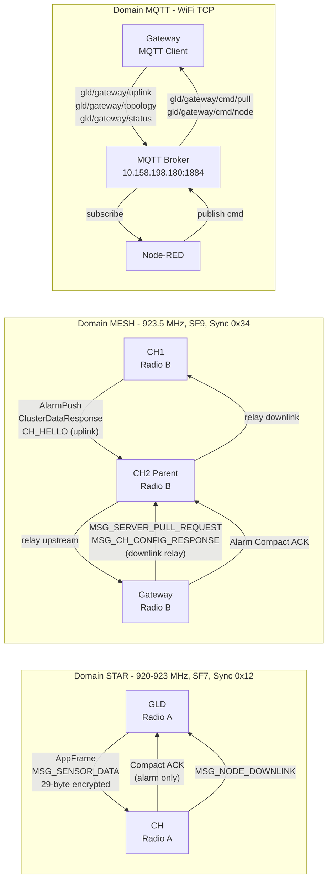
```mermaid
flowchart LR
    subgraph STAR_DOMAIN["Domain STAR - 920-923 MHz, SF7, Sync 0x12"]
        G1["GLD\nRadio A"] -->|"AppFrame\nMSG_SENSOR_DATA\n29-byte encrypted"| C1["CH\nRadio A"]
        C1 -->|"Compact ACK\n(alarm only)"| G1
        C1 -->|"MSG_NODE_DOWNLINK"| G1
    end

    subgraph MESH_DOMAIN["Domain MESH - 923.5 MHz, SF9, Sync 0x34"]
        C1M["CH1\nRadio B"] -->|"AlarmPush\nClusterDataResponse\nCH_HELLO (uplink)"| CHN["CH2 Parent\nRadio B"]
        CHN -->|"relay upstream"| GWR["Gateway\nRadio B"]
        GWR -->|"MSG_SERVER_PULL_REQUEST\nMSG_CH_CONFIG_RESPONSE\n(downlink relay)"| CHN
        CHN -->|"relay downlink"| C1M
        GWR -->|"Alarm Compact ACK"| CHN
    end

    subgraph MQTT_DOMAIN["Domain MQTT - WiFi TCP"]
        GWR2["Gateway\nMQTT Client"] -->|"gld/gateway/uplink\ngld/gateway/topology\ngld/gateway/status"| BRK["MQTT Broker\n10.158.198.180:1884"]
        BRK -->|"gld/gateway/cmd/pull\ngld/gateway/cmd/node"| GWR2
        BRK -->|"subscribe"| NRD["Node-RED"]
        NRD -->|"publish cmd"| BRK
    end
```

*Gambar 3: Tiga domain komunikasi: STAR (GLD ke CH, kiri), MESH (CH parent-child ke GW, tengah), MQTT (GW ke Server, kanan).*

---

### Penjelasan Per Jalur

| Jalur | Frekuensi | SF | Sync Word | Max Payload | Arah |
|---|---|---|---|---|---|
| **LoRa STAR** | 920-923 MHz (per-CH berbeda) | SF7 | `0x12` | 64 bytes | GLD ke CH (uplink), CH ke GLD (downlink) |
| **LoRa MESH** | 923.5 MHz | SF9 | `0x34` | 80 bytes | CH ke CH ke Gateway (bidirectional) |
| **MQTT/LAN** | WiFi TCP | — | — | 1024 bytes | Gateway ke Server |

> **Catatan:** Frekuensi deployment di atas adalah nilai operasional. Source config saat ini menggunakan 920.0 MHz (STAR) dan 921.0 MHz (MESH) — perlu diupdate sesuai deployment. Dua domain LoRa menggunakan sync word berbeda agar tidak saling mengganggu. CH memiliki dua radio fisik terpisah (Radio A = STAR, Radio B = MESH).

---

## 3. Peta Firmware Environment

### Visual Map PlatformIO

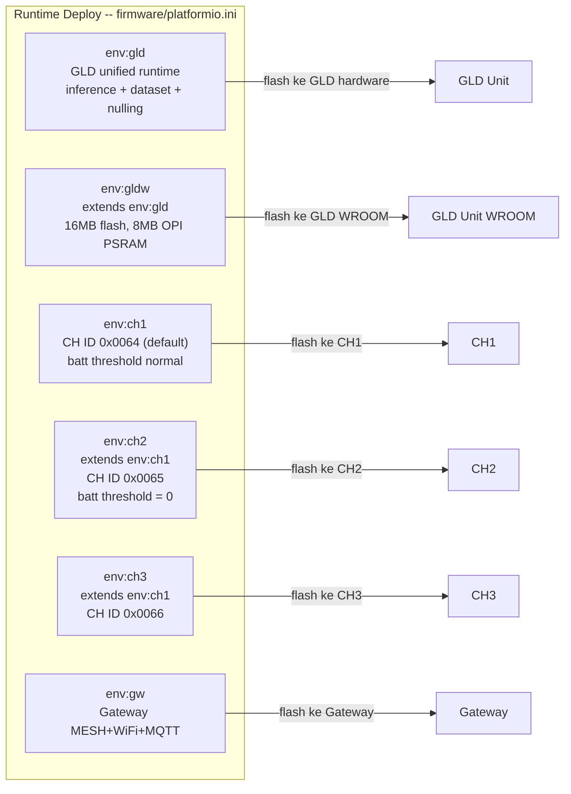
```mermaid
graph LR
    subgraph RUNTIME["Runtime Deploy -- firmware/platformio.ini"]
        GLD_ENV["env:gld\nGLD unified runtime\ninference + dataset + nulling"]
        GLDW_ENV["env:gldw\nextends env:gld\n16MB flash, 8MB OPI PSRAM"]
        CH1_ENV["env:ch1\nCH ID 0x0064 (default)\nbatt threshold normal"]
        CH2_ENV["env:ch2\nextends env:ch1\nCH ID 0x0065\nbatt threshold = 0"]
        CH3_ENV["env:ch3\nextends env:ch1\nCH ID 0x0066"]
        GW_ENV["env:gw\nGateway MESH+WiFi+MQTT"]
    end

    GLD_ENV -->|"flash ke GLD hardware"| HW_GLD["GLD Unit"]
    GLDW_ENV -->|"flash ke GLD WROOM"| HW_GLDW["GLD Unit WROOM"]
    CH1_ENV -->|"flash ke CH1"| HW_CH1["CH1"]
    CH2_ENV -->|"flash ke CH2"| HW_CH2["CH2"]
    CH3_ENV -->|"flash ke CH3"| HW_CH3["CH3"]
    GW_ENV -->|"flash ke Gateway"| HW_GW["Gateway"]
```

*Gambar 4: Peta environment PlatformIO — 6 runtime environment deploy ke hardware.*

---

### Tabel Fungsi Environment

| Env | Role | Fungsi |
|---|---|---|
| `gld` | GLD (ID 0xF001) | GLD unified: inference + dataset + nulling |
| `gldw` | GLD (ID 0xF001) | GLD unified, 16MB flash, 8MB PSRAM (WROOM variant) |
| `ch1` | CH (ID 0x0064) | CH runtime default, batt threshold normal |
| `ch2` | CH (ID 0x0065) | CH runtime, batt threshold = 0 |
| `ch3` | CH (ID 0x0066) | CH runtime |
| `gw` | Gateway (ID 0x006F) | Gateway MESH+WiFi+MQTT bridge ke server |

> **Penting:** 6 environment di atas adalah satu-satunya yang digunakan untuk deploy ke hardware (`firmware/platformio.ini`). Environment bench/selftest dan support/legacy ada di folder terpisah dan bukan untuk produksi.

---

## 4. GLD Node

### Diagram Internal GLD

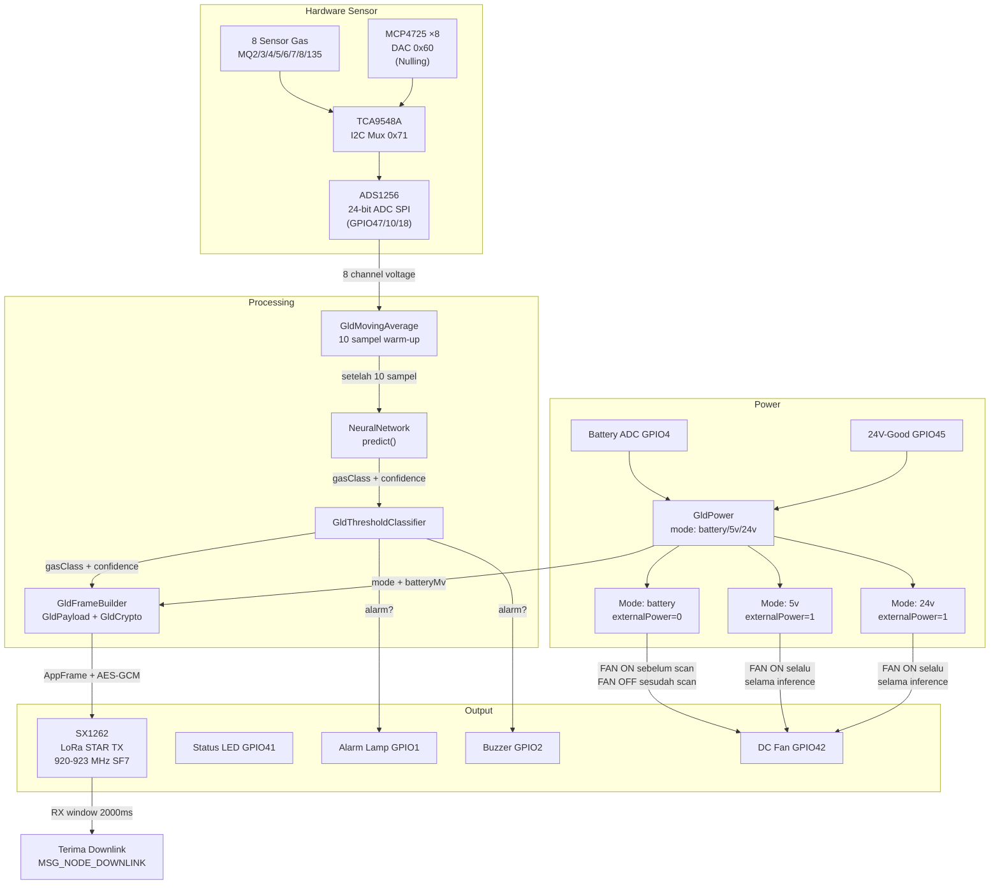
```mermaid
flowchart TD
    subgraph SENSOR_BLOCK["Hardware Sensor"]
        MQ["8 Sensor Gas\nMQ2/3/4/5/6/7/8/135"]
        TCA["TCA9548A\nI2C Mux 0x71"]
        MCP["MCP4725 ×8\nDAC 0x60\n(Nulling)"]
        ADS["ADS1256\n24-bit ADC SPI\n(GPIO47/10/18)"]
    end

    subgraph PROC_BLOCK["Processing"]
        MA["GldMovingAverage\n10 sampel warm-up"]
        TC["GldThresholdClassifier"]
        NN["NeuralNetwork\npredict()"]
        FM["GldFrameBuilder\nGldPayload + GldCrypto"]
    end

    subgraph OUTPUT_BLOCK["Output"]
        LORA["SX1262\nLoRa STAR TX\n920-923 MHz SF7"]
        LED["Status LED GPIO41"]
        LAMP["Alarm Lamp GPIO1"]
        BUZ["Buzzer GPIO2"]
        FAN["DC Fan GPIO42"]
    end

    subgraph POWER_BLOCK["Power"]
        BATT["Battery ADC GPIO4"]
        PWR24["24V-Good GPIO45"]
        POWER["GldPower\nmode: battery/5v/24v"]
        PMODE_BATT["Mode: battery\nexternalPower=0"]
        PMODE_5V["Mode: 5v\nexternalPower=1"]
        PMODE_24V["Mode: 24v\nexternalPower=1"]
    end

    MQ --> TCA
    TCA --> ADS
    MCP --> TCA
    ADS -->|"8 channel voltage"| MA
    MA -->|"setelah 10 sampel"| NN
    NN -->|"gasClass + confidence"| TC
    TC -->|"alarm?"| LAMP
    TC -->|"alarm?"| BUZ
    TC -->|"gasClass + confidence"| FM

    BATT --> POWER
    PWR24 --> POWER
    POWER --> PMODE_BATT
    POWER --> PMODE_5V
    POWER --> PMODE_24V
    POWER -->|"mode + batteryMv"| FM

    PMODE_BATT -->|"FAN ON sebelum scan\nFAN OFF sesudah scan"| FAN
    PMODE_5V -->|"FAN ON selalu\nselama inference"| FAN
    PMODE_24V -->|"FAN ON selalu\nselama inference"| FAN

    FM -->|"AppFrame + AES-GCM"| LORA
    LORA -->|"RX window 2000ms"| DOWNLINK_RX["Terima Downlink\nMSG_NODE_DOWNLINK"]
```

*Gambar 5: Diagram internal GLD Node — sensor ke frame LoRa, termasuk kontrol DC Fan dan 3 mode power.*

> **Catatan:** DC Fan (GPIO42) pada inference mode adalah design intent. Firmware saat ini belum mengimplementasikan kontrol fan di inference loop — perlu firmware update.

---

### Diagram Mode GLD

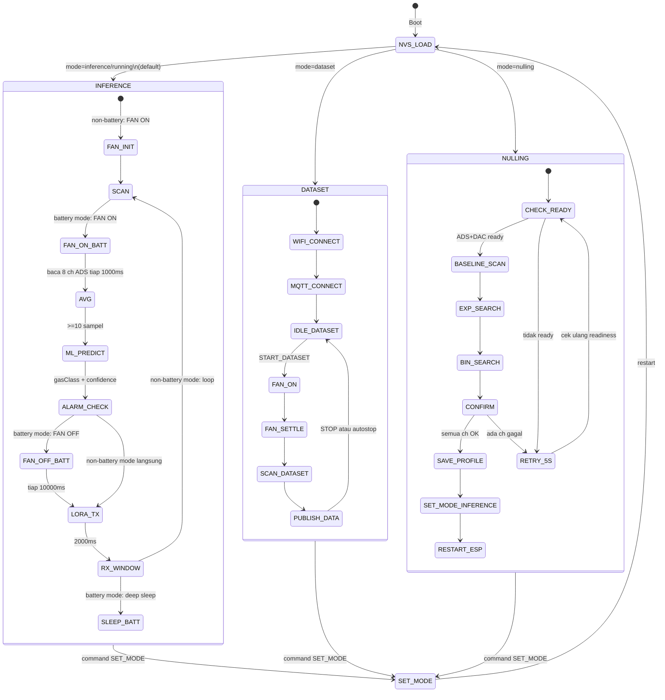
```mermaid
stateDiagram-v2
    [*] --> NVS_LOAD : Boot
    NVS_LOAD --> INFERENCE : mode=inference/running\n(default)
    NVS_LOAD --> DATASET : mode=dataset
    NVS_LOAD --> NULLING : mode=nulling

    state INFERENCE {
        [*] --> FAN_INIT : non-battery: FAN ON
        FAN_INIT --> SCAN
        SCAN --> FAN_ON_BATT : battery mode: FAN ON
        FAN_ON_BATT --> AVG : baca 8 ch ADS tiap 1000ms
        AVG --> ML_PREDICT : >=10 sampel
        ML_PREDICT --> ALARM_CHECK : gasClass + confidence
        ALARM_CHECK --> FAN_OFF_BATT : battery mode: FAN OFF
        FAN_OFF_BATT --> LORA_TX : tiap 10000ms
        ALARM_CHECK --> LORA_TX : non-battery mode langsung
        LORA_TX --> RX_WINDOW : 2000ms
        RX_WINDOW --> SLEEP_BATT : battery mode: deep sleep
        RX_WINDOW --> SCAN : non-battery mode: loop
    }

    state DATASET {
        [*] --> WIFI_CONNECT
        WIFI_CONNECT --> MQTT_CONNECT
        MQTT_CONNECT --> IDLE_DATASET
        IDLE_DATASET --> FAN_ON : START_DATASET
        FAN_ON --> FAN_SETTLE
        FAN_SETTLE --> SCAN_DATASET
        SCAN_DATASET --> PUBLISH_DATA
        PUBLISH_DATA --> IDLE_DATASET : STOP atau autostop
    }

    state NULLING {
        [*] --> CHECK_READY
        CHECK_READY --> BASELINE_SCAN : ADS+DAC ready
        CHECK_READY --> RETRY_5S : tidak ready
        BASELINE_SCAN --> EXP_SEARCH
        EXP_SEARCH --> BIN_SEARCH
        BIN_SEARCH --> CONFIRM
        CONFIRM --> SAVE_PROFILE : semua ch OK
        SAVE_PROFILE --> SET_MODE_INFERENCE
        SET_MODE_INFERENCE --> RESTART_ESP
        CONFIRM --> RETRY_5S : ada ch gagal
        RETRY_5S --> CHECK_READY : cek ulang readiness
    }

    INFERENCE --> SET_MODE : command SET_MODE
    DATASET --> SET_MODE : command SET_MODE
    NULLING --> SET_MODE : command SET_MODE
    SET_MODE --> NVS_LOAD : restart
```

*Gambar 6: Diagram mode GLD — inference (dengan fan dan sleep battery), dataset, dan nulling.*

> **Catatan design intent:** Sleep setelah RX_WINDOW pada mode battery dan kontrol DC Fan di inference loop adalah design intent yang belum diimplementasikan di firmware saat ini — keduanya perlu firmware update.

---

### Tabel Pin/Config Penting GLD

| Fungsi | Pin/Nilai |
|---|---|
| SPI SCK/MOSI/MISO | GPIO12/GPIO11/GPIO13 |
| ADS1256 CS/DRDY/SYNC | GPIO47/GPIO10/GPIO18 |
| LoRa CS/RST/BUSY/DIO1 | GPIO15/GPIO39/GPIO7/GPIO40 (4D) |
| LoRa RXEN/TXEN | GPIO5/GPIO6 |
| I2C SDA/SCL | GPIO8/GPIO9 |
| TCA9548A | I2C `0x71` |
| MCP4725 (DAC) | I2C `0x60`, range 0–4095 |
| Status LED | GPIO41 |
| Alarm Lamp | GPIO1 (4D) / disabled WROOM |
| Buzzer | GPIO2 (4D) / disabled WROOM |
| DC Fan | GPIO42 |
| Battery ADC | GPIO4 |
| 24V Power-Good | GPIO45 |
| TPL5110 DONE | GPIO14 (OUTPUT LOW saat init) |

**WROOM profile overrides:** LoRa CS/RST/BUSY/DIO1 → GPIO7/GPIO2/GPIO15/GPIO1; Alarm Lamp/Buzzer → disabled (`-1`).

---

### Tabel Sensor Order dan MUX

| HW Channel | Sensor | TCA Mux Ch | Model Input |
|---:|---|---:|---:|
| 0 | MQ8 | 7 | 0 |
| 1 | MQ135 | 6 | 2 |
| 2 | MQ3 | 5 | 5 |
| 3 | MQ5 | 4 | 3 |
| 4 | MQ4 | 3 | 4 |
| 5 | MQ7 | 2 | 6 |
| 6 | MQ6 | 0 | 1 |
| 7 | MQ2 | 1 | 7 |

---

### Tabel Command GLD

| Command | Parameter | Serial (CDC/UART0) | MQTT | LoRa Downlink |
|---|---|:---:|:---:|:---:|
| `SET_MODE inference` | mode=0 | Ya | Ya (topic /cmd) | Ya (byte[0]=0x01, byte[1]=0) |
| `SET_MODE dataset` | mode=1 | Ya | Ya (topic /cmd) | Ya (byte[0]=0x01, byte[1]=1) |
| `SET_MODE nulling` | mode=2 | Ya | Ya (topic /cmd) | Ya (byte[0]=0x01, byte[1]=2) |
| `SET_MODE running` | alias inference | Ya | Ya (topic /cmd) | Tidak |
| `DEBUG_ON` | — | Ya | Tidak | Tidak |
| `DEBUG_OFF` | — | Ya | Tidak | Tidak |
| `START_DATASET` | label, target, dll | Tidak | Ya (topic /dataset) | Tidak |
| `STOP_DATASET` | — | Tidak | Ya (topic /dataset) | Tidak |

MQTT topic: `gas-leak-detector/F001/cmd` untuk mode; `gas-leak-detector/F001/dataset` untuk dataset.

LoRa Downlink via `MSG_NODE_DOWNLINK`: dikirim dari CH ke GLD setelah CMD diterima dari Server.

---

### Model ML dan Alarm Rule

**Alarm rule (dari source):**
```
alarm = gasClass != clearGas (0) && confidence >= 30
```

| Model Class | Protocol Gas Class | Nama Gas |
|---:|---:|---|
| 0 | 0 | clearGas |
| 1 | 1 | LPG |
| 2 | 4 | methane |
| 3 | 2 | propane |
| 4 | 3 | butane |
| lainnya | 6 | anomaly |

> **Catatan:** Confidence disimpan sebagai `uint8_t(confidenceFloat * 100.0f)`. Nilai valid 0–100.

---

---

## Normal Data Flow

### Sequence Diagram Normal Data Flow

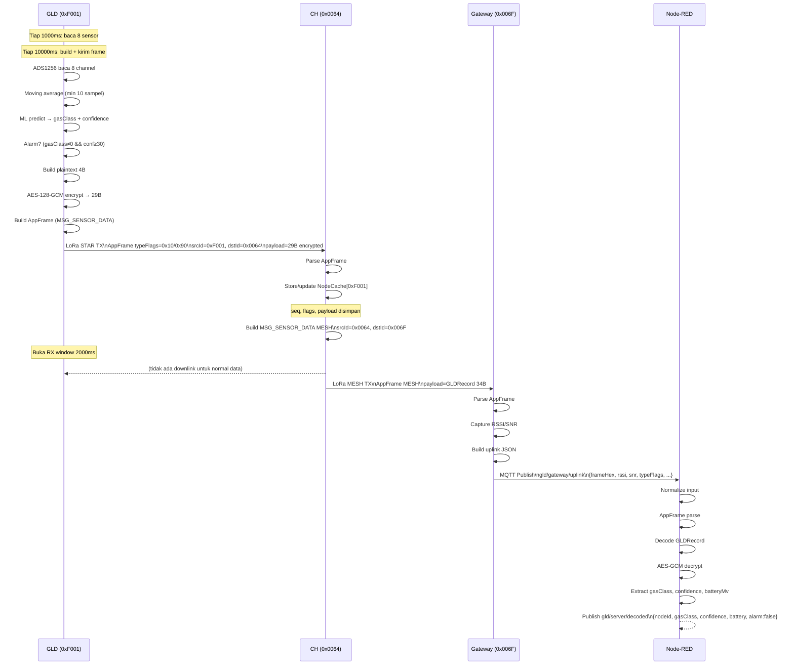
```mermaid
sequenceDiagram
    participant GLD as GLD (0xF001)
    participant CH as CH (0x0064)
    participant GW as Gateway (0x006F)
    participant NR as Node-RED

    Note over GLD: Tiap 1000ms: baca 8 sensor
    Note over GLD: Tiap 10000ms: build + kirim frame

    GLD->>GLD: ADS1256 baca 8 channel
    GLD->>GLD: Moving average (min 10 sampel)
    GLD->>GLD: ML predict → gasClass + confidence
    GLD->>GLD: Alarm? (gasClass≠0 && conf≥30)
    GLD->>GLD: Build plaintext 4B
    GLD->>GLD: AES-128-GCM encrypt → 29B
    GLD->>GLD: Build AppFrame (MSG_SENSOR_DATA)

    GLD->>CH: LoRa STAR TX\nAppFrame typeFlags=0x10/0x90\nsrcId=0xF001, dstId=0x0064\npayload=29B encrypted

    CH->>CH: Parse AppFrame
    CH->>CH: Store/update NodeCache[0xF001]
    Note over CH: seq, flags, payload disimpan

    CH->>CH: Build MSG_SENSOR_DATA MESH\nsrcId=0x0064, dstId=0x006F

    Note over GLD: Buka RX window 2000ms
    CH-->>GLD: (tidak ada downlink untuk normal data)

    CH->>GW: LoRa MESH TX\nAppFrame MESH\npayload=GLDRecord 34B

    GW->>GW: Parse AppFrame
    GW->>GW: Capture RSSI/SNR
    GW->>GW: Build uplink JSON

    GW->>NR: MQTT Publish\ngld/gateway/uplink\n{frameHex, rssi, snr, typeFlags, ...}

    NR->>NR: Normalize input
    NR->>NR: AppFrame parse
    NR->>NR: Decode GLDRecord
    NR->>NR: AES-GCM decrypt
    NR->>NR: Extract gasClass, confidence, batteryMv

    NR-->>NR: Publish gld/server/decoded\n{nodeId, gasClass, confidence, battery, alarm:false}
```

*Gambar 13: Sequence diagram alur data normal GLD → CH → Gateway → Node-RED.*

---

### Tabel Input/Output Per Tahap — Normal Flow

| Tahap | Input | Proses | Output |
|---|---|---|---|
| GLD Scan | Tegangan ADS1256 × 8 | Moving avg + ML predict | gasClass, confidence, batteryMv |
| GLD Encode | 4-byte plaintext | AES-128-GCM + AppFrame | 29-byte encrypted dalam frame |
| CH Cache | AppFrame STAR | Parse + NodeCache update | GLDRecord dalam cache |
| CH MESH TX | NodeCache entry | Build MSG_SENSOR_DATA MESH | AppFrame MESH ke GW |
| GW Receive | AppFrame MESH | Parse + RSSI/SNR | JSON uplink |
| GW Publish | JSON uplink | PubSubClient.publish | MQTT `gld/gateway/uplink` |
| NR Decode | JSON dengan frameHex | AppFrame + GLD + AES-GCM | `gld/server/decoded` |

---


---

## Alarm Flow

### Sequence Diagram Alarm

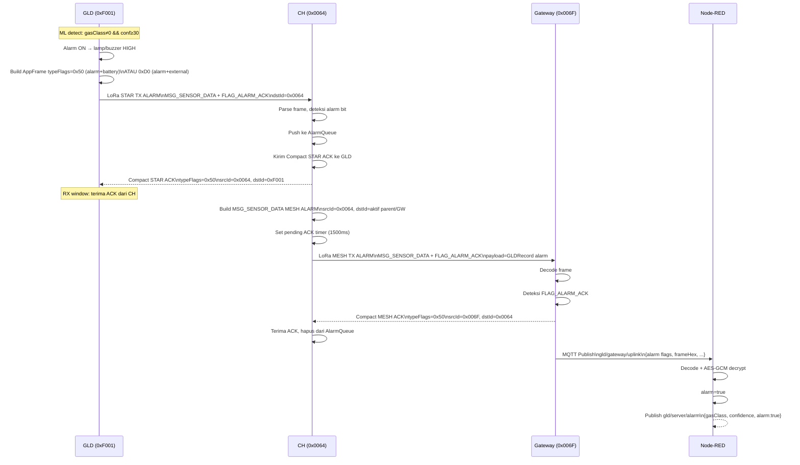
```mermaid
sequenceDiagram
    participant GLD as GLD (0xF001)
    participant CH as CH (0x0064)
    participant GW as Gateway (0x006F)
    participant NR as Node-RED

    Note over GLD: ML detect: gasClass≠0 && conf≥30

    GLD->>GLD: Alarm ON → lamp/buzzer HIGH
    GLD->>GLD: Build AppFrame typeFlags=0x50 (alarm+battery)\nATAU 0xD0 (alarm+external)

    GLD->>CH: LoRa STAR TX ALARM\nMSG_SENSOR_DATA + FLAG_ALARM_ACK\ndstId=0x0064

    CH->>CH: Parse frame, deteksi alarm bit
    CH->>CH: Push ke AlarmQueue
    CH->>CH: Kirim Compact STAR ACK ke GLD

    CH-->>GLD: Compact STAR ACK\ntypeFlags=0x50\nsrcId=0x0064, dstId=0xF001

    Note over GLD: RX window: terima ACK dari CH

    CH->>CH: Build MSG_SENSOR_DATA MESH ALARM\nsrcId=0x0064, dstId=aktif parent/GW
    CH->>CH: Set pending ACK timer (1500ms)

    CH->>GW: LoRa MESH TX ALARM\nMSG_SENSOR_DATA + FLAG_ALARM_ACK\npayload=GLDRecord alarm

    GW->>GW: Decode frame
    GW->>GW: Deteksi FLAG_ALARM_ACK

    GW-->>CH: Compact MESH ACK\ntypeFlags=0x50\nsrcId=0x006F, dstId=0x0064

    CH->>CH: Terima ACK, hapus dari AlarmQueue

    GW->>NR: MQTT Publish\ngld/gateway/uplink\n{alarm flags, frameHex, ...}

    NR->>NR: Decode + AES-GCM decrypt
    NR->>NR: alarm=true

    NR-->>NR: Publish gld/server/alarm\n{gasClass, confidence, alarm:true}
```

*Gambar 14: Sequence diagram alarm flow — dari deteksi GLD hingga server.*

---

### Diagram Queue/ACK Alarm

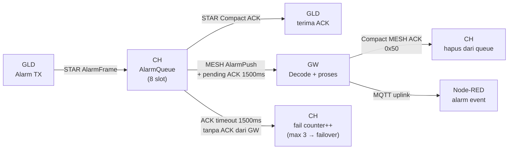
```mermaid
flowchart LR
    GLD_ALARM["GLD\nAlarm TX"] -->|"STAR AlarmFrame"| CH_QUEUE["CH\nAlarmQueue\n(8 slot)"]
    CH_QUEUE -->|"STAR Compact ACK"| GLD_ACK["GLD\nterima ACK"]
    CH_QUEUE -->|"MESH AlarmPush\n+ pending ACK 1500ms"| GW_PROC["GW\nDecode + proses"]
    GW_PROC -->|"Compact MESH ACK\n0x50"| CH_ACK["CH\nhapus dari queue"]
    GW_PROC -->|"MQTT uplink"| NR["Node-RED\nalarm event"]

    CH_QUEUE -->|"ACK timeout 1500ms\ntanpa ACK dari GW"| FAIL_COUNT["CH\nfail counter++\n(max 3 → failover)"]
```

*Gambar 15: Mekanisme queue dan ACK alarm CH.*

---

### Tabel Alarm Flags

| Flag | Nilai | Penggunaan |
|---|---|---|
| `FLAG_ALARM_ACK` | `0x40` | Bit alarm dalam typeFlags |
| `FLAG_GLD_EXT_POWER` | `0x80` | Bit external power dalam typeFlags |
| `NC_FLAG_ALARM` | `0x01` | Flag alarm dalam GLDRecord/NodeCache |
| `NC_FLAG_EXT_POWER` | `0x10` | Flag external power dalam GLDRecord |

> **Caveat:** Saat ini `checkAlarmAckTimeout()` CH hanya log timeout, hapus item dari AlarmQueue, dan increment counter — **tidak retry** alarm frame yang sama. Parent failover terpicu jika counter mencapai threshold 3, dan RECOVERY (restart ESP) terpicu jika no-ACK burst mencapai 5.

---


---

## Dataset Mode Flow

### Flowchart Dataset Mode

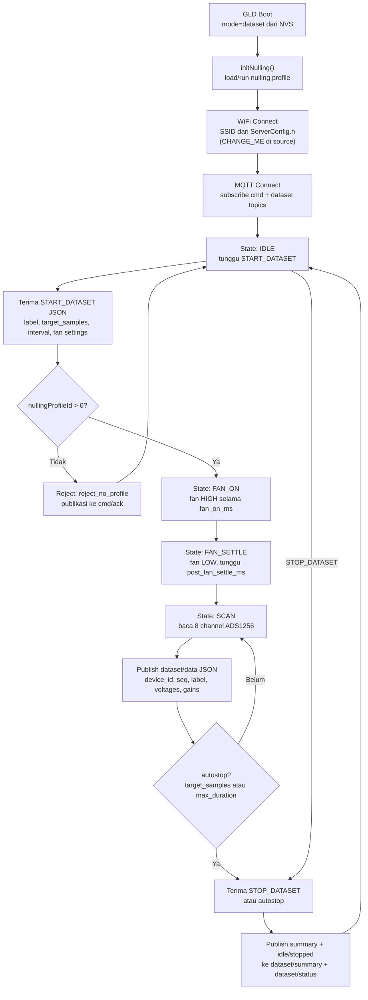
```mermaid
flowchart TD
    BOOT["GLD Boot\nmode=dataset dari NVS"]
    INIT_NULL["initNulling()\nload/run nulling profile"]
    WIFI["WiFi Connect\nSSID dari ServerConfig.h\n(CHANGE_ME di source)"]
    MQTT_CONN["MQTT Connect\nsubscribe cmd + dataset topics"]
    IDLE["State: IDLE\ntunggu START_DATASET"]
    CMD_IN["Terima START_DATASET JSON\nlabel, target_samples, interval, fan settings"]

    CHECK_PROFILE{nullingProfileId > 0?}
    REJECT["Reject: reject_no_profile\npublikasi ke cmd/ack"]

    FAN_ON["State: FAN_ON\nfan HIGH selama fan_on_ms"]
    FAN_SETTLE["State: FAN_SETTLE\nfan LOW, tunggu post_fan_settle_ms"]
    SCAN["State: SCAN\nbaca 8 channel ADS1256"]
    PUBLISH["Publish dataset/data JSON\ndevice_id, seq, label, voltages, gains"]
    AUTO_STOP{autostop?\ntarget_samples atau max_duration}
    STOP_CMD["Terima STOP_DATASET\natau autostop"]
    SUMMARY["Publish summary + idle/stopped\nke dataset/summary + dataset/status"]

    BOOT --> INIT_NULL --> WIFI --> MQTT_CONN --> IDLE
    IDLE --> CMD_IN
    CMD_IN --> CHECK_PROFILE
    CHECK_PROFILE -->|"Tidak"| REJECT
    CHECK_PROFILE -->|"Ya"| FAN_ON
    REJECT --> IDLE
    FAN_ON --> FAN_SETTLE --> SCAN --> PUBLISH
    PUBLISH --> AUTO_STOP
    AUTO_STOP -->|"Belum"| SCAN
    AUTO_STOP -->|"Ya"| STOP_CMD
    IDLE -->|"STOP_DATASET"| STOP_CMD
    STOP_CMD --> SUMMARY --> IDLE
```

*Gambar 19: Flowchart dataset mode — inisialisasi, capture loop, dan autostop.*

---

### Tabel MQTT Topics Dataset

| Topic | Arah | Isi |
|---|---|---|
| `gas-leak-detector/F001/cmd` | Server → GLD | `{"cmd":"SET_MODE","mode":"..."}` |
| `gas-leak-detector/F001/dataset` | Server → GLD | `{"cmd":"START_DATASET" atau "STOP_DATASET", ...}` |
| `gas-leak-detector/F001/dataset/data` | GLD → Server | JSON data tiap scan |
| `gas-leak-detector/F001/dataset/status` | GLD → Server | Status idle/running/stopped |
| `gas-leak-detector/F001/dataset/summary` | GLD → Server | Ringkasan sesi dataset |
| `gas-leak-detector/F001/cmd/ack` | GLD → Server | Ack command (termasuk reject) |

---

### Tabel Field JSON Dataset Data

| Field | Keterangan |
|---|---|
| `device_id` | `"F001"` |
| `node_id` | `0xF001` numerik |
| `mode` | `"DATASET"` |
| `seq` | Sequence dataset |
| `timestamp_ms` | `millis()` |
| `label` | Label dari START_DATASET |
| `nulling_profile_id` | Profile ID yang dipakai |
| `sensor_voltage` | Array 8 tegangan (float) |
| `sensor_gain` | Array 8 gain/status dari pembacaan |
| `feature_order` | Nama sensor dalam urutan hardware |

---

### Parameter START_DATASET

| Field | Default | Keterangan |
|---|---|---|
| `label` | `"unknown"` | Label untuk data capture |
| `target_samples` | 0 | 0 = infinite |
| `sample_interval_ms` | 1000 | Interval antar scan |
| `max_duration_ms` | 0 | 0 = infinite |
| `use_fan_intake` | true | Gunakan kipas intake |
| `fan_on_ms` | 1000 | Durasi kipas menyala |
| `post_fan_settle_ms` | 0 | Settle setelah kipas mati |

---


---

## Nulling Mode Flow

### Flowchart Nulling Mode

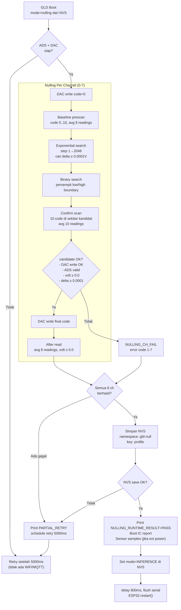
```mermaid
flowchart TD
    START["GLD Boot\nmode=nulling dari NVS"]
    CHECK_HW{ADS + DAC\nsiap?}
    RETRY_5S["Retry setelah 5000ms\n(tidak ada WiFi/MQTT)"]

    subgraph NULLING_LOOP["Nulling Per Channel (0-7)"]
        ZERO["DAC write code=0"]
        BASELINE["Baseline prescan\ncode 0..10, avg 8 readings"]
        EXP["Exponential search\nstep 1→2048\ncari delta ≥ 0.0001V"]
        BIN["Binary search\npersempit low/high boundary"]
        CONFIRM["Confirm scan\n10 code di sekitar kandidat\navg 10 readings"]
        ACCEPT{candidate OK?\n- DAC write OK\n- ADS valid\n- volt ≥ 0.0\n- delta ≥ 0.0001}
        DAC_FINAL["DAC write final code"]
        AFTER_READ["After read\navg 8 readings, volt ≥ 0.0"]
    end

    CHECK_ALL{Semua 8 ch\nberhasil?}
    SAVE_PROFILE["Simpan NVS\nnamespace: gld-null\nkey: profile"]
    SAVE_OK{NVS save OK?}
    PRINT_PASS["Print NULLING_RUNTIME_RESULT=PASS\nBoot IC report\nSensor samples (jika ext power)"]
    SET_INFERENCE["Set mode=INFERENCE di NVS"]
    RESTART["delay 800ms, flush serial\nESP32.restart()"]
    PARTIAL["Print PARTIAL_RETRY\nschedule retry 5000ms"]

    START --> CHECK_HW
    CHECK_HW -->|"Tidak"| RETRY_5S
    CHECK_HW -->|"Ya"| ZERO

    ZERO --> BASELINE --> EXP --> BIN --> CONFIRM
    CONFIRM --> ACCEPT
    ACCEPT -->|"Ya"| DAC_FINAL
    ACCEPT -->|"Tidak"| CH_FAIL["NULLING_CH_FAIL\nerror code 1-7"]
    DAC_FINAL --> AFTER_READ
    AFTER_READ --> CHECK_ALL
    CH_FAIL --> CHECK_ALL

    CHECK_ALL -->|"Ya"| SAVE_PROFILE
    CHECK_ALL -->|"Ada gagal"| PARTIAL
    SAVE_PROFILE --> SAVE_OK
    SAVE_OK -->|"Ya"| PRINT_PASS
    SAVE_OK -->|"Tidak"| PARTIAL
    PRINT_PASS --> SET_INFERENCE --> RESTART
    PARTIAL --> RETRY_5S
```

*Gambar 20: Flowchart nulling mode — per-channel calibration loop.*

---

### Diagram Relasi DAC/MUX/ADS

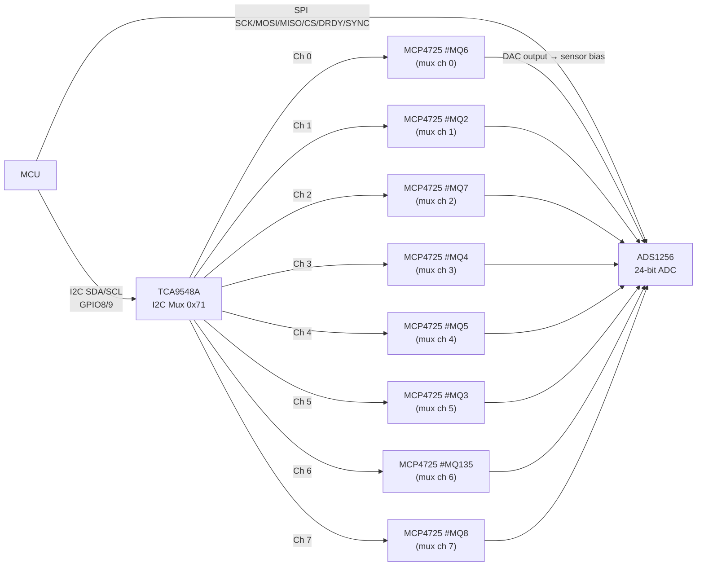
```mermaid
graph LR
    MCU["MCU"] -->|"I2C SDA/SCL\nGPIO8/9"| TCA["TCA9548A\nI2C Mux 0x71"]
    TCA -->|"Ch 0"| MQ6_DAC["MCP4725 #MQ6\n(mux ch 0)"]
    TCA -->|"Ch 1"| MQ2_DAC["MCP4725 #MQ2\n(mux ch 1)"]
    TCA -->|"Ch 2"| MQ7_DAC["MCP4725 #MQ7\n(mux ch 2)"]
    TCA -->|"Ch 3"| MQ4_DAC["MCP4725 #MQ4\n(mux ch 3)"]
    TCA -->|"Ch 4"| MQ5_DAC["MCP4725 #MQ5\n(mux ch 4)"]
    TCA -->|"Ch 5"| MQ3_DAC["MCP4725 #MQ3\n(mux ch 5)"]
    TCA -->|"Ch 6"| MQ135_DAC["MCP4725 #MQ135\n(mux ch 6)"]
    TCA -->|"Ch 7"| MQ8_DAC["MCP4725 #MQ8\n(mux ch 7)"]

    MCU -->|"SPI SCK/MOSI/MISO/CS/DRDY/SYNC"| ADS["ADS1256\n24-bit ADC"]
    MQ6_DAC -->|"DAC output → sensor bias"| ADS
    MQ2_DAC --> ADS
    MQ7_DAC --> ADS
    MQ4_DAC --> ADS
    MQ5_DAC --> ADS
    MQ3_DAC --> ADS
    MQ135_DAC --> ADS
    MQ8_DAC --> ADS
```

*Gambar 21: Relasi DAC (MCP4725 via TCA9548A) dan ADC (ADS1256) dalam nulling.*

---

### Tabel Threshold/Count/Timing Nulling

| Konstanta | Nilai | Keterangan |
|---|---|---|
| Average count | 8 | Jumlah sampel per rata-rata |
| Confirm count | 10 | Jumlah sampel per kandidat confirm |
| Baseline prescan max code | 10 | Kode DAC 0..10 untuk prescan |
| Exponential initial step | 1 | Step awal exponential search |
| Exponential max step | 2048 | Step maksimum sebelum berhenti |
| Confirm window | 10 DAC codes | Area konfirmasi di sekitar kandidat |
| Settle delay | 5 ms | Jeda setelah DAC write |
| Threshold | `0.0001 V` | Delta minimum yang diterima |
| Minimum final voltage | `0.0 V` | Tegangan akhir harus ≥ ini |

---

### Nulling Error Codes

| Code | Alasan Gagal |
|---:|---|
| 1 | `dac_zero_write_failed` |
| 2 | `baseline_no_valid_samples` |
| 3 | `exponential_range_not_found` |
| 4 | `confirm_failed` |
| 5 | `dac_final_write_failed` |
| 6 | `after_read_invalid` |
| 7 | `after_voltage_negative` |

> **Catatan:** Nulling mode berjalan **offline** — tidak ada WiFi, MQTT, atau LoRa. Setelah sukses, firmware otomatis mengubah mode ke `inference` dan restart ESP.

---

## 5. Cluster Head

### Diagram Internal CH

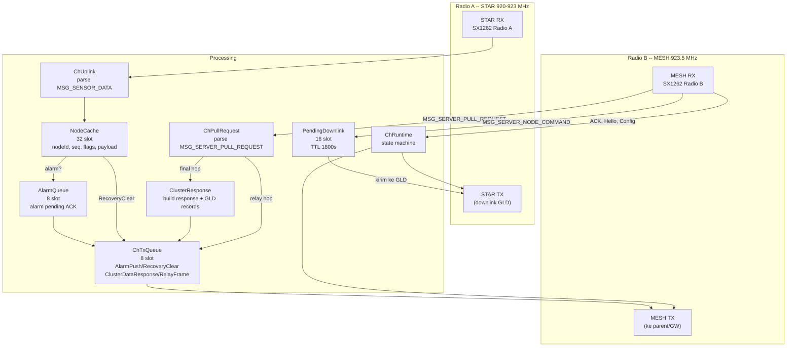
```mermaid
flowchart TD
    subgraph RADIO_A_BLOCK["Radio A -- STAR 920-923 MHz"]
        STAR_RX["STAR RX\nSX1262 Radio A"]
        STAR_TX["STAR TX\n(downlink GLD)"]
    end

    subgraph RADIO_B_BLOCK["Radio B -- MESH 923.5 MHz"]
        MESH_RX["MESH RX\nSX1262 Radio B"]
        MESH_TX["MESH TX\n(ke parent/GW)"]
    end

    subgraph PROCESSING["Processing"]
        UPLINK["ChUplink\nparse MSG_SENSOR_DATA"]
        CACHE["NodeCache\n32 slot\nnodeId, seq, flags, payload"]
        ALQ["AlarmQueue\n8 slot\nalarm pending ACK"]
        TXQ["ChTxQueue\n8 slot\nAlarmPush/RecoveryClear\nClusterDataResponse/RelayFrame"]
        PULL["ChPullRequest\nparse MSG_SERVER_PULL_REQUEST"]
        RESP["ClusterResponse\nbuild response + GLD records"]
        DWN["PendingDownlink\n16 slot\nTTL 1800s"]
        RUNTIME["ChRuntime\nstate machine"]
    end

    STAR_RX --> UPLINK
    UPLINK --> CACHE
    CACHE -->|"alarm?"| ALQ
    ALQ --> TXQ
    CACHE -->|"RecoveryClear"| TXQ
    MESH_RX -->|"MSG_SERVER_PULL_REQUEST"| PULL
    PULL -->|"final hop"| RESP
    RESP --> TXQ
    PULL -->|"relay hop"| TXQ
    MESH_RX -->|"MSG_SERVER_NODE_COMMAND"| DWN
    DWN -->|"kirim ke GLD"| STAR_TX
    TXQ --> MESH_TX
    MESH_RX -->|"ACK, Hello, Config"| RUNTIME
    RUNTIME --> STAR_TX
    RUNTIME --> MESH_TX
```

*Gambar 7: Diagram internal Cluster Head — dual radio, cache, queue, dan routing.*

---

### Diagram Dual Radio CH

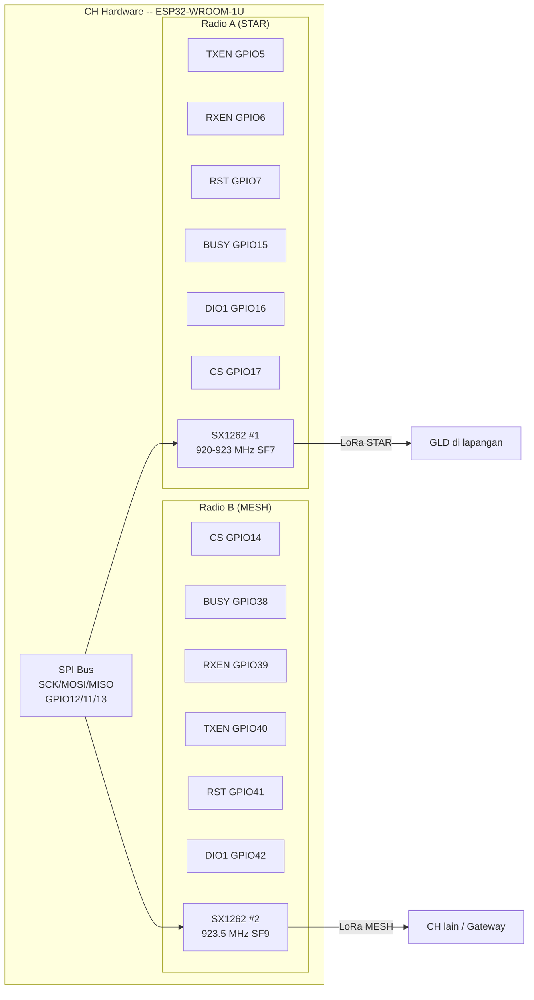
```mermaid
graph LR
    subgraph CH_HARDWARE["CH Hardware -- ESP32-WROOM-1U"]
        subgraph RADIO_A["Radio A (STAR)"]
            A_TXEN["TXEN GPIO5"]
            A_RXEN["RXEN GPIO6"]
            A_RST["RST GPIO7"]
            A_BUSY["BUSY GPIO15"]
            A_DIO1["DIO1 GPIO16"]
            A_CS["CS GPIO17"]
            SX1["SX1262 #1\n920-923 MHz SF7"]
        end

        subgraph RADIO_B["Radio B (MESH)"]
            B_CS["CS GPIO14"]
            B_BUSY["BUSY GPIO38"]
            B_RXEN["RXEN GPIO39"]
            B_TXEN["TXEN GPIO40"]
            B_RST["RST GPIO41"]
            B_DIO1["DIO1 GPIO42"]
            SX2["SX1262 #2\n923.5 MHz SF9"]
        end

        SPI["SPI Bus\nSCK/MOSI/MISO\nGPIO12/11/13"]
    end

    SPI --> SX1
    SPI --> SX2
    SX1 -->|"LoRa STAR"| GLD_FIELD["GLD di lapangan"]
    SX2 -->|"LoRa MESH"| NET["CH lain / Gateway"]
```

*Gambar 8: Dual radio CH — Radio A untuk STAR (GLD), Radio B untuk MESH (backbone).*

---

### Diagram State Machine CH

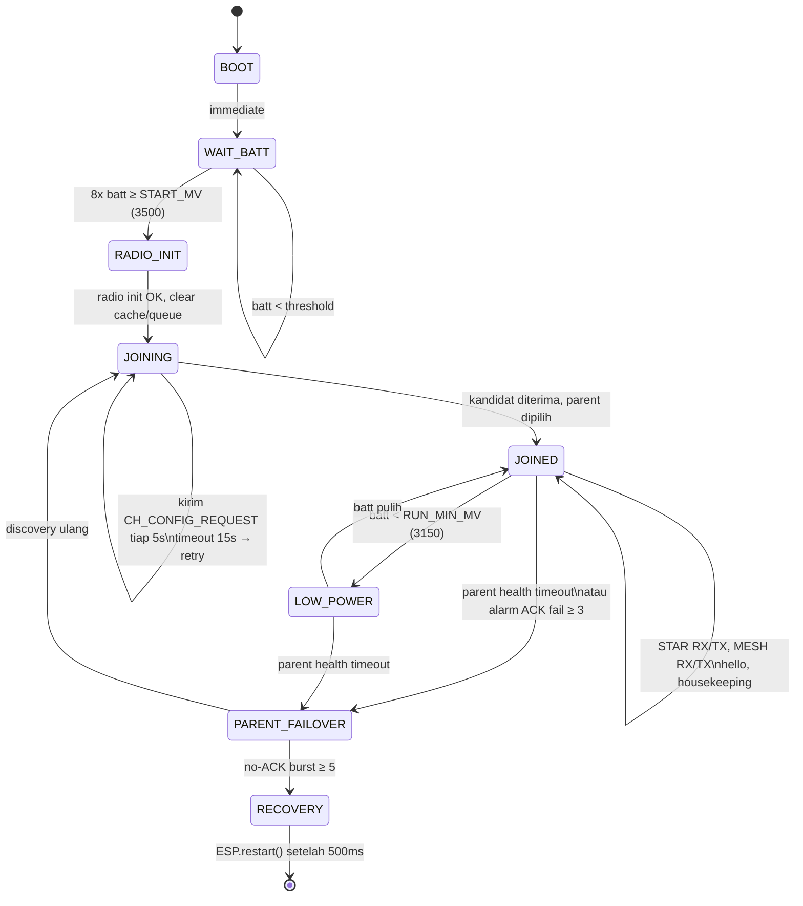
```mermaid
stateDiagram-v2
    [*] --> BOOT
    BOOT --> WAIT_BATT : immediate

    WAIT_BATT --> RADIO_INIT : 8x batt ≥ START_MV (3500)
    WAIT_BATT --> WAIT_BATT : batt < threshold

    RADIO_INIT --> JOINING : radio init OK, clear cache/queue

    JOINING --> JOINED : kandidat diterima, parent dipilih
    JOINING --> JOINING : kirim CH_CONFIG_REQUEST tiap 5s\ntimeout 15s → retry

    JOINED --> LOW_POWER : batt < RUN_MIN_MV (3150)
    JOINED --> PARENT_FAILOVER : parent health timeout\natau alarm ACK fail ≥ 3
    JOINED --> JOINED : STAR RX/TX, MESH RX/TX\nhello, housekeeping

    LOW_POWER --> JOINED : batt pulih
    LOW_POWER --> PARENT_FAILOVER : parent health timeout

    PARENT_FAILOVER --> JOINING : discovery ulang
    PARENT_FAILOVER --> RECOVERY : no-ACK burst ≥ 5

    RECOVERY --> [*] : ESP.restart() setelah 500ms
```

*Gambar 9: State machine Cluster Head — dari boot hingga operasi normal.*

---

### Tabel CH Identitas per Environment

| Env | CH ID | Hex | Battery Thresholds |
|---|---:|---|---|
| `ch1` | 100 | `0x0064` | Start: 3500mV, Run: 3150mV, Critical: 3100mV |
| `ch2` | 101 | `0x0065` | Semua = 0 (bench, batt tidak diperiksa) |
| `ch3` | 102 | `0x0066` | Start: 3500mV, Run: 3150mV, Critical: 3100mV |
| Gateway (root) | 111 | `0x006F` | — |

---

### Tabel Cache/Queue/Kapasitas CH

| Komponen | Kapasitas | TTL / Timeout |
|---|---:|---|
| NodeCache | 32 slot | Stale: 300s, Expire: 3600s |
| AlarmQueue | 8 slot | ACK timeout: 1500ms |
| MESH TX Queue | 8 slot | — |
| Pending Downlink | 16 slot | TTL: 1800000ms (30 menit) |
| Parent Candidates | 8 slot | — |

---

### Perilaku CH_HELLO dan Parent Discovery

**CH_HELLO payload** (11 byte):

| Offset | Field | Ukuran |
|---:|---|---:|
| 0–1 | CH ID | 2 |
| 2–3 | Parent ID | 2 |
| 4–5 | Battery mV | 2 |
| 6–7 | Uptime sec (low 16-bit) | 2 |
| 8 | Mesh depth | 1 |
| 9–10 | Alternate parent ID | 2 |

**Discovery timing:**

| Parameter | Nilai |
|---|---:|
| Joining timeout | 15000 ms |
| Config request interval | 5000 ms |
| Response base delay | 200 ms |
| Response slot gap | 280 ms |
| Slot count | 16 |
| Jitter formula | `20 + (CH_ID & 0x000F) * 30 + (millis() % 40)` ms |

---

## 6. Gateway

### Diagram Internal Gateway

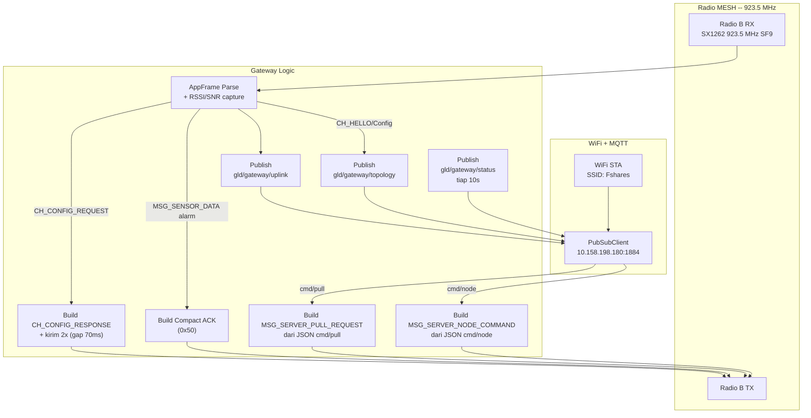
```mermaid
flowchart TD
    subgraph RADIO_BLOCK["Radio MESH -- 923.5 MHz"]
        MESH_RX_GW["Radio B RX\nSX1262 923.5 MHz SF9"]
        MESH_TX_GW["Radio B TX"]
    end

    subgraph WIFI_MQTT_BLOCK["WiFi + MQTT"]
        WIFI_GW["WiFi STA\nSSID: Fshares"]
        MQTTC_GW["PubSubClient\n10.158.198.180:1884"]
    end

    subgraph LOGIC["Gateway Logic"]
        PARSE_GW["AppFrame Parse\n+ RSSI/SNR capture"]
        PUB_UPLINK["Publish\ngld/gateway/uplink"]
        PUB_TOPO["Publish\ngld/gateway/topology"]
        PUB_STATUS["Publish\ngld/gateway/status\ntiap 10s"]
        CONFIG_RESP["Build CH_CONFIG_RESPONSE\n+ kirim 2x (gap 70ms)"]
        ALARM_ACK["Build Compact ACK\n(0x50)"]
        PULL_BUILD["Build MSG_SERVER_PULL_REQUEST\ndari JSON cmd/pull"]
        NODE_CMD["Build MSG_SERVER_NODE_COMMAND\ndari JSON cmd/node"]
    end

    MESH_RX_GW --> PARSE_GW
    PARSE_GW --> PUB_UPLINK
    PARSE_GW -->|"CH_HELLO/Config"| PUB_TOPO
    PARSE_GW -->|"CH_CONFIG_REQUEST"| CONFIG_RESP
    PARSE_GW -->|"MSG_SENSOR_DATA alarm"| ALARM_ACK
    CONFIG_RESP --> MESH_TX_GW
    ALARM_ACK --> MESH_TX_GW

    WIFI_GW --> MQTTC_GW
    PUB_UPLINK --> MQTTC_GW
    PUB_TOPO --> MQTTC_GW
    PUB_STATUS --> MQTTC_GW
    MQTTC_GW -->|"cmd/pull"| PULL_BUILD
    MQTTC_GW -->|"cmd/node"| NODE_CMD
    PULL_BUILD --> MESH_TX_GW
    NODE_CMD --> MESH_TX_GW
```

*Gambar 10: Diagram internal Gateway — MESH RX/TX dan MQTT bridge.*

---

### Tabel MQTT Topics Gateway

| Topic | Arah | Isi Payload |
|---|---|---|
| `gld/gateway/uplink` | GW → Server | JSON wrapper raw MESH frame (frameHex, rssi, snr, parse, typeFlags, ...) |
| `gld/gateway/topology` | GW → Server | JSON topology dari CH_HELLO, CH_CONFIG_REQUEST/RESPONSE |
| `gld/gateway/status` | GW → Server | JSON status: gatewayId, wifi, mqtt, meshReady, ip |
| `gld/gateway/cmd/#` | Server → GW | Wildcard subscription |
| `gld/gateway/cmd/pull` | Server → GW | JSON pull command: requestId + hopList |
| `gld/gateway/cmd/node` | Server → GW | JSON node command: cluster, node, id, ttl, hex |

---

### Tabel Config WiFi/MQTT Gateway

| Parameter | Nilai |
|---|---|
| WiFi SSID | `Fshares` |
| WiFi Password | `kayabiasa` |
| MQTT Host | `10.158.198.180` |
| MQTT Port | `1884` |
| MQTT User | `deviot` |
| MQTT Pass | `deviot` |
| Gateway ID | `0x006F` |
| Topic Root | `gld/gateway` |
| MQTT Client ID | `pgl-gateway-006F-<MAC>` |
| WiFi Retry | 5000 ms |
| MQTT Retry | 3000 ms |
| Status Interval | 10000 ms |
| Config Response Repeat | 2x, gap 70 ms |

---

### Gateway Uplink JSON Fields

| Field | Kapan Ada |
|---|---|
| `source` = `"gateway"` | Selalu |
| `gatewayId` | Selalu |
| `frameHex` | Selalu |
| `frameLen` | Selalu |
| `rssi`, `snr` | Selalu |
| `parseStatus` | Selalu |
| `typeFlags`, `msgType`, `srcId`, `dstId`, `seq`, `payloadLen` | AppFrame parse OK |
| `topology` (object embed) | Parse OK + MSG_CH_HELLO payload ≥8 byte |

---

## 7. Server / Node-RED

### Diagram Node-RED Logical Flow

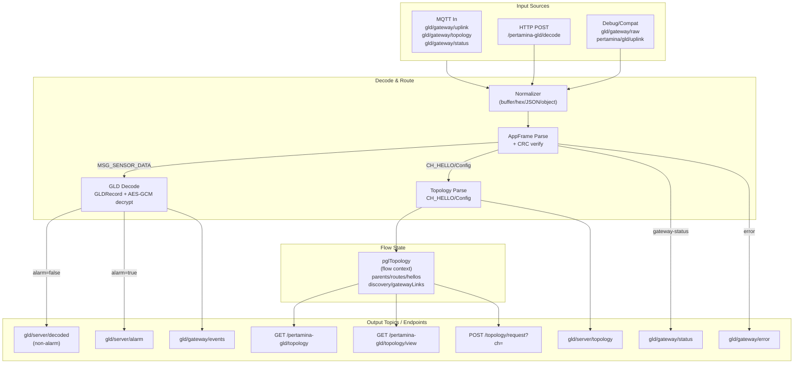
```mermaid
flowchart TD
    subgraph INPUTS["Input Sources"]
        MQTT_IN["MQTT In\ngld/gateway/uplink\ngld/gateway/topology\ngld/gateway/status"]
        HTTP_IN["HTTP POST\n/pertamina-gld/decode"]
        DEBUG_IN["Debug/Compat\ngld/gateway/raw\npertamina/gld/uplink"]
    end

    subgraph DECODE_BLOCK["Decode & Route"]
        NORM["Normalizer\n(buffer/hex/JSON/object)"]
        APP_PARSE["AppFrame Parse\n+ CRC verify"]
        GLD_DECODE["GLD Decode\nGLDRecord + AES-GCM decrypt"]
        TOPO_PARSE["Topology Parse\nCH_HELLO/Config"]
    end

    subgraph OUTPUTS["Output Topics / Endpoints"]
        OUT_STATUS["gld/gateway/status"]
        OUT_EVENTS["gld/gateway/events"]
        OUT_DECODED["gld/server/decoded\n(non-alarm)"]
        OUT_ALARM["gld/server/alarm"]
        OUT_TOPO["gld/server/topology"]
        OUT_ERR["gld/gateway/error"]
        HTTP_TOPO["GET /pertamina-gld/topology"]
        HTTP_UI["GET /pertamina-gld/topology/view"]
        HTTP_PULL["POST /topology/request?ch=<id>"]
    end

    subgraph STATE["Flow State"]
        TOPO_STATE["pglTopology\n(flow context)\nparents/routes/hellos\ndiscovery/gatewayLinks"]
    end

    INPUTS --> NORM
    DEBUG_IN --> NORM
    HTTP_IN --> NORM
    NORM --> APP_PARSE
    APP_PARSE -->|"MSG_SENSOR_DATA"| GLD_DECODE
    APP_PARSE -->|"CH_HELLO/Config"| TOPO_PARSE
    APP_PARSE -->|"gateway-status"| OUT_STATUS
    GLD_DECODE -->|"alarm=false"| OUT_DECODED
    GLD_DECODE -->|"alarm=true"| OUT_ALARM
    GLD_DECODE --> OUT_EVENTS
    APP_PARSE -->|"error"| OUT_ERR
    TOPO_PARSE --> TOPO_STATE
    TOPO_PARSE --> OUT_TOPO
    TOPO_STATE --> HTTP_TOPO
    TOPO_STATE --> HTTP_UI
    TOPO_STATE --> HTTP_PULL
```

*Gambar 11: Logical flow Node-RED — input, decode, routing, dan output.*

---

### Tabel HTTP Endpoints Node-RED

| Endpoint | Method | Fungsi |
|---|---|---|
| `/pertamina-gld/decode` | POST | Manual decode frame hex |
| `/pertamina-gld/topology` | GET | JSON topology: nodes, edges, routes, discovery |
| `/pertamina-gld/topology/view` | GET | HTML UI topology (auto-refresh 1000ms) |
| `/pertamina-gld/topology/reset` | POST | Reset state: parents, discovery, hellos, routes |
| `/pertamina-gld/topology/request?ch=<id>` | POST | Publish pull request ke `cmd/pull` jika route ada |
| `/pertamina-gld/topology/delete?ch=<id>` | POST | Hapus CH dari semua map topology |

---

### Tabel Topology State (`pglTopology`)

| Field | Isi | TTL Default |
|---|---|---|
| `parents` | Installed CH parent (dari CH_HELLO) | 900000 ms |
| `discovery` | CH_CONFIG discovery candidates | 420000 ms |
| `gatewayLinks` | Gateway-heard RSSI/SNR dari CH_CONFIG | 420000 ms |
| `hellos` | Latest CH_HELLO per CH | — |
| `routes` | Computed hop list Gateway→CH | — |

---

### Decode Output Fields (GLD Event)

| Field | Keterangan |
|---|---|
| `ok` | `true` jika decode berhasil |
| `kind` | `gld-event` |
| `receivedAt` | ISO timestamp |
| `nodeId`, `nodeIdHex` | GLD ID |
| `seq` | GLD record sequence |
| `flags` | GLDRecord flags byte |
| `alarm` | bit `0x01` dari flags |
| `externalPower` | bit `0x10` dari flags |
| `testDevice` | node ID dalam range `0xF000..0xFEFF` |
| `payloadLen`, `payloadHex` | encrypted payload |
| `dedupKey` | `<cluster>:<node>:<seq>:<alarm\|normal>` |
| `decryptOk` | AES-GCM decrypt berhasil |
| `gasClass`, `gasName` | hasil decrypt |
| `confidence` | 0–100 |
| `batteryMv` | mV baterai, `0xFFFF` = invalid |

---

---

## Server Pull Flow

### Sequence Diagram Server Pull

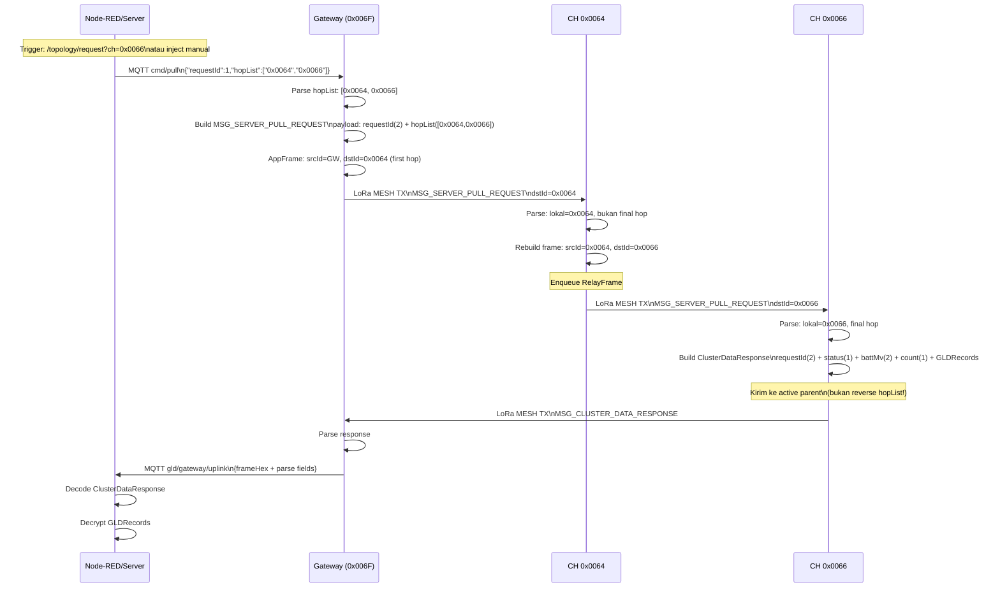
```mermaid
sequenceDiagram
    participant NR as Node-RED/Server
    participant GW as Gateway (0x006F)
    participant CH_A as CH 0x0064
    participant CH_B as CH 0x0066

    Note over NR: Trigger: /topology/request?ch=0x0066\natau inject manual

    NR->>GW: MQTT cmd/pull\n{"requestId":1,"hopList":["0x0064","0x0066"]}

    GW->>GW: Parse hopList: [0x0064, 0x0066]
    GW->>GW: Build MSG_SERVER_PULL_REQUEST\npayload: requestId(2) + hopList([0x0064,0x0066])
    GW->>GW: AppFrame: srcId=GW, dstId=0x0064 (first hop)

    GW->>CH_A: LoRa MESH TX\nMSG_SERVER_PULL_REQUEST\ndstId=0x0064

    CH_A->>CH_A: Parse: lokal=0x0064, bukan final hop
    CH_A->>CH_A: Rebuild frame: srcId=0x0064, dstId=0x0066
    Note over CH_A: Enqueue RelayFrame

    CH_A->>CH_B: LoRa MESH TX\nMSG_SERVER_PULL_REQUEST\ndstId=0x0066

    CH_B->>CH_B: Parse: lokal=0x0066, final hop
    CH_B->>CH_B: Build ClusterDataResponse\nrequestId(2) + status(1) + battMv(2) + count(1) + GLDRecords

    Note over CH_B: Kirim ke active parent\n(bukan reverse hopList!)
    CH_B->>GW: LoRa MESH TX\nMSG_CLUSTER_DATA_RESPONSE

    GW->>GW: Parse response
    GW->>NR: MQTT gld/gateway/uplink\n{frameHex + parse fields}

    NR->>NR: Decode ClusterDataResponse
    NR->>NR: Decrypt GLDRecords
```

*Gambar 16: Sequence diagram server pull flow — hopList routing hingga respons.*

---

### Diagram HopList

```
Server kirim: hopList = [0x0064, 0x0066]

Step 1: GW → CH 0x0064 (first hop)
  AppFrame: srcId=GW(0x006F), dstId=0x0064
  Payload: requestId + [0x0064, 0x0066]

Step 2: CH 0x0064 relay → CH 0x0066
  CH 0x0064 baca payload, cari posisi lokal (index 0)
  bukan final hop → relay ke next: dstId=0x0066
  AppFrame: srcId=0x0064, dstId=0x0066
  Payload: requestId + [0x0064, 0x0066] (sama)

Step 3: CH 0x0066 final → kirim respons ke active parent
  Final hop → build ClusterDataResponse
  Kirim ke runtimeConfig.meshDstId (parent aktif, bukan reverse)
```

---

### Tabel Data Status Respons Pull

| Nilai | Nama | Arti |
|---:|---|---|
| `0x00` | `DataOk` | Data tersedia dan valid |
| `0x01` | `DataEmpty` | Cache CH kosong, tidak ada GLD |
| `0x02` | `DataNotAvail` | Data tidak tersedia (belum ada data) |
| `0x03` | `DataStale` | Data ada tapi terlalu lama (>300s) |
| `0x04` | `DataBusy` | CH sedang sibuk |
| `0x05` | `DataInvalid` | Data tidak valid |

---

### ClusterDataResponse Payload

| Offset | Field | Ukuran |
|---:|---|---:|
| 0–1 | requestId | 2 |
| 2 | data status | 1 |
| 3–4 | CH battery mV | 2 |
| 5 | record count | 1 |
| 6.. | GLDRecords (34 byte per record) | variable |

> **Kapasitas:** MESH payload max 80 byte. Header 6 byte + 2 × 34 byte = 74 byte. Maksimal **2 GLDRecord** per respons.

---


---

## Downlink Command Flow

### Sequence Diagram Downlink

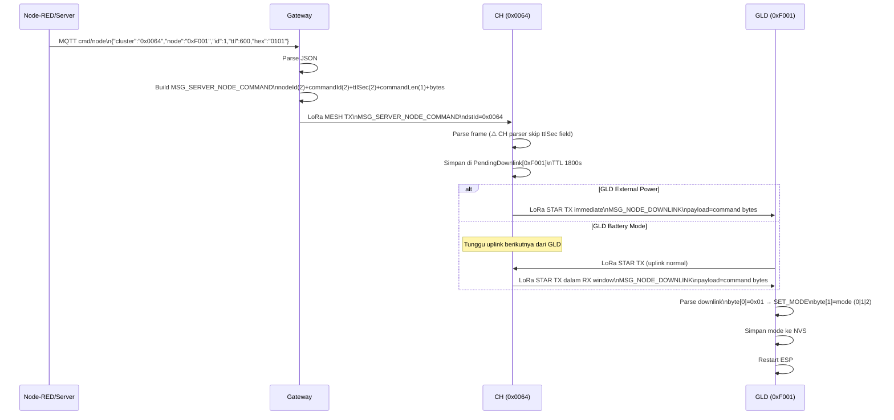
```mermaid
sequenceDiagram
    participant NR as Node-RED/Server
    participant GW as Gateway
    participant CH as CH (0x0064)
    participant GLD as GLD (0xF001)

    NR->>GW: MQTT cmd/node\n{"cluster":"0x0064","node":"0xF001","id":1,"ttl":600,"hex":"0101"}

    GW->>GW: Parse JSON
    GW->>GW: Build MSG_SERVER_NODE_COMMAND\nnodeId(2)+commandId(2)+ttlSec(2)+commandLen(1)+bytes

    GW->>CH: LoRa MESH TX\nMSG_SERVER_NODE_COMMAND\ndstId=0x0064

    CH->>CH: Parse frame (⚠️ CH parser skip ttlSec field)
    CH->>CH: Simpan di PendingDownlink[0xF001]\nTTL 1800s

    alt GLD External Power
        CH->>GLD: LoRa STAR TX immediate\nMSG_NODE_DOWNLINK\npayload=command bytes
    else GLD Battery Mode
        Note over CH: Tunggu uplink berikutnya dari GLD
        GLD->>CH: LoRa STAR TX (uplink normal)
        CH->>GLD: LoRa STAR TX dalam RX window\nMSG_NODE_DOWNLINK\npayload=command bytes
    end

    GLD->>GLD: Parse downlink\nbyte[0]=0x01 → SET_MODE\nbyte[1]=mode (0|1|2)
    GLD->>GLD: Simpan mode ke NVS
    GLD->>GLD: Restart ESP
```

*Gambar 17: Sequence diagram downlink command flow.*

---

### Immediate vs Deferred Downlink

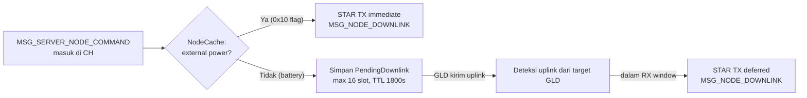
```mermaid
flowchart LR
    CMD_IN["MSG_SERVER_NODE_COMMAND\nmasuk di CH"] --> CHECK_POWER{NodeCache:\nexternal power?}
    CHECK_POWER -->|"Ya (0x10 flag)"| IMMEDIATE["STAR TX immediate\nMSG_NODE_DOWNLINK"]
    CHECK_POWER -->|"Tidak (battery)"| PENDING["Simpan PendingDownlink\nmax 16 slot, TTL 1800s"]
    PENDING -->|"GLD kirim uplink"| WAIT_UPLINK["Deteksi uplink dari target GLD"]
    WAIT_UPLINK -->|"dalam RX window"| DEFERRED["STAR TX deferred\nMSG_NODE_DOWNLINK"]
```

*Gambar 18: Immediate downlink (external power) vs deferred downlink (battery mode).*

---

### GLD Downlink Parser

| Byte | Field | Nilai Saat Ini |
|---:|---|---|
| 0 | Command type | `0x01` = SET_MODE |
| 1 | Mode value | `0` = inference, `1` = dataset, `2` = nulling |

> **Caveat TTL Mismatch:** Gateway build payload `nodeId(2) + commandId(2) + ttlSec(2) + commandLen(1) + commandBytes`, sedangkan CH parser membaca `nodeId(2) + commandId(2) + commandLen(1) + commandBytes`. Field `ttlSec` dari Gateway dilewati CH dan menimpa `commandLen`, sehingga perintah downlink saat ini **tidak ter-align**. Ini adalah mismatch yang ada di source saat ini.

---

## 8. Protocol Visual Map

### Diagram Lapisan Protocol

```mermaid
flowchart TB
    subgraph GLD_LAYER["GLD — Pembentukan Data"]
        S_DATA["Sensor: gasClass + confidence\n+ batteryMv (4 bytes plaintext)"]
        AAD_BUILD["AAD = nodeId(2) + seq(1) + flags(1) + keyId(1)\n→ 5 bytes"]
        AES["AES-128-GCM encrypt\nplaintext 4B → ciphertext 4B + tag 12B"]
        ENC_PAYLOAD["Encrypted Payload 29 bytes\n[keyId(1) + nonce(12) + ciphertext(4) + tag(12)]"]
        APPFRAME["AppFrame\n[0xAA + typeFlags + srcId + dstId + seq + payloadLen + payload + CRC16]"]
    end

    subgraph RADIO_LAYER["Transport — LoRa STAR"]
        LORA_PKT["LoRa Packet\n920-923 MHz SF7 sync 0x12\nmax 74 bytes (10 overhead + 64 payload)"]
    end

    subgraph CH_LAYER["CH — Cache & Relay"]
        GLD_REC["GLDRecord 34 bytes\n[nodeId(2) + seq(1) + flags(1) + payloadLen(1) + encrypted(29)]"]
        MESH_FRAME["AppFrame MESH\nsrcId=CH, dstId=parent\npayload = GLDRecord(s)"]
    end

    subgraph GW_LAYER["Gateway — Bridge"]
        UPLINK_JSON["MQTT JSON Uplink\ngld/gateway/uplink\nframeHex + rssi + snr + parse"]
    end

    subgraph SERVER_LAYER["Server — Decode"]
        DECRYPT["AES-GCM Decrypt\ngasClass + confidence + batteryMv"]
    end

    S_DATA --> AAD_BUILD
    S_DATA --> AES
    AAD_BUILD --> AES
    AES --> ENC_PAYLOAD
    ENC_PAYLOAD --> APPFRAME
    APPFRAME --> LORA_PKT
    LORA_PKT --> GLD_REC
    GLD_REC --> MESH_FRAME
    MESH_FRAME --> UPLINK_JSON
    UPLINK_JSON --> DECRYPT
```

*Gambar 12: Lapisan protocol dari data sensor hingga dekripsi di server.*

---

### Tabel AppFrame Field

| Offset | Field | Ukuran | Keterangan |
|---:|---|---:|---|
| 0 | Magic `0xAA` | 1 | Identifikasi frame |
| 1 | typeFlags | 1 | Type (6-bit) + Flags (2-bit) |
| 2–3 | srcId | 2 | Source node ID (big-endian) |
| 4–5 | dstId | 2 | Destination node ID (big-endian) |
| 6 | seq | 1 | Sender sequence counter |
| 7 | payloadLen | 1 | Panjang payload (0–64 STAR, 0–80 MESH) |
| 8.. | payload | N | Isi sesuai message type |
| akhir | CRC16-CCITT-FALSE | 2 | Over header + payload |

---

### Tabel Message Types

| Hex | Nama | Penggunaan |
|---|---|---|
| `0x10` | `MSG_SENSOR_DATA` | GLD uplink, alarm push, recovery clear, compact ACK reuse |
| `0x14` | `MSG_NODE_DOWNLINK` | CH → GLD downlink command |
| `0x30` | `MSG_SERVER_PULL_REQUEST` | Server → GW → CH: pull data request |
| `0x31` | `MSG_CLUSTER_DATA_RESPONSE` | CH → GW: pull data response |
| `0x32` | `MSG_SERVER_NODE_COMMAND` | GW → CH: command ke GLD tertentu |
| `0x33` | `MSG_CH_HELLO` | CH topology/liveness announcement |
| `0x34` | `MSG_CH_CONFIG_REQUEST` | CH discovery broadcast |
| `0x35` | `MSG_CH_CONFIG_RESPONSE` | CH/GW balasan discovery |

---

### Tabel typeFlags GLD

| Name | Nilai | Kondisi |
|---|---|---|
| Normal + Battery | `0x10` | gasClass=0 atau conf<30, baterai |
| Normal + External | `0x90` | gasClass=0 atau conf<30, external power |
| Alarm + Battery | `0x50` | alarm aktif, baterai |
| Alarm + External | `0xD0` | alarm aktif, external power |
| Compact Alarm ACK | `0x50` | ACK dari CH/GW ke pengirim alarm |

---

### Diagram GLD Payload — 4 Byte Plaintext dan 29 Byte Encrypted

```
PLAINTEXT (4 bytes):
┌─────────────┬─────────────┬─────────────────────────────┐
│  gasClass   │ confidence  │       batteryMv (BE)         │
│   1 byte    │   1 byte    │          2 bytes             │
└─────────────┴─────────────┴─────────────────────────────┘

ENCRYPTED PAYLOAD (29 bytes):
┌──────────┬──────────────────────────────┬──────────────┬──────────────────────────────┐
│  keyId   │          nonce               │  ciphertext  │           tag                │
│  1 byte  │         12 bytes             │   4 bytes    │         12 bytes             │
└──────────┴──────────────────────────────┴──────────────┴──────────────────────────────┘

AAD (5 bytes, tidak dikirim tapi dipakai untuk enkripsi/validasi):
┌──────────────┬──────────┬──────────────┬──────────┐
│    nodeId    │   seq    │    flags     │  keyId   │
│   2 bytes    │  1 byte  │   1 byte     │  1 byte  │
└──────────────┴──────────┴──────────────┴──────────┘
```

---

### Diagram GLDRecord (34 byte) — Unit Cache dan Respons CH

```
GLDRecord (34 bytes):
┌──────────────┬──────────┬──────────────┬──────────────┬────────────────────────────────────┐
│    nodeId    │   seq    │    flags     │  payloadLen  │   encrypted payload (29 bytes)     │
│   2 bytes    │  1 byte  │   1 byte     │   1 byte     │                                    │
└──────────────┴──────────┴──────────────┴──────────────┴────────────────────────────────────┘
 offset 0-1      offset 2   offset 3       offset 4         offset 5-33

Record flags:
  0x01 = alarm
  0x10 = external power
```

---

## 9. Konfigurasi Penting

### Visual Config Map Per File

```mermaid
graph TB
    subgraph SHARED_CONFIG["firmware/config/"]
        GLD_CFG["GldConfig.h\nGLD_NODE_HEX=F001\nGLD_CH_ID=0x0064\nScan: 1000ms\nTX: 10000ms\nRX window: 2000ms"]
        CH_CFG["ChConfig.h\nCH_ID=0x0064 (default)\nROOT_GW=0x006F\nCache: 32\nAlarm Q: 8\nTX Q: 8\nDownlink: 16"]
        GW_CFG["GwConfig.h\nGATEWAY_ID=0x006F\nWiFi: Fshares\nMQTT: 10.158.198.180:1884"]
        STAR_CFG["LoraStarConfig.h\n920.0 MHz, 125 kHz\nSF7, CR4/5\nSync 0x12, 17dBm"]
        MESH_CFG["LoraMeshConfig.h\n921.0 MHz, 125 kHz\nSF9, CR4/5\nSync 0x34, 17dBm"]
        SRV_CFG["ServerConfig.h\nDataset: CHANGE_ME\nSite: Fshares / 10.158.198.180:1884\ndeviot/deviot"]
    end

    GLD_CFG --> GLD_NODE["GLD Firmware"]
    CH_CFG --> CH_NODE["CH Firmware"]
    GW_CFG --> GW_NODE["Gateway Firmware"]
    STAR_CFG --> GLD_NODE
    STAR_CFG --> CH_NODE
    MESH_CFG --> CH_NODE
    MESH_CFG --> GW_NODE
    SRV_CFG --> GLD_NODE
    SRV_CFG --> GW_NODE
```

*Gambar 22: Peta config file dan dependency ke firmware.*

---

### Tabel Node IDs

| Node | ID (hex) | ID (desimal) | Peran |
|---|---|---:|---|
| GLD | `0xF001` | 61441 | Sensor gas node |
| CH1 | `0x0064` | 100 | Cluster Head 1 |
| CH2 | `0x0065` | 101 | Cluster Head 2 |
| CH3 | `0x0066` | 102 | Cluster Head 3 |
| Gateway | `0x006F` | 111 | Root Gateway/MESH |
| Broadcast | `0xFFFF` | 65535 | Broadcast ke semua |

---

### Tabel Radio Config STAR/MESH

| Parameter | STAR (GLD↔CH) | MESH (CH↔GW) |
|---|---|---|
| Frekuensi | 920.0 MHz | 921.0 MHz |
| Bandwidth | 125 kHz | 125 kHz |
| Spreading Factor | SF7 | SF9 |
| Coding Rate | 4/5 | 4/5 |
| Sync Word | `0x12` | `0x34` |
| TX Power | 17 dBm | 17 dBm |
| Preamble | 8 | 8 |
| SPI Clock | 2 MHz | 2 MHz |
| TCXO | 1.6V (fallback 0.0V) | 1.6V (fallback 0.0V) |
| Max Payload | 64 bytes | 80 bytes |

---

### Tabel Timing Penting

| Parameter | Nilai | Komponen |
|---|---|---|
| GLD scan interval | 1000 ms | GLD |
| GLD TX interval | 10000 ms | GLD |
| GLD RX window | 2000 ms | GLD |
| GLD WiFi timeout | 15000 ms | GLD |
| GLD MQTT retry | 3000 ms | GLD |
| CH joining timeout | 15000 ms | CH |
| CH config request interval | 5000 ms | CH |
| CH hello interval | 300000 ms | CH |
| CH alarm ACK timeout | 1500 ms | CH |
| CH pending downlink TTL | 1800000 ms | CH |
| CH parent health timeout | 180000 ms | CH |
| CH parent min dwell | 300000 ms | CH |
| CH housekeeping | 60000 ms | CH |
| CH route verify | 600000 ms | CH |
| GW status interval | 10000 ms | Gateway |
| GW WiFi retry | 5000 ms | Gateway |
| GW MQTT retry | 3000 ms | Gateway |

---

### Tabel Battery Thresholds

| Threshold | env:ch1/ch3 | env:ch2 | Kondisi |
|---|---|---|---|
| Start (BATT_START_MV) | 3500 mV | 0 (disabled) | Harus terpenuhi 8x berturut sebelum radio init |
| Run Min (BATT_RUN_MIN_MV) | 3150 mV | 0 (disabled) | Di bawah ini → LOW_POWER state |
| Critical (BATT_CRITICAL_MV) | 3100 mV | 0 (disabled) | TX diblokir di LOW_POWER |

---

## 10. Operasi Lapangan

### Checklist Operasi Visual

```mermaid
flowchart TD
    subgraph PRE["Persiapan"]
        P1["✅ Cek COM port: pio device list"]
        P2["✅ Pastikan env sesuai hardware:\ngld/gldw untuk GLD\nch1/ch2/ch3 untuk CH\ngw untuk Gateway"]
        P3["✅ Cek credential ServerConfig.h\n(site: Fshares/10.158.198.180\ndataset: CHANGE_ME harus diisi)"]
    end

    subgraph BUILD["Build & Upload"]
        B1["Build GLD:\npio run -d firmware -e gldw"]
        B2["Upload GLD:\npio run -d firmware -e gldw -t upload --upload-port COM<X>"]
        B3["Build CH1:\npio run -d firmware -e ch1"]
        B4["Upload CH1:\npio run -d firmware -e ch1 -t upload --upload-port COM<Y>"]
        B5["Upload GW:\npio run -d firmware -e gw -t upload --upload-port COM<Z>"]
    end

    subgraph MONITOR["Monitor & Verifikasi"]
        M1["Serial monitor GLD:\npio device monitor -p COM<X> -b 115200"]
        M2["Cek log [BOOT_IC_REPORT]"]
        M3["Cek log CH_STATE, CH_PARENT_SELECT"]
        M4["Cek MQTT: subscribe gld/gateway/#"]
        M5["Cek topology Node-RED:\nGET /pertamina-gld/topology/view"]
    end

    PRE --> BUILD --> MONITOR
```

*Gambar 23: Checklist operasi lapangan.*

---

### Command Build/Upload

```powershell
# Cek COM port
pio device list

# Build GLD (board WROOM, env gldw)
pio run -d firmware -e gldw

# Upload GLD ke COM9 (contoh)
pio run -d firmware -e gldw -t upload --upload-port COM9

# Build + Upload CH1
pio run -d firmware -e ch1 -t upload --upload-port COM3

# Build + Upload CH2
pio run -d firmware -e ch2 -t upload --upload-port COM5

# Build + Upload Gateway
pio run -d firmware -e gw -t upload --upload-port COM38

# Serial monitor GLD
pio device monitor -p COM9 -b 115200

# Serial monitor CH
pio device monitor -p COM3 -b 115200
```

> **Catatan:** COM port di atas adalah contoh dari sesi bench sebelumnya. Selalu cek ulang dengan `pio device list` sebelum upload.

---

### Cara Membaca Log Serial GLD

| Log Token | Arti |
|---|---|
| `[BOOT_IC_REPORT]` | Tabel IC check setelah boot |
| `[BOOT_SENSOR_SAMPLES]` | 5 baris sampel sensor (external power) |
| `MODE_READY` | Mode siap dieksekusi |
| `NULLING_SERVICE_START` | Nulling mulai |
| `NULLING_CH_OK` / `NULLING_CH_FAIL` | Per-channel nulling result |
| `NULLING_RUNTIME_RESULT=PASS` | Semua channel sukses |
| `PARTIAL_RETRY` | Ada channel gagal, retry |

### Cara Membaca Log Serial CH

| Log Token | Arti |
|---|---|
| `CH_STATE` | Transisi state machine |
| `CH_PARENT_SELECT` | Parent terpilih |
| `CH_STAR_RX` | Terima frame dari GLD |
| `CH_STAR_PROCESS` | Proses + update cache |
| `CH_MESH_TX_KIND` | Frame MESH yang dikirim |
| `CH_ALARM_ACK_RECV` | Terima ACK alarm |
| `CH_ALARM_ACK_TIMEOUT` | Timeout ACK alarm |
| `CH_HELLO_TX` | Kirim CH_HELLO |
| `CH_CACHE_SUMMARY` | Ringkasan isi NodeCache |

### Cara Membaca Log Serial Gateway

| Log Token | Arti |
|---|---|
| `parseStatus` di MQTT JSON | Decode result frame MESH |
| `rssi`, `snr` di MQTT JSON | Kualitas link MESH |
| `frameHex` | Raw frame untuk debugging |
| `topology` object | CH_HELLO embedded |

---

## 11. Verifikasi dan Test

### Diagram Test Coverage

```mermaid
flowchart LR
    subgraph HOST_TESTS["Host-Level Tests\npython firmware/tests/run_tests.py"]
        T1["Protocol constants\n(ProtocolConstants.h values)"]
        T2["Firmware versions\n(FirmwareVersion.h values)"]
        T3["Active envs\n(platformio.ini check)"]
        T4["GLD board pin macros"]
        T5["GLD unified scaffolds"]
        T6["Node-RED pull hopList contract"]
        T7["Source guardrails"]
    end

    subgraph BENCH_TESTS["Bench Self-Tests\n(firmware/bench/)"]
        B1["gld_sensor_selftest\nADS1256 + sensor read"]
        B2["gld_nulling_selftest\nNulling calibration"]
        B3["gld_lora_tx_selftest\nLoRa TX packet"]
        B4["ch_star_rx_selftest\nCH STAR RX parse"]
    end

    HOST_TESTS -->|"Expected: 27/27 passed"| RESULT["Test Result"]
    BENCH_TESTS -->|"Hardware required"| RESULT
```

*Gambar 24: Coverage test — host-level dan bench self-test.*

---

### Tabel Test Command

| Command | Platform | Expected |
|---|---|---|
| `python firmware/tests/run_tests.py` | Host (Python) | `27/27 tests passed` |
| `pio run -d firmware/bench -e gld_sensor_selftest_esp32s3` | ESP32-S3 bench | Sensor read OK |
| `pio run -d firmware/bench -e gld_nulling_selftest_esp32s3` | ESP32-S3 bench | Nulling OK |
| `pio run -d firmware/bench -e gld_lora_tx_selftest_esp32s3` | ESP32-S3 bench | LoRa TX OK |
| `pio run -d firmware/bench -e ch_star_rx_selftest_esp32s3` | ESP32-S3 bench | STAR RX parse OK |

---

### Tabel Status Test (Yang Boleh Diklaim)

| Area | Status |
|---|---|
| Protocol constants (source) | ✅ Terimplementasi, ter-guard test host |
| Firmware versions (source) | ✅ Terimplementasi, ter-guard test host |
| Active env config (platformio.ini) | ✅ Ter-guard test host |
| GLD board pin macros | ✅ Ter-guard test host |
| GLD unified scaffolds | ✅ Ter-guard test host |
| Node-RED pull hopList contract | ✅ Ter-guard test host |
| GLD sensor read | Source ada, bench test terpisah |
| Nulling calibration | Source ada, bench test terpisah |
| LoRa STAR TX | Source ada, bench test terpisah |
| CH STAR RX parse | Source ada, bench test terpisah |
| End-to-end GLD→Server dengan AES-GCM | Source + Node-RED ada, **belum ada test otomatis E2E** |
| Multi-hop pull via hopList | Source ada, **belum ada test integrasi otomatis** |
| Downlink command (TTL mismatch) | Source ada caveat, **tidak ter-guard test** |

---

## 12. Known Caveats / Risiko

| Area | Caveat | Dampak | Status di Source | Rekomendasi |
|---|---|---|---|---|
| **Downlink TTL mismatch** | Gateway build `nodeId+commandId+ttlSec+commandLen+bytes`, CH parser skip `ttlSec` sehingga `commandLen` salah offset | Downlink command dari server ke GLD **tidak berfungsi** via remote | Terdokumentasi eksplisit di `ch-gw/final_design.md` dan `gld-ch/payload-contract.draft.md` | Align satu sisi (tambah ttlSec parsing di CH atau hapus dari GW) sebelum live deploy |
| **Dataset WiFi credential** | `PGL_SERVER_DATASET_WIFI_SSID/PASSWORD` dan `MQTT_HOST` di `ServerConfig.h` bernilai `"CHANGE_ME"` | Dataset mode tidak bisa konek WiFi/MQTT sampai credential diisi | Terlihat di `firmware/config/ServerConfig.h` | Isi dengan credential prod sebelum build dataset |
| **Alarm ACK tidak retry** | Saat ACK timeout (1500ms), CH hanya log dan hapus alarm dari queue — tidak kirim ulang | Alarm bisa hilang jika link MESH sementara drop | Terdokumentasi di `ch/final_design.md` | Implementasikan alarm retry logic jika reliabilitas diutamakan |
| **Dataset flow JSON mismatch** | `pertamina-gld-dataset.flow.json` expect field `ch`, `gain`, `ok`, `nodeId`, `ts_ms`, `profileId` — sedangkan GLD unified kirim `sensor_voltage`, `sensor_gain`, `node_id`, `timestamp_ms`, `nulling_profile_id` | Dataset recorder dari flow lama tidak kompatibel dengan GLD unified | Terdokumentasi di `server/final_design.md` | Gunakan `gld_dataset_recorder.py` yang cocok, atau update flow dataset |
| **MQTT buffer limit** | GLD dan GW MQTT buffer 1024 bytes | Payload besar (dataset JSON + 8 voltage) mendekati limit | Source: `GLD_MQTT_BUFFER_SIZE = 1024` | Verifikasi ukuran payload dataset di lapangan |
| **NodeCache expire** | Entry GLD expire setelah 3600s tanpa data | CH tidak kirim data GLD yang lama ke server sampai GLD kirim lagi | Source: `CACHE_EXPIRE_MS = 3600000` | Normal behavior, dokumentasikan ke operator |
| **Gateway parent di CH** | CH mem-boot ulang fresh setiap restart dan Gateway link harus fresh (NVS Gateway parent di-clear saat boot) | Perlu waktu re-discovery setelah restart CH | Source: `ch/final_design.md` | Biarkan joining timeout 15s untuk stabilisasi |
| **Default test AES key** | Node-RED default key `000102030405060708090A0B0C0D0E0F` via env `GLD_AES128_KEY_HEX` | Jika env tidak diset, server memakai test key yang sama dengan GLD | Source: `server/final_design.md` | Set `GLD_AES128_KEY_HEX` env di prod Node-RED dan GLD |

---

## 13. Appendix

### A. Visual Glossary

| Term | Definisi |
|---|---|
| **AppFrame** | Format frame biner sistem: magic + typeFlags + srcId + dstId + seq + payloadLen + payload + CRC16 |
| **AES-128-GCM** | Enkripsi authenticated dengan key 128-bit, nonce 12 byte, tag 12 byte |
| **AAD** | Additional Authenticated Data — 5 byte untuk validasi enkripsi tanpa decrypt |
| **CH** | Cluster Head — node relay antara GLD dan Gateway |
| **GLD** | Gas Leak Detector — node sensor gas utama |
| **STAR** | Topologi radio GLD↔CH — satu GLD ke satu CH |
| **MESH** | Topologi radio CH↔CH↔Gateway — multi-hop backbone |
| **NodeCache** | Cache GLD record di CH — 32 slot, stale 300s, expire 3600s |
| **AlarmQueue** | Queue alarm GLD pending ACK di CH — 8 slot, ACK timeout 1500ms |
| **GLDRecord** | Unit data GLD 34 byte: nodeId+seq+flags+payloadLen+encrypted |
| **hopList** | Daftar CH yang harus dilalui pull request dalam urutan tertentu |
| **typeFlags** | Byte kombinasi message type (6-bit) + FLAG_ALARM_ACK + FLAG_GLD_EXT_POWER |
| **pglTopology** | Flow context Node-RED untuk menyimpan state jaringan CH/GW |
| **NVS** | Non-Volatile Storage ESP32 — penyimpanan mode, nulling profile, parent ID |
| **TCXO** | Temperature-Compensated Crystal Oscillator — sumber clock akurat SX1262 |

---

### B. Daftar File Penting

| File | Peran |
|---|---|
| `firmware/platformio.ini` | Definisi env build runtime |
| `firmware/shared/include/ProtocolConstants.h` | Semua konstanta protokol |
| `firmware/shared/include/FirmwareVersion.h` | Versi firmware semua komponen |
| `firmware/config/GldConfig.h` | Config GLD node |
| `firmware/config/ChConfig.h` | Config CH node |
| `firmware/config/GwConfig.h` | Config Gateway |
| `firmware/config/ServerConfig.h` | Config WiFi/MQTT server |
| `firmware/config/LoraStarConfig.h` | Config radio STAR |
| `firmware/config/LoraMeshConfig.h` | Config radio MESH |
| `firmware/gld/src/GldUnifiedMain.cpp` | Main runtime GLD |
| `firmware/gld/src/GldNullingService.cpp` | Nulling calibration |
| `firmware/ch/src/ChStarMeshRuntimeMain.cpp` | Main runtime CH |
| `firmware/ch/src/ChRuntime.cpp` | State machine CH |
| `firmware/gateway/src/GatewayMqttMeshMain.cpp` | Main runtime Gateway |
| `server/nodered/functions/pertamina-gld-decode.js` | Decode + AES-GCM server |
| `server/nodered/apply-pertamina-gld-flow.js` | Generator Node-RED flow |
| `server/nodered/pertamina-gld-server.flow.json` | Snapshot flow server |

---

### C. Daftar Env Aktif

| Env | Board | Firmware | Tujuan |
|---|---|---|---|
| `gld` | 4D-ESP32S3-Gen4 | GLD `0.8.12` | GLD runtime standar |
| `gldw` | ESP32-S3-WROOM-1U-N16R8 | GLD `0.8.12` | GLD runtime WROOM 16MB |
| `ch1` | 4D-ESP32S3-Gen4 | CH `0.7.1` | CH ID `0x0064` |
| `ch2` | 4D-ESP32S3-Gen4 | CH `0.7.1` | CH ID `0x0065` (batt disabled) |
| `ch3` | 4D-ESP32S3-Gen4 | CH `0.7.1` | CH ID `0x0066` |
| `gw` | 4D-ESP32S3-Gen4 | GW `0.1.3` | Gateway |

---

### D. Daftar MQTT Topics

| Topic | Arah | Komponen |
|---|---|---|
| `gld/gateway/uplink` | GW → Server | Uplink frame MESH wrapped JSON |
| `gld/gateway/topology` | GW → Server | Topology CH_HELLO/Config JSON |
| `gld/gateway/status` | GW → Server | Status GW periodic |
| `gld/gateway/cmd/#` | Server → GW | Command wildcard |
| `gld/gateway/cmd/pull` | Server → GW | Pull request JSON |
| `gld/gateway/cmd/node` | Server → GW | Node command JSON |
| `gld/server/decoded` | Node-RED internal | Decoded normal GLD event |
| `gld/server/alarm` | Node-RED internal | Decoded alarm event |
| `gld/server/topology` | Node-RED internal | Topology event |
| `gld/gateway/error` | Node-RED internal | Error event |
| `gas-leak-detector/F001/cmd` | Server → GLD | Command dataset mode |
| `gas-leak-detector/F001/dataset` | Server → GLD | Dataset start/stop |
| `gas-leak-detector/F001/dataset/data` | GLD → Server | Data scan dataset |
| `gas-leak-detector/F001/dataset/status` | GLD → Server | Status dataset |
| `gas-leak-detector/F001/dataset/summary` | GLD → Server | Summary sesi |
| `gas-leak-detector/F001/cmd/ack` | GLD → Server | Command ack |

---

### E. Daftar Message Types

| Hex | Constant | Penggunaan |
|---|---|---|
| `0x10` | `MSG_SENSOR_DATA` | GLD uplink, alarm push, recovery, compact ACK |
| `0x14` | `MSG_NODE_DOWNLINK` | CH → GLD downlink |
| `0x30` | `MSG_SERVER_PULL_REQUEST` | Server pull request |
| `0x31` | `MSG_CLUSTER_DATA_RESPONSE` | CH pull response |
| `0x32` | `MSG_SERVER_NODE_COMMAND` | Server command ke GLD via CH |
| `0x33` | `MSG_CH_HELLO` | CH topology hello |
| `0x34` | `MSG_CH_CONFIG_REQUEST` | CH parent discovery |
| `0x35` | `MSG_CH_CONFIG_RESPONSE` | CH/GW discovery response |

---

### F. Daftar Log Token Penting

| Token | Komponen | Arti |
|---|---|---|
| `[BOOT_IC_REPORT]` | GLD | Tabel IC check boot |
| `[BOOT_SENSOR_SAMPLES]` | GLD | 5 baris sampel sensor |
| `MODE_READY` | GLD | Mode siap |
| `NULLING_SERVICE_START` | GLD | Nulling dimulai |
| `NULLING_CH_OK` / `NULLING_CH_FAIL` | GLD | Per-channel nulling result |
| `NULLING_RUNTIME_RESULT=PASS` | GLD | Semua channel sukses |
| `PARTIAL_RETRY` | GLD | Ada gagal, retry |
| `CH_STATE` | CH | State machine transition |
| `CH_PARENT_SELECT` | CH | Parent terpilih |
| `CH_STAR_RX` | CH | Terima dari GLD |
| `CH_ALARM_ACK_RECV` | CH | ACK alarm diterima |
| `CH_ALARM_ACK_TIMEOUT` | CH | ACK alarm timeout |
| `CH_HELLO_TX` | CH | Kirim topology hello |
| `CH_CACHE_SUMMARY` | CH | Ringkasan cache |
| `CH_MESH_TX_KIND` | CH | Jenis frame MESH dikirim |

---

*Dokumen ini dibuat berdasarkan source code dan konfigurasi repo Pertamina GLD per tanggal 2026-06-29.*  
*Source priority: `firmware/platformio.ini` → `shared/include/*.h` → `config/*.h` → `gld/`, `ch/`, `gateway/` → `server/nodered/` → `docs/design/*/final_design.md`*
