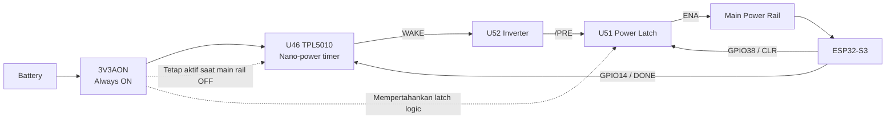
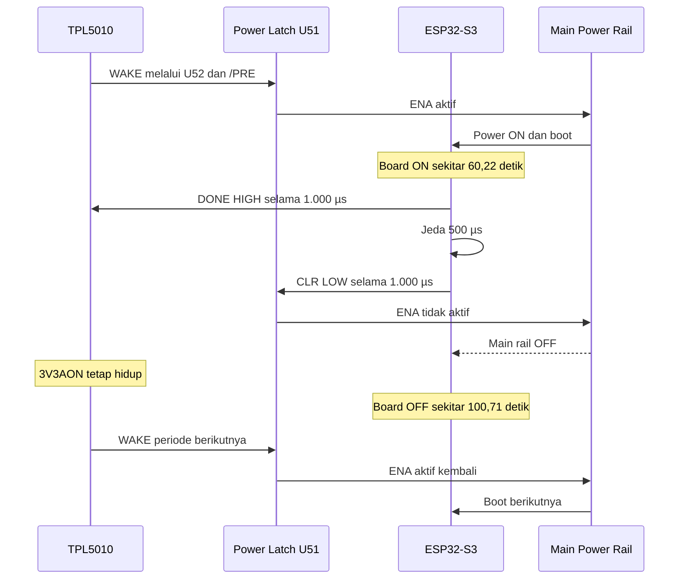
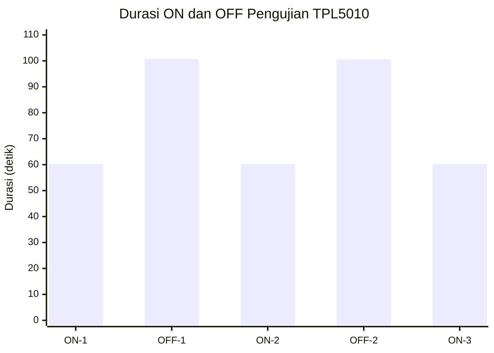

# Laporan Teknis: Pengujian Siklus Sleep–Wake TPL5010 pada Board Pertamina GLD

Tanggal: 20 Juli 2026

Status: PASS secara fungsional (dibuktikan lewat pengukuran multimeter dan log firmware, belum diverifikasi lewat oscilloscope/logic analyzer).

## 1. Identitas Pengujian

| Item | Detail |
| --- | --- |
| Tanggal pengujian | 20 Juli 2026 |
| Perangkat | Pertamina GLD |
| MCU | ESP32-S3 |
| IC timer | U46 TPL5010 |
| Resistor timer | R92 = 33 kΩ |
| Port upload | COM3 |
| Firmware environment | `gld_tpl5010_powercycle_test` |
| Catatan firmware | Firmware uji terpisah dari firmware produksi |
| Mode pengujian | Battery mode |
| Alat ukur | Multimeter pada jalur positif baterai menuju board |
| Oscilloscope | Tidak digunakan |
| Logic analyzer | Tidak digunakan |

## 2. Tujuan

Pengujian ini bertujuan memverifikasi alur berikut secara end-to-end:

1. TPL5010 mengeluarkan sinyal WAKE.
2. WAKE mengaktifkan latch daya.
3. Main rail menyala dan ESP32-S3 boot.
4. Board tetap ON sekitar 60 detik.
5. ESP32-S3 mengirim pulsa DONE ke TPL5010.
6. ESP32-S3 memberikan pulsa CLR ke latch daya.
7. Main rail mati.
8. TPL5010 tetap aktif melalui `3V3AON`.
9. Pada periode berikutnya, TPL5010 membangunkan board kembali.
10. Siklus berulang tanpa reset atau intervensi komputer.

Pengujian ini merupakan tindak lanjut dari
[gld-tpl5010-wake-sleep-com10-report.md](gld-tpl5010-wake-sleep-com10-report.md),
yang pada 14 Juli 2026 belum berhasil membuktikan wake-back otomatis TPL5010
pada COM10. Pengujian kali ini menggunakan firmware uji khusus pada COM3 dan
mengamati siklus ON/OFF secara langsung lewat multimeter, bukan lewat log
serial pasif.

## 3. Konfigurasi Hardware

- **U46 TPL5010** — timer nano-power yang mengeluarkan pulsa WAKE periodik
  berdasarkan nilai resistor eksternal, dan menerima pulsa DONE dari MCU
  sebagai watchdog acknowledgement.
- **R92 (33 kΩ)** — resistor yang dipasang pada pin `DELAY/M_RST` TPL5010
  untuk mengatur interval timer.
- **U52 SN74LVC1G04** — inverter tunggal yang membalik sinyal WAKE aktif-tinggi
  menjadi sinyal `/PRE` aktif-rendah untuk latch.
- **U51 SN74AUP1G74** — flip-flop yang berfungsi sebagai power latch: `/PRE`
  men-set output `Q` (ENA) HIGH, sedangkan `/CLR` me-reset `Q` ke LOW.
- **ENA** — sinyal output latch (U51 pin `Q`) yang mengaktifkan/menonaktifkan
  main power rail.
- **3V3AON** — rail 3.3 V yang selalu aktif (dipasok dari regulator always-on
  U42), memberi daya ke TPL5010 dan latch U51 bahkan ketika main rail mati.
- **GPIO14 ESP32-S3** — jalur DONE menuju TPL5010, dipulsakan HIGH oleh
  firmware sebagai watchdog acknowledgement sebelum tidur.
- **GPIO38 ESP32-S3** — jalur CLR menuju latch U51, dipulsakan LOW oleh
  firmware untuk mereset `ENA` dan mematikan main rail.

## 4. Diagram Blok Hardware



**Penjelasan diagram:**

- **Tetap mendapat daya saat kondisi OFF:** rail `3V3AON`, TPL5010 (U46),
  inverter (U52), dan power latch (U51). Ketiga komponen ini tidak pernah
  kehilangan daya selama baterai masih terpasang.
- **Kehilangan daya saat kondisi OFF:** main power rail dan seluruh beban di
  belakangnya, termasuk ESP32-S3. Ini sebabnya ESP32-S3 tidak dapat
  menjalankan kode apa pun selama kondisi OFF — ia benar-benar mati, bukan
  sekadar sleep software.
- **Jalur yang menyebabkan board kembali ON:** TPL5010 mengeluarkan WAKE
  ketika interval timer R92 habis, diteruskan lewat U52 dan U51 ke ENA, yang
  menyalakan kembali main rail dan mem-boot ESP32-S3 — sepenuhnya independen
  dari kondisi software sebelumnya.

## 5. Alur Firmware

Firmware uji `gld_tpl5010_powercycle_test` menjalankan urutan berikut:

1. Board boot.
2. DONE dipertahankan LOW.
3. CLR dipertahankan HIGH atau tidak aktif.
4. Board menunggu selama 60.000 ms.
5. GPIO14 menghasilkan pulsa DONE:
   - LOW
   - HIGH selama 1.000 µs
   - kembali LOW
6. Firmware menunggu 500 µs.
7. GPIO38 menghasilkan pulsa CLR:
   - HIGH
   - LOW selama 1.000 µs
   - kembali HIGH
8. Main rail seharusnya mati.
9. Program tidak dapat melanjutkan karena ESP32-S3 kehilangan daya.
10. TPL5010 kemudian membangunkan board pada periode timer berikutnya.

Tidak ada pulsa DONE periodik selama countdown 60 detik. Hanya ada satu pulsa
DONE tepat sebelum power latch dimatikan.

## 6. Diagram Urutan Sleep–Wake



Diagram ini menunjukkan hubungan sebab-akibat antar kejadian, bukan
representasi skala waktu yang proporsional — durasi ON dan OFF sesungguhnya
digambarkan secara terpisah pada Bagian 9.

## 7. Data Pengukuran

Durasi tiap fase, diukur dengan multimeter pada jalur positif baterai:

| Siklus | Status | Durasi tercatat |
| ---: | --- | ---: |
| 1 | ON | 60,21 detik |
| 1 | OFF | 100,72 detik |
| 2 | ON | 60,23 detik |
| 2 | OFF | 100,70 detik |
| 3 | ON | 60,22 detik |
| 3 | OFF | 97,41 detik, belum selesai |

Timestamp perubahan kondisi:

| Event | Status | Timestamp |
| ---: | --- | ---: |
| 1 | ON | 00:01:37,41 |
| 2 | OFF | 00:02:37,63 |
| 3 | ON | 00:04:18,33 |
| 4 | OFF | 00:05:18,57 |
| 5 | ON | 00:06:59,30 |
| 6 | OFF | 00:07:59,51 |

Durasi OFF siklus 3 (97,41 detik) dicatat sebagai "belum selesai" karena
pengamatan dihentikan sebelum board kembali ON. Nilai ini **tidak dipakai**
untuk perhitungan rata-rata pada Bagian 8, karena akan bias rendah dibanding
durasi OFF yang sesungguhnya.

## 8. Perhitungan

**Rata-rata ON:**

```
(60,21 + 60,23 + 60,22) / 3 = 60,22 detik
```

**Rata-rata OFF lengkap** (hanya siklus 1 dan 2, siklus 3 dikecualikan):

```
(100,72 + 100,70) / 2 = 100,71 detik
```

**Estimasi satu periode lengkap:**

```
60,22 + 100,71 = 160,93 detik
```

**Periode berdasarkan timestamp ON ke ON:**

- 00:01:37,41 → 00:04:18,33 = 160,92 detik
- 00:04:18,33 → 00:06:59,30 = 160,97 detik

**Rata-rata wake-to-wake:**

```
(160,92 + 160,97) / 2 = 160,945 detik ≈ 160,95 detik
```

Selisih kecil antara hasil stopwatch per-fase (160,93 detik) dan hasil
timestamp wake-to-wake (160,95 detik) berada dalam orde puluhan milidetik,
dan dapat dijelaskan oleh resolusi pencatatan waktu serta waktu reaksi
operator saat mencatat perubahan kondisi ON/OFF.

## 9. Timeline Proporsional ON/OFF

Timeline satu periode menggunakan durasi rata-rata (ON: 60,22 detik, OFF:
100,71 detik, total: 160,93 detik):

```text
WAKE                                                        WAKE berikutnya
 │                                                               │
 ▼                                                               ▼
 ├──────────── ON: 60,22 detik ────────────┼──────── OFF: 100,71 detik ────────┤
 0 s                                      60,22 s                           160,93 s
                                           │
                                           ├─ DONE: HIGH 1.000 µs
                                           ├─ Jeda: 500 µs
                                           └─ CLR: LOW 1.000 µs
```

Representasi proporsional (stacked bar, hijau = ON, abu-abu = OFF):

```
ON  (37,4%)  ███████████████████████████████████████
OFF (62,6%)  █████████████████████████████████████████████████████████████
```

- `ON percentage = 60,22 / 160,93 × 100 ≈ 37,4%`
- `OFF percentage = 100,71 / 160,93 × 100 ≈ 62,6%`

**Mengapa durasi OFF lebih pendek daripada total periode TPL5010:** total
periode TPL5010 (≈160,93 detik) mencakup seluruh siklus wake-to-wake, yaitu
fase ON (board menyala dan menjalankan firmware, ≈60,22 detik) ditambah fase
OFF (main rail mati, TPL5010 menghitung mundur, ≈100,71 detik). Karena
sebagian dari periode timer terpakai oleh fase ON, durasi OFF yang tersisa
selalu lebih pendek daripada total periode itu sendiri.

## 10. Grafik Durasi Setiap Siklus



OFF siklus 3 (97,41 detik, belum selesai) sengaja tidak dimasukkan ke grafik
karena bukan data lengkap.

**Penjelasan grafik:**

- Durasi ON sangat konsisten di sekitar 60,22 detik (rentang 60,21–60,23
  detik, selisih hanya 0,02 detik).
- Dua durasi OFF lengkap sangat konsisten di sekitar 100,71 detik (rentang
  100,70–100,72 detik, selisih hanya 0,02 detik).
- Konsistensi tersebut menunjukkan siklus berjalan berulang dan stabil,
  bukan kejadian sekali saja atau kebetulan.
- Grafik ini menunjukkan durasi waktu, **bukan** konsumsi arus — perubahan
  kondisi ON/OFF terdeteksi lewat perubahan pembacaan multimeter, tetapi
  nilai arusnya sendiri tidak dilaporkan di sini.

## 11. Analisis Teknis

1. TPL5010 memiliki periode wake-to-wake sekitar 161 detik pada board yang
   diuji.
2. Pulsa DONE tidak memulai ulang timer dari nol.
3. Board menggunakan sekitar 60,22 detik dari periode tersebut dalam keadaan
   ON.
4. Sisa periode, sekitar 100,71 detik, berlangsung dalam keadaan OFF.
5. Hubungannya adalah:

   ```
   Total periode ≈ durasi ON + durasi OFF
   160,93 detik ≈ 60,22 detik + 100,71 detik
   ```

6. Board kembali ON tanpa reset manual merupakan bukti fungsional bahwa
   jalur berikut bekerja: TPL5010 WAKE → U52 inverter → U51 power latch →
   ENA → main rail → ESP32-S3 boot.
7. Board menjadi OFF setelah urutan DONE dan CLR merupakan bukti fungsional
   bahwa jalur pemutusan latch bekerja.
8. Periode terukur sekitar 160,95 detik masih konsisten dengan R92 = 33 kΩ,
   dengan mempertimbangkan toleransi resistor, toleransi internal timer
   TPL5010, dan ketelitian pencatatan.

Hasil ini juga menjawab kegagalan yang tercatat pada pengujian COM10 tanggal
14 Juli 2026 (lihat
[gld-tpl5010-wake-sleep-com10-report.md](gld-tpl5010-wake-sleep-com10-report.md)),
yang saat itu belum berhasil mengamati wake-back otomatis dalam jendela
pengamatan pasif. Pengujian COM3 kali ini mengamati minimal dua siklus penuh
wake-to-wake secara langsung, sehingga jalur AON timer/latch yang sebelumnya
diragukan kini terbukti berfungsi.

## 12. Kriteria PASS/FAIL

PASS apabila:

- Board ON selama sekitar 60 detik.
- Main rail kemudian mati.
- Board OFF selama sekitar 101 detik.
- Board kembali ON otomatis.
- Tidak ada reset manual atau perintah komputer saat wake.
- Siklus berulang minimal dua kali.
- Durasi tiap siklus relatif konsisten.

Berdasarkan data pada Bagian 7–10, seluruh kriteria di atas terpenuhi.
**Kesimpulan: pengujian berstatus PASS secara fungsional.**

## 13. Keterbatasan

- Multimeter hanya membuktikan perubahan kondisi konsumsi arus atau state
  ON/OFF.
- Multimeter tidak dapat memverifikasi waveform mikrodetik.
- Lebar pulsa DONE 1.000 µs, jeda 500 µs, dan CLR 1.000 µs berasal dari
  implementasi firmware, bukan dari pengukuran elektrik langsung.
- Bentuk sinyal DONE, CLR, WAKE, dan PRE belum diverifikasi secara elektrik.
- Verifikasi waveform memerlukan oscilloscope atau logic analyzer.
- Tidak ada grafik konsumsi arus dalam laporan ini karena nilai arus ON dan
  OFF belum diberikan.
- Nilai penghematan baterai tidak dinyatakan karena arus ON, arus OFF, dan
  kapasitas baterai belum diketahui.

## 14. Kesimpulan

- Siklus ON sekitar 60,22 detik berhasil dijalankan.
- Main rail berhasil dimatikan sekitar 100,71 detik.
- Board berhasil wake kembali secara otomatis.
- Periode wake-to-wake rata-rata sekitar 160,95 detik.
- Alur TPL5010, inverter, latch, dan firmware DONE–CLR telah terbukti
  berfungsi secara end-to-end.
- Pengujian dinyatakan **PASS secara fungsional**.
- Pengujian oscilloscope tetap direkomendasikan untuk memvalidasi waveform
  dan timing pulsa secara langsung, serta untuk menutup keterbatasan yang
  disebutkan pada Bagian 13.
