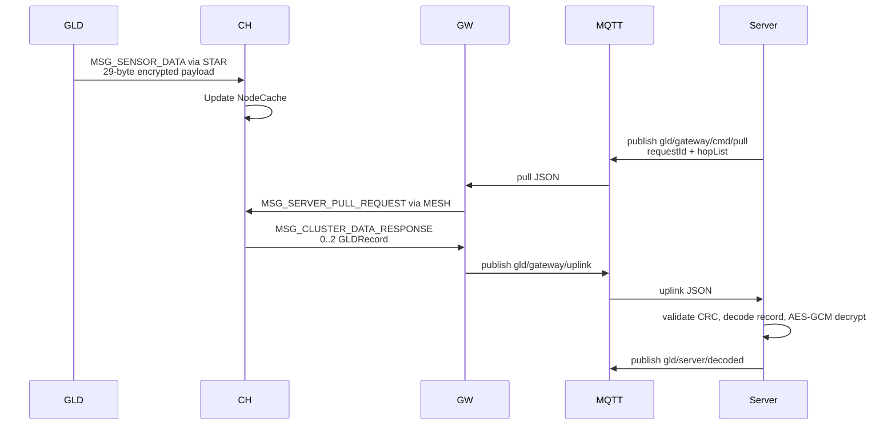
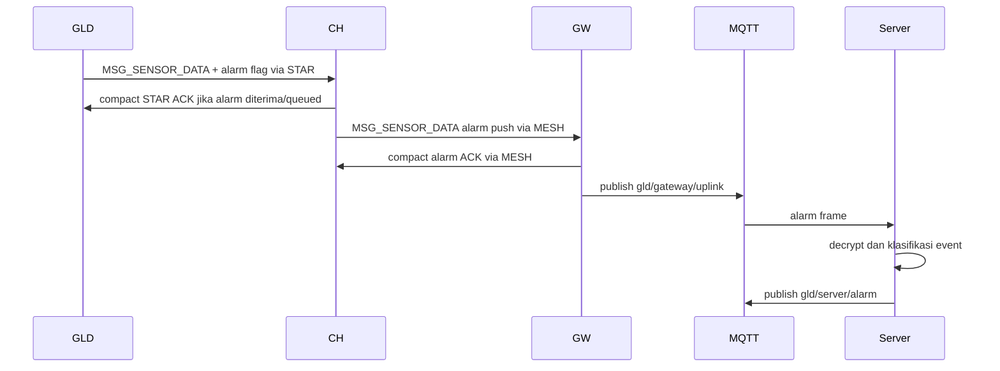
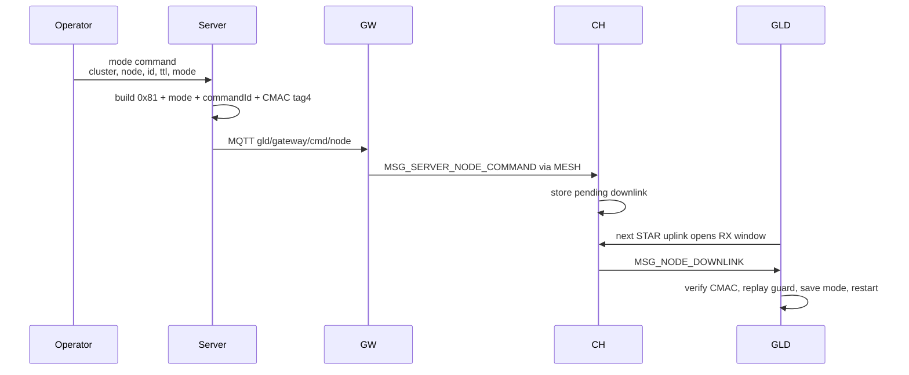

# Arsitektur Sistem Pertamina GLD

Status: current architecture summary, 2026-08-26.

Dokumen ini merangkum arsitektur sistem Pertamina GLD dari node GLD, Cluster
Head (CH), Gateway (GW), hingga Server. Detail byte-level tetap mengacu ke
`Pertamina_GLD_Protocol_Reference.md` dan dokumen `docs/design/*/final_design.md`.

## 1. Ringkasan

Sistem Pertamina GLD memakai arsitektur berlapis:

```text
GLD sensor node -> CH STAR receiver/cache -> CH/GW MESH backbone -> GW MQTT bridge -> Server Node-RED
```

GLD berada di titik deteksi gas. CH menjadi pengumpul lokal dan router radio.
GW menjadi jembatan antara jaringan LoRa MESH dan jaringan IP. Server menerima,
men-decode, menampilkan, dan mengirim perintah balik ke node lapangan.

```mermaid
flowchart LR
    GLD[GLD<br/>Gas Leak Detector<br/>sensor + ML + AES-GCM]
    CH[CH<br/>Cluster Head<br/>STAR RX + NodeCache + MESH routing]
    GW[GW<br/>Gateway<br/>MESH root + WiFi/MQTT bridge]
    MQTT[(MQTT Broker<br/>port 1884)]
    NR[Server Node-RED<br/>decoder + topology + command bridge]
    UI[Operator UI / HTTP API<br/>topology, request, alarm]

    GLD -- "LoRa STAR<br/>920 MHz SF7<br/>AppFrame MSG_SENSOR_DATA" --> CH
    CH -- "LoRa MESH<br/>921 MHz SF9<br/>alarm/pull/topology" --> GW
    GW -- "MQTT JSON<br/>gld/gateway/*" --> MQTT
    MQTT --> NR
    NR --> UI

    UI -- "pull / command" --> NR
    NR -- "gld/gateway/cmd/*" --> MQTT
    MQTT --> GW
    GW -- "MESH command/request" --> CH
    CH -- "STAR downlink window" --> GLD
```



## 2. Peran Komponen

| Komponen | Peran utama | Runtime utama |
|---|---|---|
| GLD | Membaca sensor gas, menjalankan moving average dan ML inference, membuat payload terenkripsi, mengirim uplink ke CH, menerima downlink mode | `firmware/gld/src/GldUnifiedMain.cpp` |
| CH | Menerima GLD via STAR, menyimpan data terakhir di NodeCache, meneruskan alarm, menjawab pull request, melakukan routing MESH dan pending downlink | `firmware/ch/src/ChStarMeshRuntimeMain.cpp` |
| GW | Root MESH, menerima frame dari CH, publish ke MQTT, menerima command dari server, membangun frame MESH ke CH | `firmware/gateway/src/GatewayMqttMeshMain.cpp` |
| Server | Node-RED flow untuk decode, decrypt, dedup/replay guard, topology state, HTTP UI, command signing, dataset support | `server/nodered/apply-pertamina-gld-flow.js` dan `server/nodered/functions/pertamina-gld-decode.js` |

## 3. Domain Komunikasi

| Domain | Jalur | Fungsi | Konfigurasi radio/protokol |
|---|---|---|---|
| STAR | GLD <-> CH | Uplink sensor dan downlink singkat ke GLD | LoRa 920.0 MHz, BW 125 kHz, SF7, CR 4/5, sync `0x12`, TX 17 dBm |
| MESH | CH <-> CH/GW | Backbone, topology, pull, alarm, command relay | LoRa 921.0 MHz, BW 125 kHz, SF9, CR 4/5, sync `0x34`, TX 17 dBm |
| IP/MQTT | GW <-> Server | Bridge data dan command | MQTT topic root `gld/gateway`, default port `1884` |
| HTTP | Operator <-> Server | Topology view, request GLD, reset/delete topology, manual decode | Node-RED endpoint `/pertamina-gld/*` |

STAR dan MESH dipisahkan oleh frekuensi, spreading factor, dan sync word agar
traffic GLD lokal tidak bercampur dengan backbone CH/GW.

## 4. Protokol Dasar

Semua frame radio memakai `AppFrame`:

```text
magic(1) + typeFlags(1) + srcId(2) + dstId(2) + seq(1) + payloadLen(1) + payload(N) + crc16(2)
```

Nilai penting:

| Item | Nilai |
|---|---|
| Magic | `0xAA` |
| STAR payload maksimum | 64 byte |
| MESH payload maksimum | 80 byte |
| CRC | CRC16-CCITT-FALSE |
| Message mask | `typeFlags & 0x3F` |
| Alarm flag | `0x40` |
| External-power flag | `0x80` |

Message type yang dipakai sistem:

| Type | Nama | Fungsi |
|---|---|---|
| `0x10` | `MSG_SENSOR_DATA` | Data GLD, alarm push, recovery clear |
| `0x14` | `MSG_NODE_DOWNLINK` | Perintah CH ke GLD via STAR |
| `0x30` | `MSG_SERVER_PULL_REQUEST` | Server/GW meminta data cache ke CH |
| `0x31` | `MSG_CLUSTER_DATA_RESPONSE` | CH menjawab pull request |
| `0x32` | `MSG_SERVER_NODE_COMMAND` | Server/GW mengirim command ke GLD via CH |
| `0x33` | `MSG_CH_HELLO` | Topology/liveness CH |
| `0x34` | `MSG_CH_CONFIG_REQUEST` | CH mencari parent |
| `0x35` | `MSG_CH_CONFIG_RESPONSE` | GW/CH menawarkan route parent |

## 5. GLD Layer

GLD adalah sensor ujung. Alur internal utamanya:

```text
8 sensor MQ -> TCA9548A/MCP4725/ADS1256 -> moving average -> NeuralNetwork.predict()
-> gasClass + confidence + batteryMv -> AES-128-GCM -> AppFrame -> LoRa STAR
```

Perilaku runtime:

| Area | Detail |
|---|---|
| Sensor | 8 channel MQ: MQ8, MQ135, MQ3, MQ5, MQ4, MQ7, MQ6, MQ2 |
| Sampling inference | Scan ADS tiap 1000 ms |
| Moving average | Window 10 sampel per channel sebelum inference valid |
| Uplink | Transmit STAR tiap 10000 ms pada mode inference |
| Payload plaintext | 4 byte: `gasClass`, `confidence`, `batteryMv` |
| Payload terenkripsi | 29 byte: `keyId`, nonce 12 byte, ciphertext 4 byte, tag 12 byte |
| Crypto | AES-128-GCM dengan AAD `nodeId + seq + flags + keyId` |
| Alarm | `gasClass != 0` dan `confidence >= 30` |
| Downlink | GLD membuka RX window 2000 ms setelah TX |

Mode GLD:

| Mode | Fungsi |
|---|---|
| `inference` / `running` | Mode deteksi normal, LoRa STAR aktif, WiFi/MQTT off |
| `dataset` | Capture dataset via WiFi/MQTT lokal, memakai nulling profile |
| `nulling` | Kalibrasi DAC/nulling offline, menyimpan profile ke NVS |

Dalam mode baterai, GLD menjalankan sesi warm-up, sampling, inference, TX, RX
window, lalu mematikan rail melalui TPL5010 latch flow. Dalam mode
eksternal, GLD dapat terus aktif dan CH boleh mengirim downlink segera.

## 6. CH Layer

CH adalah penghubung antara GLD lokal dan backbone MESH. CH memakai dua domain
radio:

```text
Radio A: STAR untuk GLD
Radio B: MESH untuk CH/GW
```

Tanggung jawab CH:

| Fungsi | Penjelasan |
|---|---|
| STAR receive | Menerima `MSG_SENSOR_DATA` dari GLD |
| NodeCache | Menyimpan data GLD terbaru tanpa decrypt payload |
| Alarm queue | Menahan alarm sampai ada ACK upstream |
| Pull response | Menjawab request server dengan GLDRecord dari cache |
| Parent discovery | Mencari parent MESH melalui `CH_CONFIG_REQUEST/RESPONSE` |
| Topology hello | Mengirim `CH_HELLO` berkala ke parent/GW |
| Downlink store | Menyimpan pending command untuk GLD baterai sampai RX window berikutnya |

NodeCache:

| Item | Nilai |
|---|---|
| Kapasitas | 32 GLD entry |
| Stale threshold | 300000 ms (5 menit) |
| Expire threshold | 3600000 ms (1 jam) |
| Isi penting | `nodeId`, `seq`, `flags`, `lastSeenMs`, encrypted payload |

CH tidak membuka isi terenkripsi GLD. CH hanya menyimpan dan meneruskan
`GLDRecord`, sehingga rahasia AES tetap menjadi boundary GLD dan server.

## 7. GW Layer

Gateway adalah root MESH sekaligus bridge ke server. GW menerima frame MESH
dari CH, membungkusnya sebagai JSON, lalu publish ke MQTT.

Topic utama GW:

| Topic | Arah | Fungsi |
|---|---|---|
| `gld/gateway/uplink` | GW -> Server | Wrapper JSON untuk semua frame MESH yang valid/terbaca |
| `gld/gateway/topology` | GW -> Server | Event topology dari `CH_HELLO` dan config frame |
| `gld/gateway/status` | GW -> Server | Status WiFi, MQTT, meshReady, IP |
| `gld/gateway/cmd/pull` | Server -> GW | Pull request ke CH |
| `gld/gateway/cmd/node` | Server -> GW | Command ke GLD via CH |

Saat menerima `CH_CONFIG_REQUEST`, GW menjawab sebagai root dengan depth `0`.
Saat menerima alarm `MSG_SENSOR_DATA`, GW mengirim compact ACK ke CH sumber dan
tetap publish frame alarm ke server.

## 8. Server Layer

Server saat ini direpresentasikan oleh Node-RED flow. Fungsi server:

| Fungsi | Detail |
|---|---|
| Decode AppFrame | Validasi magic, length, CRC, typeFlags, src/dst, seq |
| Decode GLDRecord | Membaca record dari alarm push atau cluster response |
| Decrypt GLD payload | AES-128-GCM memakai `GLD_AES128_KEY_HEX` dan `GLD_KEY_ID` |
| Alarm routing | Publish hasil alarm ke `gld/server/alarm` |
| Normal routing | Publish hasil normal ke `gld/server/decoded` |
| Topology state | Menyimpan parent, discovery, gateway links, hello, route |
| Command signing | Membangun authenticated GLD mode command dengan AES-CMAC tag pendek |
| Operator HTTP UI | Menampilkan topology dan menyediakan request/reset/delete |

Endpoint HTTP utama:

| Endpoint | Fungsi |
|---|---|
| `POST /pertamina-gld/decode` | Decode manual/test |
| `GET /pertamina-gld/topology` | JSON topology |
| `GET /pertamina-gld/topology/view` | UI topology |
| `POST /pertamina-gld/topology/reset` | Reset topology state |
| `POST /pertamina-gld/topology/request?ch=<id>` | Minta data cache GLD dari CH |
| `POST /pertamina-gld/topology/delete?ch=<id>` | Hapus CH dari state topology |

## 9. Alur Data Normal

Data normal tidak selalu langsung dipush ke server. CH menyimpan data GLD di
cache, lalu server dapat mengambilnya dengan pull request.



Response MESH dapat membawa maksimal dua GLDRecord fase saat ini:

```text
response header 6 byte + 2 * GLDRecord 34 byte = 74 byte
```

## 10. Alur Alarm

Alarm dipush otomatis tanpa menunggu server pull.



Jika GLD mengirim record non-alarm setelah sebelumnya alarm, CH dapat mengirim
`RecoveryClear` upstream agar server/operator mengetahui kondisi pulih.

## 11. Alur Command Server ke GLD

Command mode GLD dibangun dari server, ditandatangani, dikirim ke Gateway,
dirutekan ke CH, lalu diteruskan ke GLD.



Aturan penting:

| Item | Detail |
|---|---|
| Command GLD aktif | Authenticated `SET_MODE` |
| Payload ke GLD | `0x81 + mode + commandId + cmacTag4` |
| Maks command bytes | 8 byte |
| Mode value | `0=inference/running`, `1=dataset`, `2=nulling` |
| GLD baterai | Downlink ditunda sampai uplink/RX window berikutnya |
| GLD eksternal | CH dapat mengirim downlink segera jika STAR ready |

Untuk route multi-hop, server/GW memakai `hopList`. Direct legacy tetap bisa
dipakai untuk CH satu-hop, sedangkan routed v1 membutuhkan setiap CH dalam
route mendukung capability `node-command route v1`.

## 12. Topology dan Routing

Topology dibangun dari tiga sumber frame:

| Frame | Fungsi topology |
|---|---|
| `CH_CONFIG_REQUEST` | CH sedang mencari parent |
| `CH_CONFIG_RESPONSE` | GW/CH menawarkan route dan capability |
| `CH_HELLO` | CH melaporkan parent aktif, depth, battery, uptime, alternate parent |

CH memilih parent berdasarkan kualitas link dan kedalaman mesh. Gateway adalah
root dengan depth `0`; CH yang berada jauh dapat memilih CH lain sebagai parent
jika route itu lebih stabil. Server menyimpan route sebagai hop list dari GW ke
target CH untuk pull request dan command routed v1.

```text
GW root (contoh: 0x0001 pada bench, 0x006F sebagai default design)
  -> CH 0x0010
      -> CH 0x0011
          -> CH 0x0012
              -> GLD 0x1001 / 0x1002
```

Contoh di atas adalah bentuk chain. Pada bench dekat, semua CH bisa saja
langsung terhubung ke GW karena direct link cukup kuat.

## 13. Boundary Keamanan

| Boundary | Mekanisme |
|---|---|
| GLD payload | AES-128-GCM; CH hanya menyimpan payload terenkripsi |
| Payload authenticity | AES-GCM tag 12 byte |
| Downlink mode command | AES-CMAC tag 4 byte, replay guard `commandId` |
| Radio integrity | AppFrame CRC16 untuk deteksi kerusakan frame |
| Server command input | Token authorization sebelum command ditandatangani Node-RED |
| Replay server | Replay state untuk encrypted record identik atau nonce reuse |
| MQTT production | Host non-loopback wajib credential/TLS kecuali bench isolated explicit |

## 14. Dataset dan Nulling

Dataset dan nulling adalah mode GLD yang berada di luar jalur alarm normal:

| Mode | Jalur |
|---|---|
| Dataset | GLD memakai WiFi/MQTT topic `gas-leak-detector/F001/dataset/*` untuk capture data sensor |
| Nulling | GLD melakukan kalibrasi DAC/ADS offline, menyimpan nulling profile ke NVS |

Server memiliki dataset flow terpisah untuk menerima record dataset, menulis
CSV/MySQL, dan memberi kontrol `START_DATASET`/`STOP_DATASET`. Jalur ini tidak
mengganti jalur LoRa STAR/MESH untuk deteksi lapangan.

## 15. File Referensi Utama

| Area | File |
|---|---|
| Ringkasan protokol | `Pertamina_GLD_Protocol_Reference.md` |
| Kontrak payload | `docs/design/gld-ch/payload-contract.draft.md` |
| GLD design current | `docs/design/gld/final_design.md` |
| CH design current | `docs/design/ch/final_design.md` |
| CH-GW boundary | `docs/design/ch-gw/final_design.md` |
| Gateway design current | `docs/design/gw/final_design.md` |
| GW-server boundary | `docs/design/gw-server/final_design.md` |
| Server design current | `docs/design/server/final_design.md` |
| Node-RED flow | `server/nodered/README.md` |
| Radio config | `firmware/config/LoraStarConfig.h`, `firmware/config/LoraMeshConfig.h` |
| Protocol constants | `firmware/shared/include/ProtocolConstants.h` |

## 16. Catatan Operasional

- GLD inference normal tidak mempertahankan WiFi/MQTT; jalur utama lapangan
  adalah LoRa STAR ke CH.
- CH tidak decrypt payload GLD; server menjadi endpoint decode/decrypt.
- Alarm memakai jalur push agar lebih cepat daripada menunggu polling server.
- Data normal diambil dengan pull request agar server dapat memilih CH target
  dan memakai route topology terkini.
- Gateway harus terhubung ke WiFi dan MQTT agar data radio masuk ke server.
- Node-RED harus dijalankan dengan key dan token yang benar:
  `GLD_AES128_KEY_HEX`, `GLD_KEY_ID`, `PGL_COMMAND_AUTH_TOKEN`, dan replay
  state path.
- Untuk startup lokal, gunakan launcher repo `start-pertamina-gld-system.bat`
  agar Operator Hub, MQTT broker, Node-RED, dan flow GLD memakai credential
  yang konsisten.
