# 6(a).8 PCB layout — GLD V4 Main Board

Dokumen ini memenuhi butir **6(a).8 PCB layout** (sertakan minimum: top layer, bottom layer,
component placement, board dimensions, mounting holes, connectors, high-current/power area,
sensor interface, grounding arrangement).

Gambar utama untuk ke-9 butir adalah screenshot asli dari EasyEDA yang diberi highlight. Hanya gambar zoom per blok (Gambar 10–18 di bagian 6(a).8.3) yang masih render dari file PCB EasyEDA `1-PCB_PCB_MotherBoardGLDVer2.json`
(di dalam `docs/wiring/GLD/V4/GLD ATEX.zip`), lalu diberi highlight bernomor. Setiap gambar
membawa legenda sendiri (nomor → nama bagian → fungsi), jadi bisa dipakai sebagai screenshot
mandiri. Skrip pembuat gambar: lihat bagian [Cara membuat ulang gambar](#cara-membuat-ulang-gambar).

## Nama PCB

Arsip V4 hanya berisi **satu PCB**:

| Nama PCB | Isi | Sumber |
|---|---|---|
| **Main Board** (`MotherBoardGLDVer2`) | MCU ESP32-S3, LoRa, manajemen daya, ADC sensor, RS485, driver alarm/kipas, 8 port sensor | `GLD ATEX.zip` → `1-PCB_PCB_MotherBoardGLDVer2.json` |

Modul sensor yang dicolok ke port H1–H8 adalah papan terpisah dan **tidak ada** di arsip V4
(lihat [../../README.md](../../README.md): pasangan `SensorBoardAdapter` baru ada di arsip V5).
Jika modul sensor dimasukkan ke dokumen, beri nama terpisah, misalnya *Sensor Board*.

> Catatan identitas versi: label "V4" mengikuti indeks `docs/wiring/README.md`, yang menandai
> pemetaan nama proyek EasyEDA ke versi produk ini sebagai **perlu konfirmasi**.

## Ringkasan papan

| Parameter | Nilai | Dasar |
|---|---|---|
| Bentuk / ukuran | Lingkaran **Ø84,0 mm** | `CIRCLE` layer BoardOutline, r = 165,35 unit × 0,254 mm |
| Jumlah layer | **2** (Top + Bottom), tanpa inner layer | layer inner nonaktif di file |
| Komponen | 214 footprint (84 C, 63 R, 26 U, 13 D, 8 H, 7 L, 5 Q, 4 J, 2 F, USB1, SW1, LED1, G$1, U50) | blok `LIB` |
| Pad | 746 | |
| Sisi pemasangan | Semua SMD di **Top**; THT (J1–J4, USB1) menembus ke Bottom | layer pad |
| Segmen jalur | 580 di Top, 141 di Bottom | |
| Via | 400 (176 di antaranya GND); pad 0,62 mm / bor 0,31 mm | |
| Clearance | 0,15 mm (6 mil) | `DRCRULE` |
| Pour tembaga | GND di Top dan Bottom | `COPPERAREA` |

Satuan koordinat EasyEDA = 10 mil = 0,254 mm.

---

## 6(a).8.1 Top layer

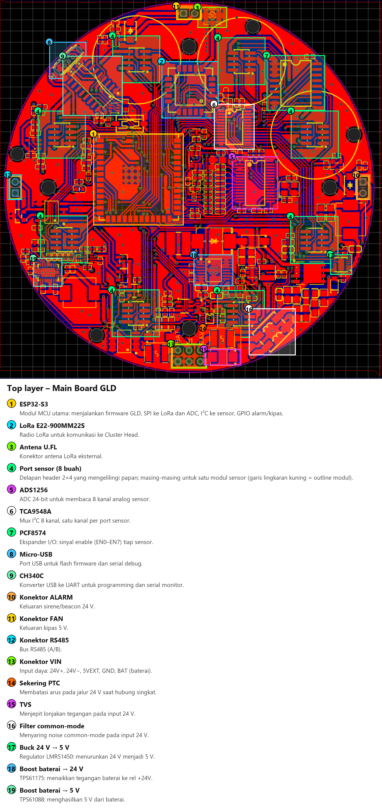

Screenshot asli tanpa highlight: [easyeda/top_layer_easyeda.png](easyeda/top_layer_easyeda.png).

| Bagian | Apa itu | Fungsi |
|---|---|---|
| Merah | Tembaga, pad, dan pour GND sisi Top | Semua IC, R/C/L, dioda, MOSFET dan modul dipasang di sisi atas (perakitan satu sisi) |
| Biru | Tembaga sisi Bottom yang terlihat di sela merah | Routing tambahan dan pour GND bawah |
| Titik abu-abu | 400 via | Pindah layer dan stitching GND |
| Garis kuning | Silk | Outline footprint komponen |
| Garis ungu | Outline papan Ø84 mm | Menyesuaikan casing aluminium bulat |

## 6(a).8.2 Bottom layer

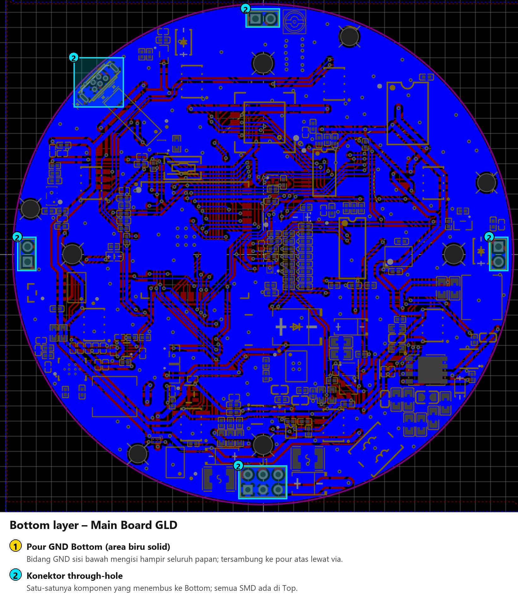

Screenshot asli tanpa highlight: [easyeda/bottom_layer_easyeda.png](easyeda/bottom_layer_easyeda.png).

| Bagian | Apa itu | Fungsi |
|---|---|---|
| Pad through-hole | J1, J2, J3, J4, USB1 | Satu-satunya komponen yang menembus ke Bottom |

Bottom dibuat sebagai layer routing; tidak ada komponen SMD di sisi ini.

## 6(a).8.3 Component placement

Peta zona seluruh papan:

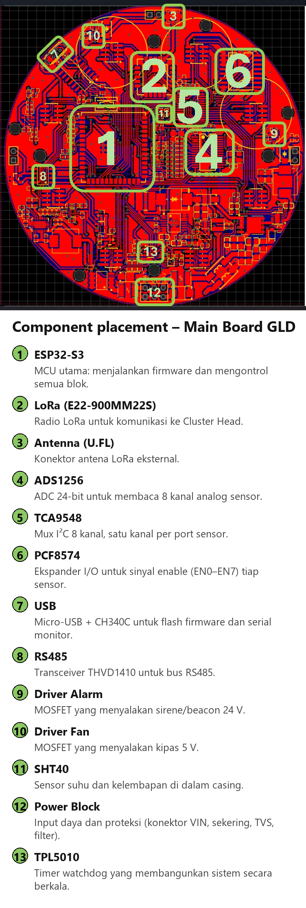

Screenshot asli dengan kotak buatan sendiri: [easyeda/placement_easyeda.png](easyeda/placement_easyeda.png).

Detail per zona (zoom, tiap komponen diberi label dan fungsi):

| Zona | Gambar |
|---|---|
| Input daya & proteksi | [fig10](img/fig10_detail_input_proteksi.png) |
| Buck 24 V → 5 V | [fig11](img/fig11_detail_buck_24v.png) |
| Boost +24 V, buck 3,3 V, watchdog | [fig12](img/fig12_detail_boost24_3v3_watchdog.png) |
| Boost 5 V, power-mux, LDO always-on | [fig13](img/fig13_detail_boost5v_mux.png) |
| MCU ESP32-S3 + USB | [fig14](img/fig14_detail_mcu_usb.png) |
| LoRa, antena, driver kipas | [fig15](img/fig15_detail_lora_antena_fan.png) |
| Akuisisi sensor (ADC, mux I²C) | [fig16](img/fig16_detail_adc_sensor.png) |
| RS485 | [fig17](img/fig17_detail_rs485.png) |
| Driver alarm | [fig18](img/fig18_detail_alarm.png) |

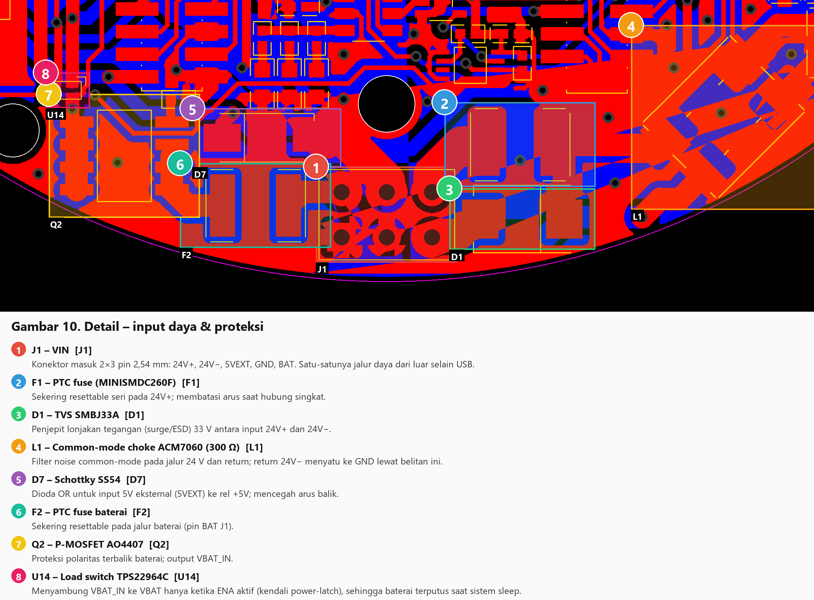

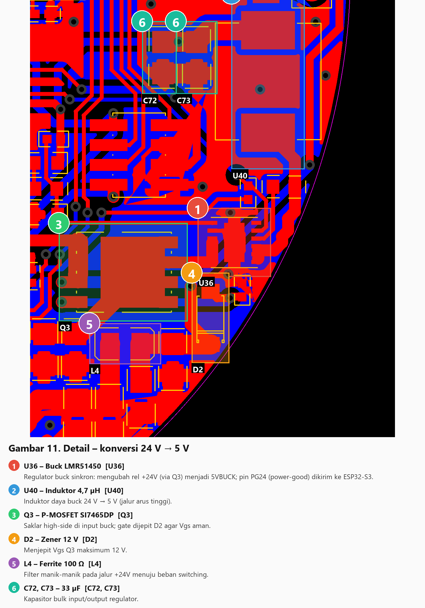

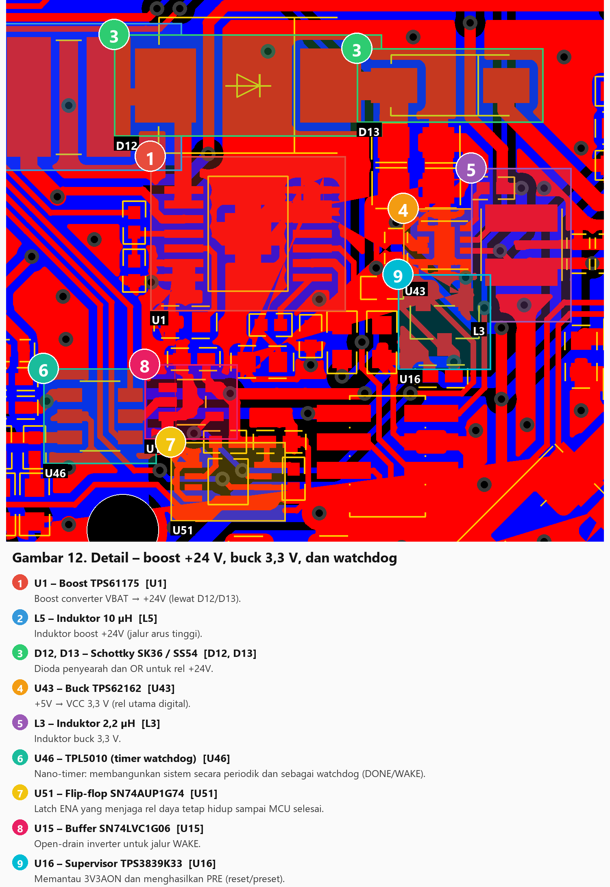

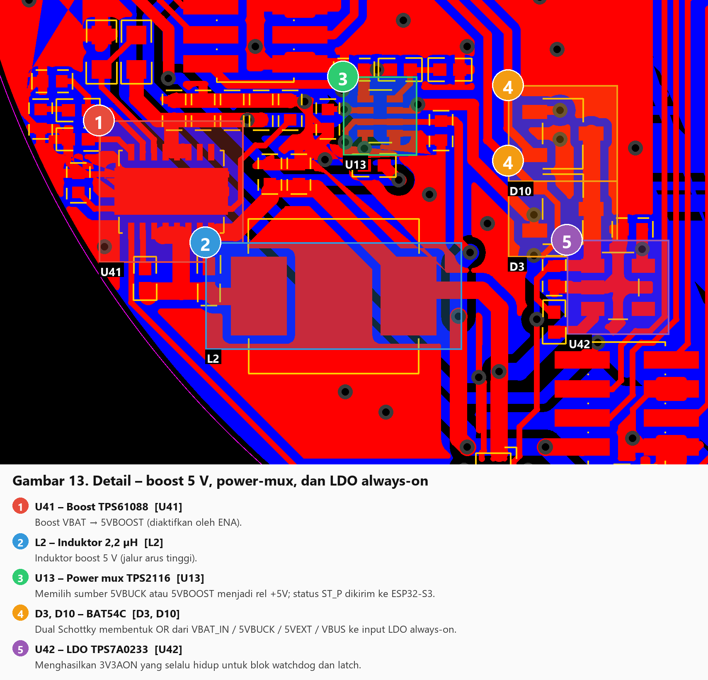

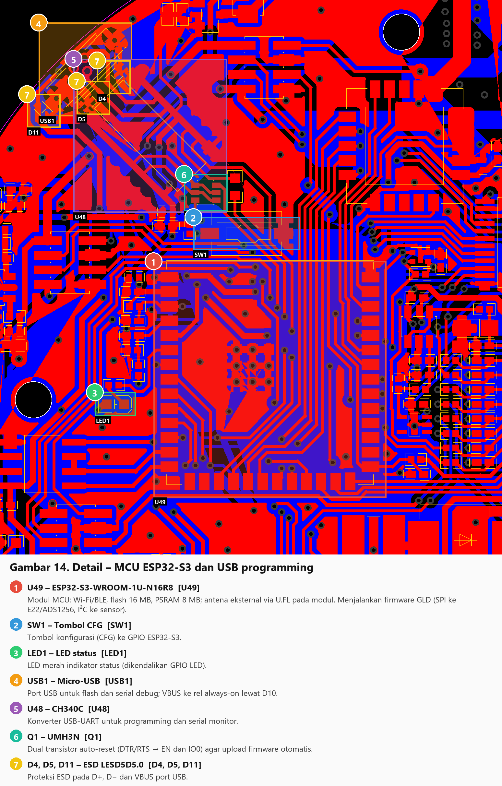

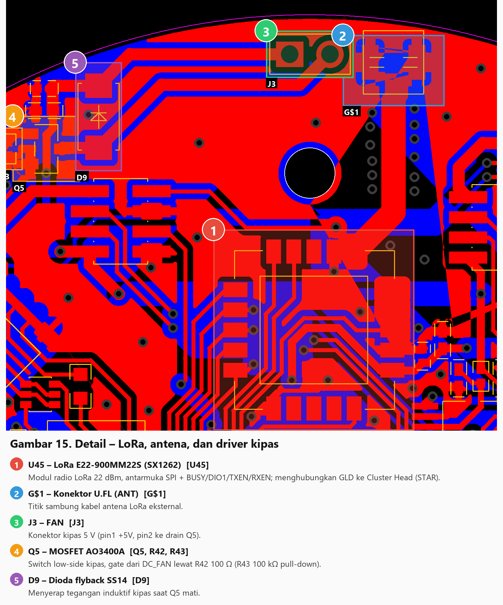

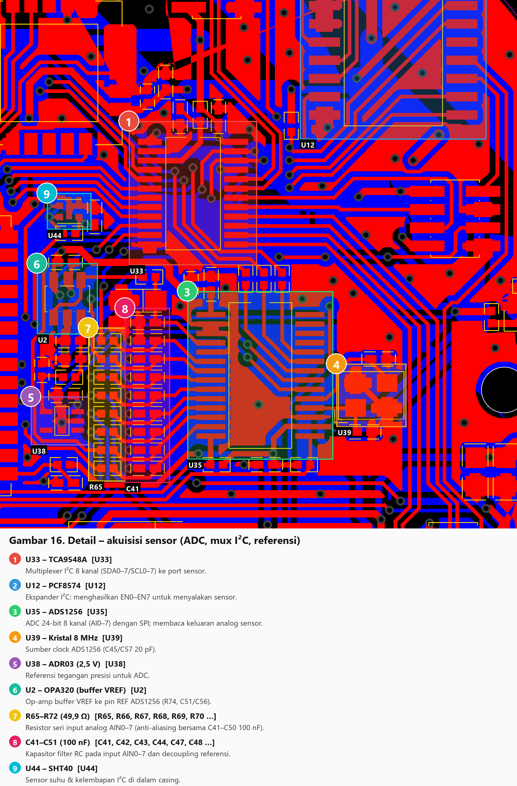

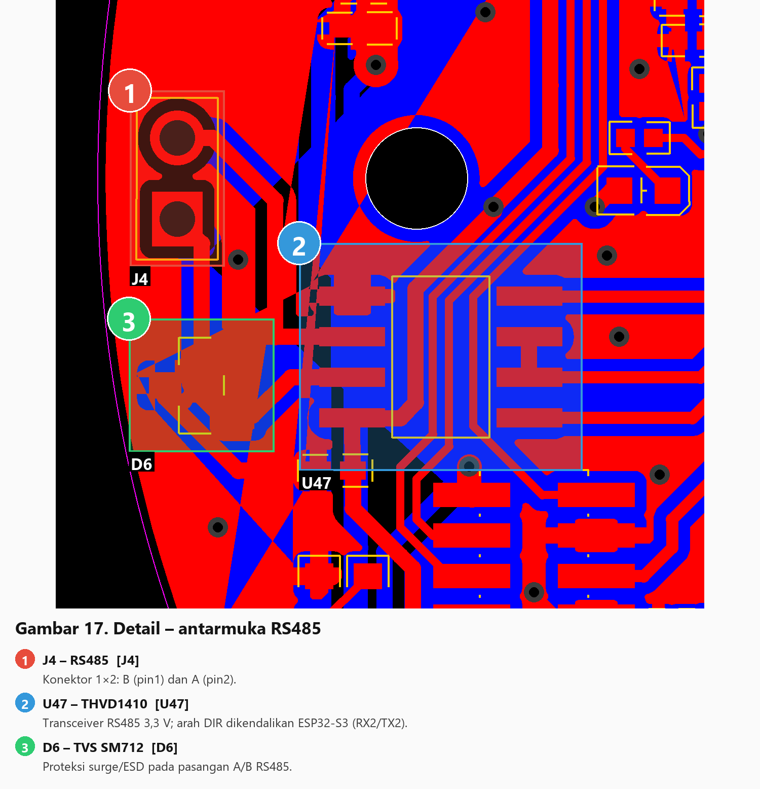

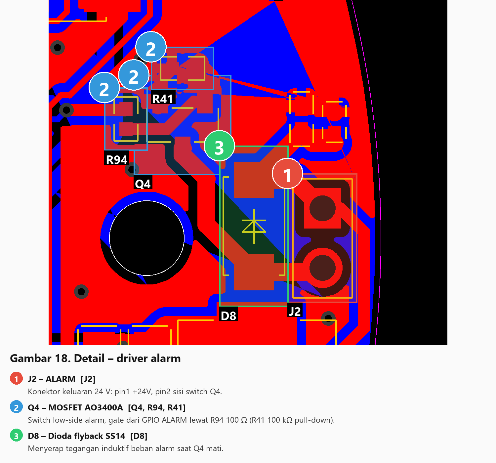

**Alur fungsi singkat (dari netlist):**

```text
24V+ → F1 → L1 → L4 → +24V → Q3 → U36 (buck) → 5VBUCK ─┐
BAT  → F2 → Q2 → VBAT_IN → U14 → VBAT ─┬→ U1 (boost) → +24V
                                        └→ U41 (boost) → 5VBOOST ─┤
5VBUCK / 5VBOOST → U13 (power-mux) → +5V → U43 (buck) → VCC 3,3 V → ESP32-S3, LoRa, sensor
VBAT_IN / 5VBUCK / 5VEXT / VBUS → D3,D10 → U42 (LDO) → 3V3AON → U46, U51, U15, U16
```

## 6(a).8.4 Board dimensions

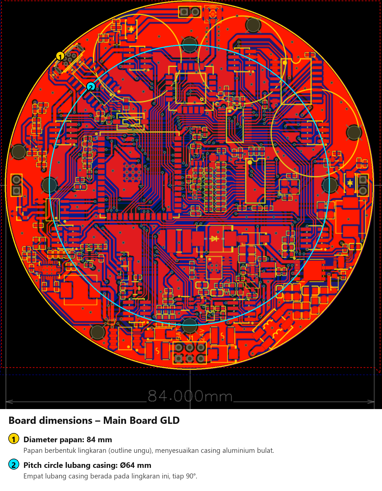

Screenshot asli: [easyeda/dimension_easyeda.png](easyeda/dimension_easyeda.png).

| Parameter | Nilai |
|---|---|
| Bentuk | Lingkaran |
| Diameter | 84,0 mm |
| Pusat (koordinat EasyEDA) | 4215,5 ; 3762,0 |
| Pitch circle lubang casing | Ø64,0 mm |
| Tebal papan | Tidak tercantum di file PCB (perlu spesifikasi fabrikasi) |

## 6(a).8.5 Mounting holes

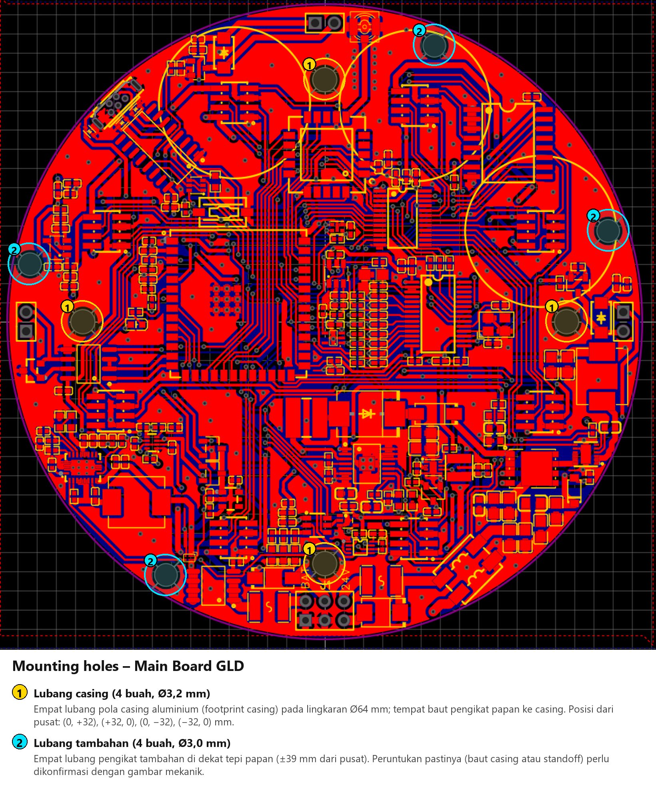

Koordinat relatif terhadap pusat papan (X ke kanan, Y ke atas):

| ID | Diameter | X (mm) | Y (mm) | Keterangan |
|---|---|---|---|---|
| C1 | 3,2 mm | 0,0 | +32,0 | Pola casing (footprint U50) |
| C2 | 3,2 mm | +32,0 | 0,0 | Pola casing |
| C3 | 3,2 mm | 0,0 | −32,0 | Pola casing |
| C4 | 3,2 mm | −32,0 | 0,0 | Pola casing |
| M1 | 3,0 mm | +37,5 | +12,0 | Tambahan, dekat tepi |
| M2 | 3,0 mm | −39,0 | +7,6 | Tambahan, dekat tepi |
| M3 | 3,0 mm | −21,0 | −33,5 | Tambahan, dekat tepi |
| M4 | 3,0 mm | +14,5 | +36,5 | Tambahan, dekat tepi |

C1–C4 adalah pengikat papan ke casing aluminium (footprint `casingAlGasLeak`). M1–M4 adalah lubang
tambahan Ø3,0 mm; peruntukan pastinya (baut ke casing atau standoff) **perlu dikonfirmasi** dengan
gambar mekanik karena file PCB tidak memuatnya.

## 6(a).8.6 Connectors

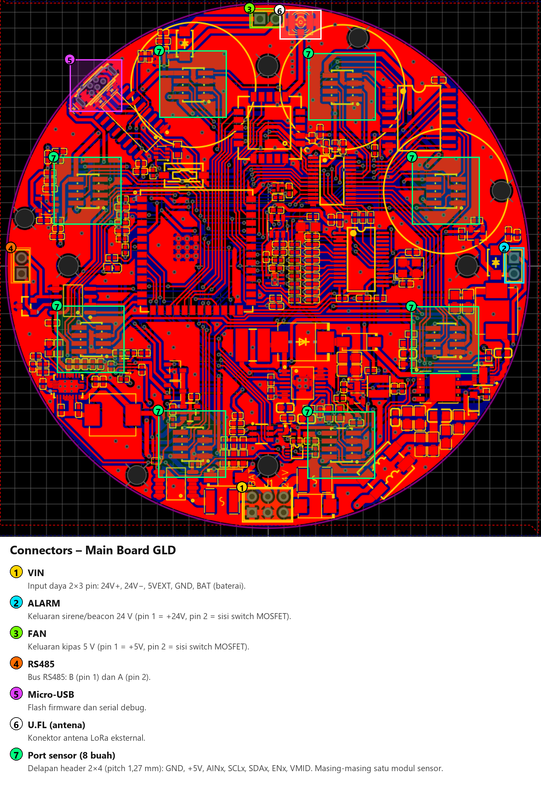

| Ref | Apa itu | Fungsi / pin |
|---|---|---|
| J1 | VIN, 2×3 pin 2,54 mm THT | 24V+, 24V−, 5VEXT, GND, BAT — input daya |
| J2 | ALARM, 1×2 THT | pin1 +24V, pin2 sisi switch Q4 — keluaran sirene/beacon |
| J3 | FAN, 1×2 THT | pin1 +5V, pin2 sisi switch Q5 — keluaran kipas |
| J4 | RS485, 1×2 THT | B, A — bus RS485 via U47 |
| USB1 | Micro-USB THT | Flash firmware dan serial debug |
| G$1 | U.FL | Antena LoRa eksternal |
| H1–H8 | Header 2×4, pitch 1,27 mm SMD | Port modul sensor (lihat 6(a).8.8) |

## 6(a).8.7 High-current / power area

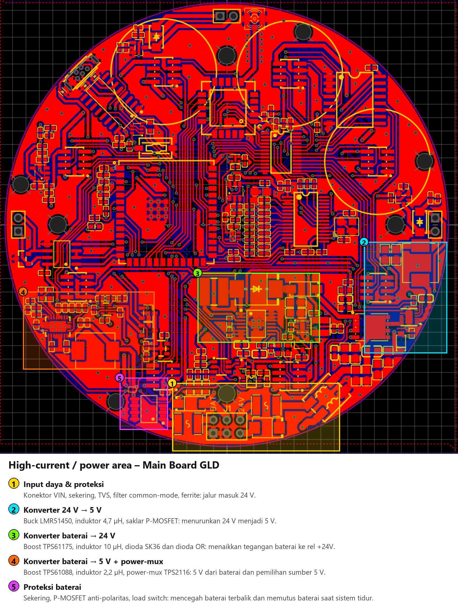

Kotak bernomor menandai area daya.

| Area | Komponen utama | Fungsi |
|---|---|---|
| Input & proteksi 24 V | J1, F1, D1, L1, L4 | Jalur arus masuk, proteksi surge dan noise |
| Buck 24 V → 5 V | U36, U40, Q3, C72/C73 | Konversi daya terbesar |
| Boost +24 V | U1, L5, D12, D13 | Menaikkan VBAT ke +24V |
| Boost 5 V + mux | U41, L2, U13 | 5VBOOST dan pemilihan sumber |
| Proteksi baterai | F2, Q2, U14 | Jalur arus baterai |

## 6(a).8.8 Sensor interface

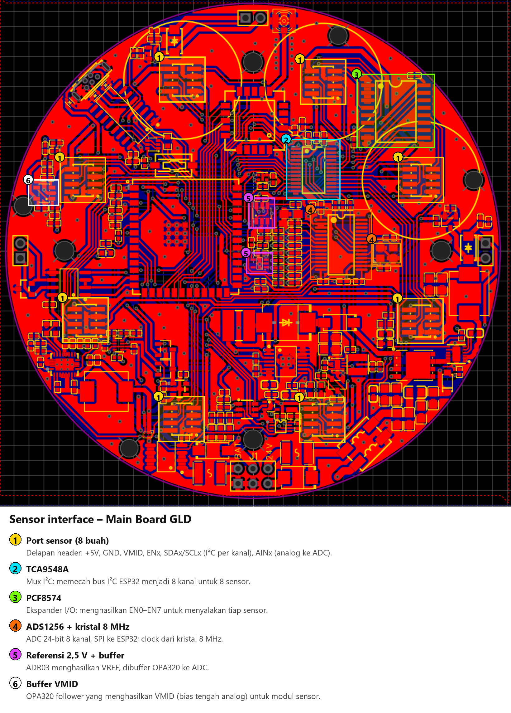

Pin port sensor H1–H8 (identik semua, nomor kanal berbeda):

| Pin | Net | Fungsi |
|---|---|---|
| 1 | GND | Ground |
| 2 | +5V | Suplai sensor |
| 3 | AINx | Keluaran analog → ADS1256 (AI0–7) |
| 4 | SCLx | I²C per kanal TCA9548A |
| 5 | GND | Ground |
| 6 | SDAx | I²C per kanal TCA9548A |
| 7 | ENx | Enable sensor dari PCF8574 (EN0–7) |
| 8 | VMID | Bias tengah analog dari buffer OPA320 (U3) |

Pemetaan nomor port ke kanal (urutan H1…H8 **tidak** sama dengan nomor kanal):

| Port | Kanal I²C (SDA/SCL) | Analog | Enable |
|---|---|---|---|
| H1 | 6 | AIN1 | EN6 |
| H2 | 7 | AIN0 | EN0 |
| H3 | 5 | AIN2 | EN7 |
| H4 | 4 | AIN3 | EN3 |
| H5 | 3 | AIN4 | EN4 |
| H6 | 2 | AIN5 | EN5 |
| H7 | 1 | AIN6 | EN2 |
| H8 | 0 | AIN7 | EN1 |

Detail zoom area ADC ada di [fig16](img/fig16_detail_adc_sensor.png).

## 6(a).8.9 Grounding arrangement

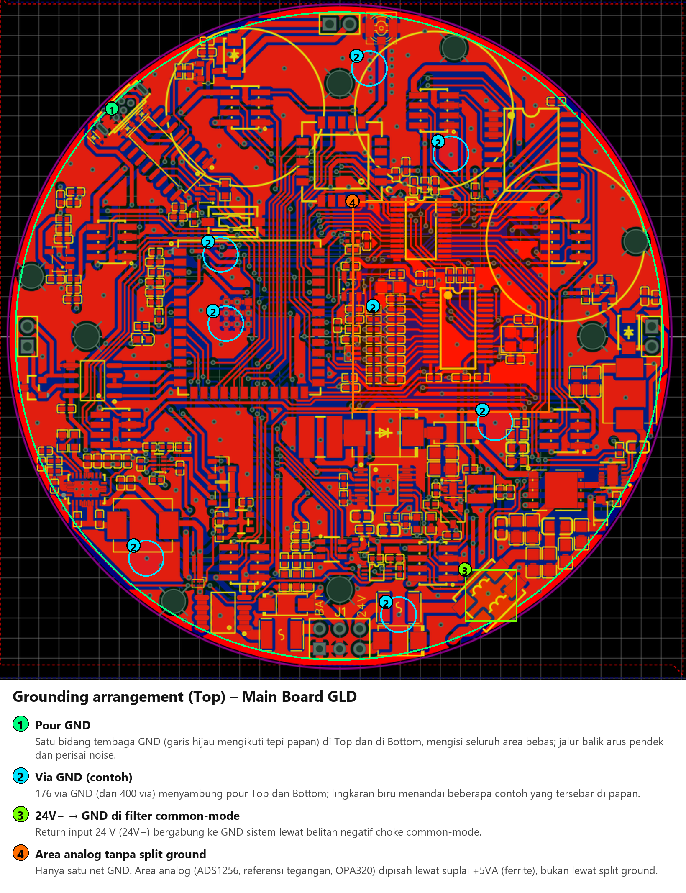

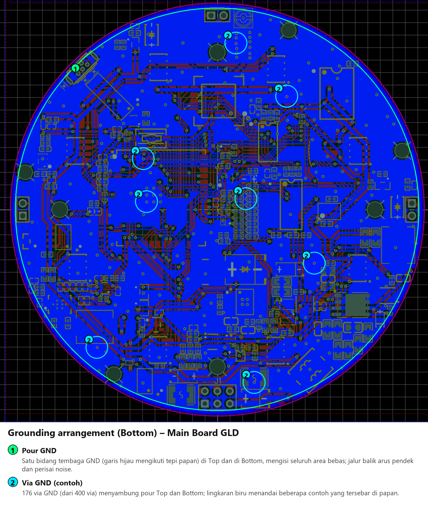

| Elemen | Penjelasan |
|---|---|
| Pour GND dua sisi | Satu net GND di Top dan Bottom mengisi area bebas hingga tepi papan |
| Via stitching | 176 via GND menyambung kedua pour dan menjaga impedansi return rendah |
| Return 24 V | 24V− bergabung ke GND lewat belitan negatif choke common-mode L1; TVS D1 menjepit di sisi 24V− |
| Analog | Tidak ada split AGND/DGND; area analog dipisah lewat suplai +5VA (ferrite L6) |
| Shield/konektor | Pad GND USB1 dan U.FL (G$1) tersambung langsung ke pour |

---

## Batas dan catatan

- Fungsi komponen disimpulkan dari part number dan koneksi net pada file PCB. Fungsi yang bergantung
  pada firmware (mis. pemakaian pin tertentu) tidak diverifikasi di dokumen ini.
- Ketebalan papan, finishing, dan spesifikasi fabrikasi tidak ada di file PCB.
- Pembuatan gambar tidak mengubah file sumber EasyEDA.

## Cara membuat ulang gambar

Highlight pada screenshot EasyEDA dibuat oleh `tools/annotate_easyeda.py`. Gambar render lainnya dibuat dengan Python (Pillow) dari JSON PCB dalam tampilan seperti editor EasyEDA
(Top merah, Bottom biru): `pcbrender.py` (parser + renderer) dan
`gen.py` (crop dan highlight tiap gambar). Skrip disimpan di folder [tools/](tools/).
